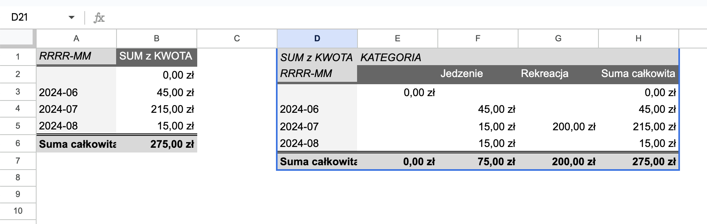
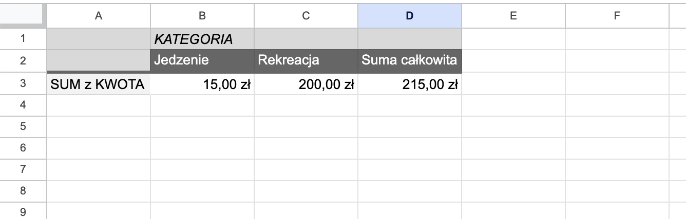
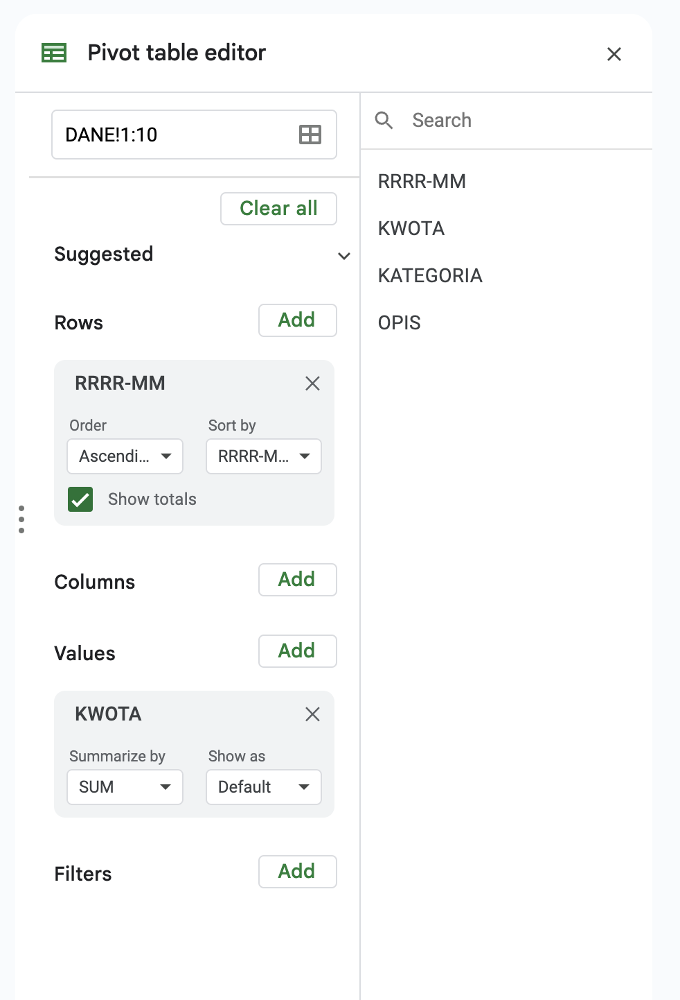
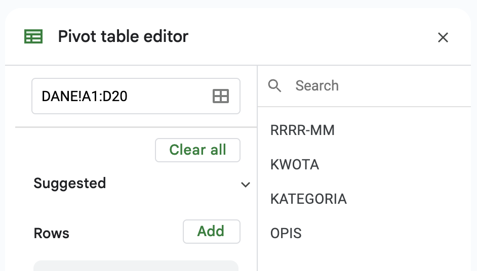

Wielu z nas korzysta z **tabel przestawnych** w Google Sheets do analizy danych. To proste w użyciu i jednocześnie potężne narzędzie.

Jednak moi klienci, którym tworzę raporty i inne narzędzia za ich pomocą, zwrócili mi ostatnio uwagę na to, że tabele wyglądają na niepełne. Powodem był niezaktualizowany zakres danych w tabeli przestawnej po dodaniu nowych rekordów w arkuszu z danymi.

Skąd ten problem i jak sobie z nim poradziłem? O tym w dzisiejszym artykule.

## Problem

Za przykład niech posłuży nam [arkusz](https://docs.google.com/spreadsheets/d/1ww5fmQXJlcGJJO8Hz2awQPYRikPLxaV4DGkmQJDzCWs/edit?gid=0#gid=0), który stworzyłem na potrzeby testów.

Znajdziesz w nim 3 arkusze:

1. **DANE**, w którym są 4 kolumny z pierwszym wierszem z nagłówkami i maksymalnie 20 rekordów


2. **MIESIĘCZNIE**, gdzie znajdziemy dwie tabele przestawne



3. **2024-07**, gdzie znajdziemy jeszcze jedną tabelę.


I w ustawieniach tabel zobaczymy, że zakres źródła danych jest statyczny, np. `1:10`.



Żeby objąć wszystkie rekordy możemy próbować użyć zakresu dynamicznego, np. `A1:D`, ale niestety Google Sheets automatycznie zmienia to na maksymalny zakres, np. `A1:D20`



I teraz jeśli dodamy kolejne wiersze do arkusza z danymi, to **ten zakres nie zostanie zaktualizowany!** To oznacza, że jeśli nie wejdziemy i ręcznie nie zmienimy tego zakresu, to będzie brakować danych. A klient, który nie ogarnia tabel przestawnych, sam sobie tego nie zmieni.
## Najprostsze rozwiązanie

Najprościej naprawić ten problem dodając rekordów na zapas. Jeśli miesięcznie przybywa nam 100 rekordów, to wystarczy dodać ich 1200, żeby problem wrócił dopiero po roku. I teraz w zależności od ilości tych wpisów, to rozwiązanie może być bardziej lub mniej atrakcyjne.

> [!tip] Jak znaleźć koniec tabeli? 
> Do arkuszy, które ja przygotowuję, często dane wprowadzają osoby mało techniczne. Zdarza się, że nie wiedzą jak użyć klawiatury, aby sprawnie poruszać się po arkuszach.
> 
> Będąc w dowolnym miejscu wystarczy nacisnąć kombinację `CTRL+strzałka w dół`, aby przeniosło nas do ostatniego dopisanego rekordu tabeli.

Może się jednak zdarzyć, że tych rekordów przybywa w tempie np. 1000 miesięcznie i jeśli nie chcemy do tego wracać przez najbliższe 5 lat, to musimy dodać 60 tys. rekordów. 

Google Sheets ma limit 1 mln komórek na arkusz, co można łatwo przekroczyć przy dużej liczbie kolumn. Wtedy jednak być może warto zastanowić się nad innymi rozwiązaniami, np. dedykowanym oprogramowaniem.

Ponadto jeśli nie chcemy aktualizować ręcznie kilku, kilkunastu tabel przestawnych *na cito*, bo klientowi nagle przestał wyświetlać się krytyczny raport miesięczny, to możemy zrobić to automatycznie.

## Automatyczna aktualizacja zakresów tabel przestawnych

Aby zrobić cokolwiek automatycznie w arkuszach Google, to możemy zastosować makra albo skrypty (Apps Scripts).
### Makro

Makro nie do końca działa. Po zarejestrowaniu makra, podczas którego aktualizujemy zakres podając go w sposób dynamiczny, dostałem taki kod:
```js
function UpdateT1() {
  var spreadsheet = SpreadsheetApp.getActive();

  spreadsheet.getRange('A1').activate();

  var sourceData = spreadsheet.getRange('DANE!A1:D20');

  var pivotTable = spreadsheet.getRange('A1').createPivotTable(sourceData);

  var pivotValue = pivotTable.addPivotValue(2, SpreadsheetApp.PivotTableSummarizeFunction.SUM);

  var pivotGroup = pivotTable.addRowGroup(1);
};
```

Widać, że tutaj również dostaliśmy ostatecznie zakres statyczny (`DANE!A1:D20`). Moglibyśmy ten zakres utworzyć automatycznie. Trzeba by pobrać maksymalną liczbę wierszy z arkusza z danymi, np. w ten sposób:
```js
function UpdateT1() {
  var spreadsheet = SpreadsheetApp.getActive();
  // Pobieranie arkusza DANE
  var dataSheet = spreadsheet.getSheetByName('DANE');
  
  // Pobieranie liczby wierszy w arkuszu DANE
  var maxRows = dataSheet.getMaxRows();
  
  // Definiowanie zakresu źródłowego danych na podstawie liczby wierszy
  var sourceData = dataSheet.getRange('A1:D' + maxRows);
  var pivotTable = spreadsheet.getSheetByName("MIESIĘCZNIE").getRange('A1').createPivotTable(sourceData);
  var pivotValue = pivotTable.addPivotValue(2, SpreadsheetApp.PivotTableSummarizeFunction.SUM);
  var pivotGroup = pivotTable.addRowGroup(1);
};
```

OK, mamy jedną tabelę przestawną. Makro możemy wywołać w dowolnym miejscu, bo szukamy po nazwach potrzebnych nam arkuszy.

Są z tym skryptem jednak pewne problemy:
1. Jeśli zmienimy nazwy arkuszy (`DANE` i `MIESIĘCZNIE`), to skrypt nie zadziała, a wręcz może nam ten arkusz popsuć.
2. Jeśli zmienimy strukturę tabeli przestawnej (np. dodamy dodatkowe kolumny czy wiersze), to ten skrypt przywróci pierwotną strukturę tabeli.
3. Jeśli zmienimy lokalizację tabeli, to skrypt utworzy ją w tym samym miejscu, w którym była pierwotnie i teraz będziemy mieli dwie, które mogą nachodzić na siebie i powodować błędy.
4. Trzeba pamiętać o wywołaniu tego makra, czyli skojarzyć, że jeśli brakuje danych, to trzeba uruchomić specjalne makro do aktualizacji. Jeśli robimy to rzadko, to gwarantuję, że zapomnimy o tym i będziemy się głowić dlaczego nam brakuje danych w tabeli.
5. I wreszcie: działa tylko dla jednej tabeli. Jeśli mamy ich kilka, to dla każdej będziemy musieli zarejestrować, poprawić i wywoływać makra osobno dla każdej tabeli.

### Automatyczny skrypt do aktualizacji wszystkich tabel przestawnych

Makro pokazało nam drogę do skryptów (Apps Script) i to będzie nasze rozwiązanie.

Jak widać było w poprzednim skrypcie, aktualizacja nie jest taka prosta. Byłem zaskoczony, że nie ma prostej metody do wywołania na tabeli przestawnej, np. `updateRange` ("weźże mi zaktualizuj zakres mojej tabeli przestawnej"). 

Nagłowiłem się nad tym i okazało się, że trzeba stworzyć zupełnie nową tabelę przestawną w miejscu, w którym była stara. I nie trzeba nawet usuwać poprzedniej.

Ba, nawet lepiej, żebyśmy tego nie robili!

Na szczęście ze starej - dopóki jej nie usuniemy - da się wyciągnąć wszystkie jej ustawienia (wiersze, kolumny, filtry), dzięki czemu można podmienić ją w miejscu, w którym była.

Jak już mamy skrypt do aktualizacji zakresu jednej tabeli przestawnej, to teraz wystarczy, że automatycznie wykonamy go dla wszystkich dostępnych w arkuszu tabel.

Do ich wyszukania potrzebujemy przelecieć po wszystkich arkuszach i dla każdej znalezionej w arkuszu tabeli przestawnej dokonać podmianki.

Cały skrypt utworzyłem i opisałem w [publicznym repozytorium na github](https://github.com/degregar/pivot-table-range-updater), dlatego nie będę wklejał tutaj całego kodu ani instrukcji instalacji i użycia.

Dodam tylko, że skrypt można uruchamiać automatycznie zaraz po otwarciu arkusza. Wystarczy utworzyć wyzwalacz (ang. *trigger*) `onOpen`.

> [!warning] Jaki wyzwalacz skryptu?
> Próbowałem używać wyzwalacza `onChange`, który uruchamia się wtedy, gdy zmienimy strukturę dokumentu. Byłoby to idealne, bo oznacza to, że wywoła nasz skrypt aktualizacyjny w momencie, w którym dodamy nowe wiersze do arkusza z danymi.
>
> Niestety wyzwala się to również w momencie, gdy zmienimy strukturę samej tabeli przestawnej, co kończy się bezpowrotnym zepsuciem tejże tabeli. Trzeba wtedy przywracać z historii zmian całego arkusza, bo proste `CTRL+Z` nadal powoduje wywołanie `onChange` i kręcimy się w kółko.

### Ograniczenia

To rozwiązanie **ma swoje ograniczenia** i wymagałoby bardziej skomplikowanych poprawek, żeby je pokonać. 

Oto na co musisz uważać:
1. Sztywna struktura źródła danych
Zakładam, że arkusz ze źródłem danych jest uporządkowany, z jednym wierszem nagłówkowym, po którym następują wiersze z danymi – i nic więcej. Jeśli dodasz wiersz przed tym z nagłówkami, to automatyczna aktualizacja zepsuje tabele przestawne, bo zacznie od pierwszego wiersza, z którego pobiera nazwy parametrów.

2. Utrata stylów
Skrypt nie zachowa stylizacji tabeli przestawnej. Apps Script zepsuje Twoje style i sprawi, że wszystkie będą domyślnie w odcieniach szarości. Nawet makra nagrane podczas tworzenia tabel przestawnych nie ustawią ich tak, jak to się dzieje, gdy ręcznie ustawiamy je za pomocą interfejsu Google Sheets.

3. Odświeżanie tylko przy otwieraniu
Jeśli dodasz nowe wiersze, nie wyzwoli to automatycznie odświeżenia tabel przestawnych. Musisz zamknąć i ponownie otworzyć arkusz kalkulacyjny, aby to się stało. Dzieje się tak, ponieważ używamy wyzwalacza `onOpen` (i nie ma czegoś takiego jak `onClose` 😞)

## Podsumowanie

Automatyzacja aktualizacji zakresów tabel przestawnych w Google Sheets nie jest prostym zadaniem, ale jest możliwa. Dzięki odpowiedniemu [skryptowi](https://github.com/degregar/pivot-table-range-updater) możemy skutecznie zarządzać danymi bez konieczności ręcznego aktualizowania zakresów. Ma on swoje ograniczenia, ale działa. 

Mam nadzieję, że moje doświadczenia i rozwiązania pomogą Tobie w efektywnej pracy z tabelami przestawnymi.