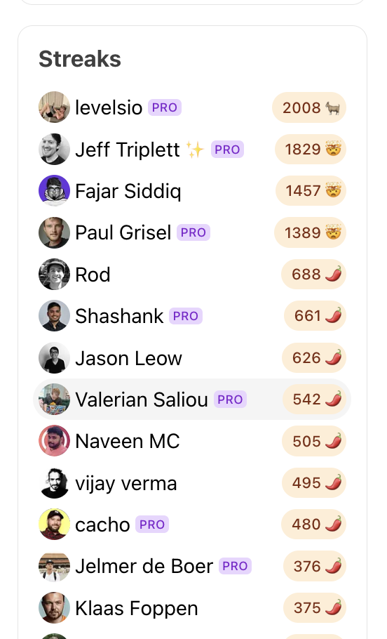
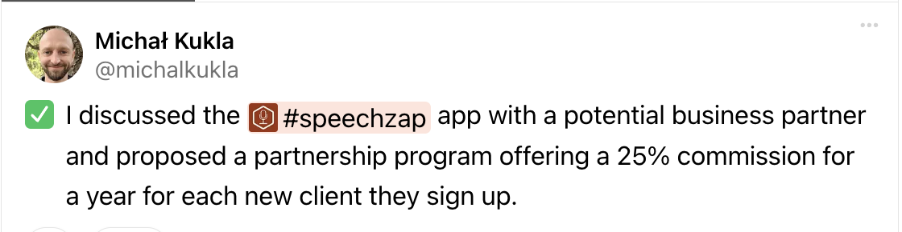

Dzisiaj będzie trochę o automatyzacji tworzenia *contentu*. 

Jest taka platforma social media [wip.co](https://wip.co). Twórcy aplikacji, tacy jak ja, dzielą się tam postępami w budowaniu i wspierają nawzajem. Coś jak [[slowtracker|SlowTracker]], tylko domyślnie publiczne i zaczęli 7 lat temu.

Coś jak SlowTracker, no właśnie... O WIP dowiedziałem się od znajomego już po tym, jak stworzyłem moje narzędzie do zapisywania swoich sukcesów i postępów. Tylko SlowTracker domyślnie jest prywatny i służy do zapisywania WSZYSTKICH postępów. Nie tylko zawodowych, czy związanych z budowaniem aplikacji, ale też doświadczeń z budowania nawyków i realizacji wyzwań. Może też służyć do zapisywania lekcji, jakich nauczyłem się podczas wspólnego biwaku z rodziną.

## Niche down

Ta wszechstronność to jednocześnie zaleta i wada mojej aplikacji. 

Zaleta, bo mam w jednym miejscu całą historię i wszystko, co może mi się przydać do stworzenia wartościowych treści czy poprawy nastroju, gdy mam gorszy dzień. Wystarczy spojrzeć wstecz i zobaczyć jak daleko już zaszedłem.

Wada, bo trudno jest mi zbudować społeczność, skoro może służyć do tak wielu rzeczy.

I dlatego WIP wygrywa. Ma już wielu użytkowników, którzy mają wspólne zainteresowania, cele i wyzwania. 

Ten wspólny cel - rozwijać aplikacje - to jest [[Niche down  - zalety i wady|nisza]], którą zagospodarowali w obszarze mediów społecznościowych. I robią to dobrze. Można pokazać swoją aplikację i do tego poznać innych twórców, zwłaszcza *bootstrapperów*.

Mają też tego pewien mechanizm, który zachęca do dodawania wpisów.

## Ranking streaków

Trzeba dodać przynajmniej 1 wpis dziennie, aby utrzymać *streak* (passę, ciągłość). I są ludzie, którzy dodają codziennie już od ponad 5 lat 🤯

## Codzienne wpisy

Mógłbym dodawać do WIP swoje postępy, ale dodaję już do SlowTrackera. Poza tym aż takich korzyści z dodawania do WIP nie widzę, żeby codziennie pamiętać o tym, żeby tam publikować.

Jednak super byłoby znaleźć się w top25. To mogłoby pokazać innym (i sobie), że jestem konsekwentny w działaniu, a może nawet wypromować część moich produktów.

Mam już swojego SlowTrackera i uznałem, że mógłbym część z tych wpisów dodawać do WIP. Problem jednak w tym, że mi się nie chce 😅 Jestem bardziej łowcą, niż farmerem. Wpisy w SlowTracker mam po polsku, a do WIP pasowałoby po angielsku pisać. 

Mam jednak dwa produkty, które są tłumaczone na angielski (SlowTracker i [[speechzap|SpeechZap]]) i mógłbym o nich pisać.

Podsumowując: jakieś korzyści widać, ale nie chce mi się pisać. Ale od czego mamy LLM i automatyzacje?
## Automatyzacja z użyciem LLM

SlowTracker udostępnia [API](https://app.slowtracker.com/api-keys). Miało być od początku *API-first*, aby można było z niego korzystać przez MicroSkills i móc pobierać sukcesy do dalszej obróbki, np. przez GPT czy inne generatywne AI.

Dlatego wszystkie wpisy, które mają trafić na WIP, oznaczam tagiem `#wip`. Napisałem skrypt, który raz dziennie:
1. pobiera mi najstarszy wpis z tym tagiem,
2. tłumaczy z użyciem jednego z modeli OpenAI,
3. usuwa tag `#wip`, a zamiast niego dodaje `#wip-added` i...
4. wysyła mi mailem treść do wklejenia.

Potem z tego maila wklejam do wip.co i voilà!

Ale dlaczego mailem? Nie można tego w pełni zautomatyzować?
## Nie mogę (i nie chcę) użyć API

WIP udostępnia swoje API. Jednak dodawanie przez API w celu utrzymania *streak* nie jest dozwolone. Nie sprawdzałem, czy zrobili jakieś zabezpieczenie na poziomie API, czy sprawdzają to innymi metodami, ale jak już mam dodawać tam wpisy, to chcę powalczyć o pozycję w top 25.

Poza tym chcę mieć kontrolę nad treścią wpisów. Nie ufam LLM (i swojemu *prompt engineering* 😉), aby powierzyć mu cały proces, od początku do końca.

Robię więc półautomat, który umożliwia mi robienie czegoś, czego normalnie by mi się w życiu nie chciało robić.

A gdy uznam, że treść jest dokładnie taka, jaką chciałem, to wtedy być może to zautomatyzuję (bo już znalazłem inny sposób 😈).
## Zmiany po drodze

Skrypt napisałem dość szybko. Na pewno w krócej, niż godzinę. Nie był idealny, ale robił to, co chciałem. Postawiłem na AWS Lambda, żeby nie przejmować się infrastrukturą i tym, że może mi paść mój serwer nagle, a ja nie zauważę, że mi się maile nie wysyłają.

Pierwsza wersja skryptu była prostym podsumowaniem i przetłumaczeniem. Jednak i tak musiałem to nieco przeredagować. 

W WIP można dodawać projekty, które można w postach podlinkować, używając tagów:

Proste tłumaczenie nie załatwiło sprawy, bo nie stosowało tagów. W tagach do wpisów w SlowTracker zawsze dodaję projekty. Zmieniłem więc *prompt*, żeby zamieniał treść w taki sposób, aby dodawać tagi, jeśli takie są. Wtedy `SpeechZap` zamienia na `#speechzap` i elegancko tworzy się treść.

Okazało się jednak, że jak było słowo `marketing` w treści, a w tagach też miałem `#marketing`, to zamieniało mi na taki tag. A to już niedobrze, bo bezwiednie tagowałbym projekty innych osób, jeśli skorzystają z takiego tagu do opisania swoich projektów.

Wystarczy jednak w *prompcie* dodać listę aktualnych projektów (którą mógłbym też z automatu pobrać z WIP - na przyszłość).

## Zdjęcia

Zauważyłem, że wiele osób wkleja zdjęcia ze swoich projektów czy nowych funkcji. Post w WIP to taka mini-premiera, więc warto to wykorzystać i dodać materiały wizualne.

W SlowTracker też jest dodawanie zdjęć. Nie chciałoby mi się w momencie wrzucania postu tworzyć jeszcze grafik, dlatego postanowiłem, że takie materiały będę wrzucał od razu do SlowTracker. Potem skrypt może mi dodać załączniki do maila, żebym nie musiał ich szukać.

## Podsumowanie

Można wykorzystać [[slowtracker|SlowTracker]] do automatycznego tworzenia postów do mediów społecznościowych. Warto zbudować wstępną automatyzację, która choćby częściowo ułatwi nam realizację zadań. Potem stopniowo można dokładać kolejne funkcje i dopracować cały proces.

Teoretycznie powinno się automatyzować procesy, które istnieją. Jednak w tym przypadku, bez tego skryptu w ogóle bym nie dodawał postów na WIP. Wiedziałem, że nie będę miał na to czasu i nie widzę aż takiej korzyści w tym, żeby codziennie siadać i tłumaczyć ręcznie posty lub wymyślać na bieżąco.

SlowTracker stanowi dla mnie taki bufor treści. Działa to zarówno w przypadku krótszych postów na WIP (i być może na inne SoMe w przyszłości również), jak i dłuższych postów na bloga. (Wtedy często przeglądam kilka treści podobnie otagowanych, tak jak w przypadku tego właśnie artykułu.)

Jeśli masz podobnie jak ja (codzienna pielęgnacja to cierpienie 😅) i wpadnie Ci do głowy pomysł na zrobienie automatyzacji, która skróciłaby systematyczne działanie do max 2 minut, to myślę, że warto to rozważyć.

Oczywiście warto najpierw rozważyć [ile czasu zajmie przygotowanie takiej automatyzacji](https://michalkukla.pl/blog/czy-warto-automatyzowac). Jeśli nie wiesz jak to oszacować, to zawsze możesz [napisać do mnie](mailto:michal@kukla.tech).