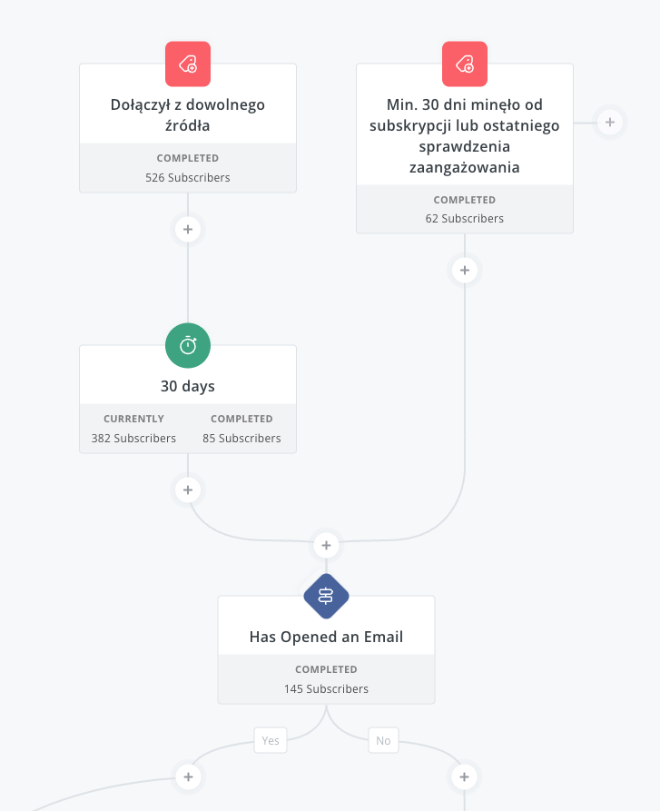
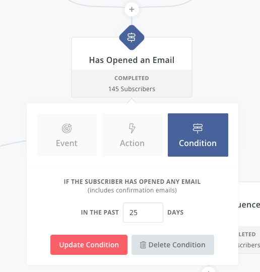
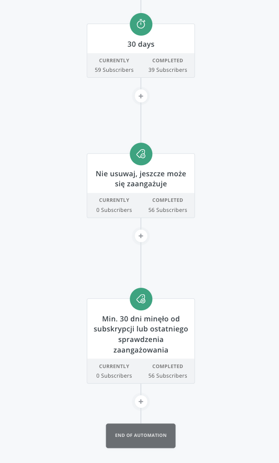
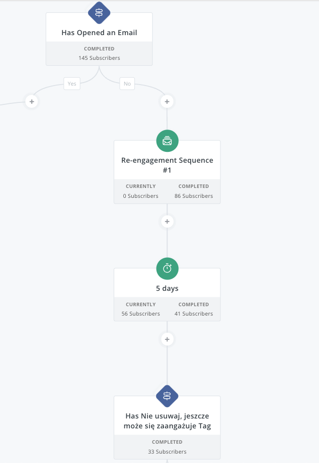
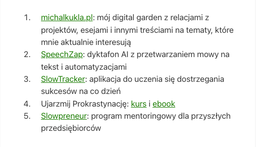
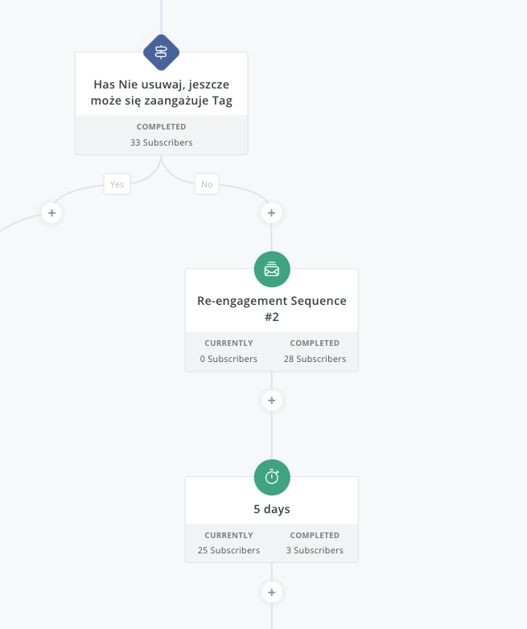

Uruchomiłem ponownie automatyczne czyszczenie subskrybentów w [ConvertKit](https://partners.convertkit.com/klgg948khpjo). To dobra okazja, aby pokazać dlaczego warto to robić i jak to działa od kuchni.
## Dlaczego warto to robić?

Powody są trzy:
1. Koszty
2. *Deliverability*
3. *1000 true fans*

### Koszty

Płacę za ilość subskrybentów na liście - im więcej adresów tym wyższe opłaty. Obecnie mam ok. 570 adresów mailowych z różnych produktów, które stworzyłem w ciągu ostatnich dwóch lat. Wysyłanie maili do osób, które nie czytają moich treści i nie są nimi zainteresowane, to przepalanie pieniędzy.

### Deliverability

Jeśli mam na mojej liście 100 adresów @gmail.com i 90% z odbiorców nie przeczyta mojego maila, tylko go usunie, albo zignoruje, to jest spora szansa, że taki Gmail będzie automatycznie wrzucał wiadomości ode mnie do SPAMu za każdym razem.

Zależy mi więc na tym, aby osoby, do których wysyłam maile, przynajmniej otwierały te wiadomości. Jednym ze sposobów na podniesienie wskaźnika otwarć jest... usunięcie osób, które nie otwierają maili.

O wskaźniku otwarć i wiążącymi się z tym problemami za chwilę.
### *1000 true fans*

Kevin Kelly w swoim eseju [1,000 True Fans](https://kk.org/thetechnium/1000-true-fans/) napisał:
> To be a successful creator you don’t need millions. You don’t need millions of dollars or millions of customers, millions of clients or millions of fans. To make a living as a craftsperson, photographer, musician, designer, author, animator, app maker, entrepreneur, or inventor **you need only thousands of true fans.**

Czyszczenie listy pozwala oszacować ile osób jest potencjalnie fanami treści i narzędzi, które dostarczam.

Swoją drogą polecam jeszcze artykuł Li Jin pt. [1,000 True Fans? Try 100](https://a16z.com/1000-true-fans-try-100/).
## Dlaczego *ponownie* uruchomiłem czyszczenie?

Ten automat do czyszczenia nieaktywnych subskrybentów przygotowałem jeszcze w zeszłuym roku. Jednak przez kilka miesięcy niczego nie wysyłałem nikomu, a część produktów zaorałem, choć adresy zostały. Automat do czyszczenia listy opiera się o otwieralność w ostatnich 30 dniach. Skoro nie wysyłałem maili, to nikt niczego nie mógł otworzyć, więc wyłączyłem go, by nie usunął mi całej listy.

A ponieważ od kilku miesięcy regularnie publikuję 5 postów tygodniowo i [[automatyczny-newsletter|ułatwiłem sobie tworzenie newsletterów]], to przyda się zrobić porządki. Poza tym część z osób trafiło do tej listy z innego powodu, niż moje obecne treści na blogu.
## Jak działa u mnie automatyczne czyszczenie listy adresowej?

Systemy do wysyłki maili umożliwiają zliczanie wskaźnika otwarć. Nie zawsze to jednak działa. 

Informację o otwarciu maila systemy pobierają w ten sposób, że wklejają do treści maila obrazek w HTML (np. przezroczysty obrazek wielkości 1x1 px). Obrazek jednak nie jest dostarczany z mailem, tylko podawany jest do niego unikalny adres, który jest skorelowany z adresem email odbiorcy. Po pobraniu obrazka serwer odnotowuje, że użytkownik widział obrazek, co oznacza, że otworzył email.

Wystarczy jednak, że jako czytający nie wyrazisz zgody na pokazywanie obrazków, a cały ten system nie będzie działał.

Dlatego stosuję nieco inne podejście.

Ale po kolei.

Utworzyłem w ConvertKit automatyzację (*Visual Automation*) i dodaję do niej użytkownika za każdym razem, gdy otrzyma tag *Dołączył z dowolnego źródła* . (Do tego przypisania tego tagu mam osobną automatyzację.)

Następnie czekam 30 dni i sprawdzam, czy otworzył maila w ciągu ostatnich 25 dni (zostawiam bufor na wypadek, gdyby mailing był wysyłany rzadziej):

Jeśli otworzył, to sprawa jest jasna - czyta maile i warto mu je nadal wysyłać. Ale to nie oznacza, że będzie czytał za miesiąc, więc:
1. Czekam 30 dni.
2. Usuwam tag zabezpieczający przed usunięciem (o nim za chwilę)
3. Dodaję tag, że minęło 30 dni i trzeba wrócić do kroku pierwszego, tylko tym razem od razu sprawdza, czy mail został wysłany.
4. Kończę sekwencję, bo użytkownik i tak wpadł do niej ponownie.

Jeśli natomiast podczas pierwszego sprawdzenia nie otworzył emaila, to wysyłamy pierwszą wiadomość z pytaniem, czy chce nadal otrzymywać ode mnie wiadomości:

W tym mailu wymieniam projekty, którymi się zajmuję i proszę o kliknięcie w jeden z linków, przykładowo obecnie mam:

Jeśli kliknie, to mam specjalną regułę ustawioną w tym miejscu, która dodaje 2 tagi:
- `Zainteresowanie: [tutaj nazwa projektu]`
- `Nie usuwaj, może się jeszcze zaangażuje`

O tym drugim już wspominałem, bo to ten właśnie tag usuwam przed ponownym dodaniem do sekwencji.

Po wysłaniu maila czekam więc 5 dni (bo może nie od razu otworzy) i wtedy dopiero sprawdzam, czy ma ten tag z nieusuwaniem.

Jeśli ma, no to znaczy, że kliknął i nadal chce otrzymywać maile. Jeśli nie, to wysyłam drugiego maila z przypomnieniem (trochę inna treść, inny tytuł) oraz listą projektów do kliknięcia w dowolny z nich.

I znowu czekam 5 dni. Po tym czasie ostatecznie sprawdzam, czy dostał ten specjalny tag, czy nie:

Jeśli nie, to usuwam z listy i już. A jeśli ma, no to oczywiście zostaje w tej liście tak długo, aż nie minie 30 dni i całą procedurę zaczniemy od nowa.

## Minusy

1. Trzeba było to skonfigurować, a to nie jest łatwe zadanie i zajęło mi pewnie ze dwie godziny, zanim doszedłem do odpowiedniego dla mnie *flow*.
2. Trzeba aktualizować co jakiś czas listę projektów.
3. To jest jedna automatyzacja dla całej listy, w której zajmuję się wieloma różnymi tematami, a wysyłam ostatnio maile tylko dotyczące moich wpisów na blogu, choć tam przewijają się akurat tematy powiązane ze wszystkimi moimi produktami. Ostatecznie tematyka przecina się często ze slow life, produktywnością, programowaniem, tworzeniem produktów cyfrowych i treści. W każdym razie, z wielu względów, lepiej byłoby prowadzić listę osobną dla każdego produktu.
4. Ktoś, kto wyłączył obrazki w mailach, może dostawać co miesiąc maile z prośbą o określenie się, czy chce zostać, czy nie, co może być irytujące. Być może wystarczyłoby takie czyszczenie robić raz na 2-3 miesiące?

## Podsumowanie

Zaledwie liznąłem temat istoty dostarczalności newsletterów, ale może zainspiruje Cię to do ustawienia swojej własnej sekwencji automatycznie czyszczącej nieaktywne adresy. Jest tutaj kilka rzeczy, nad którymi trzeba się pochylić, w tym tematyka, częstotliwość, treść wiadomości.

Automatyczne czyszczenie listy subskrybentów w ConvertKit jest istotnym narzędziem dla twórców treści, pomagającym w:
- zarządzaniu kosztami, 
- poprawie dostarczalności maili oraz...
- budowaniu zaangażowanej społeczności. 

Zgodnie z koncepcją "1000 true fans" Kevina Kelly'ego, celem jest posiadanie mniejszej, ale bardziej zaangażowanej grupy odbiorców, która jest rzeczywiście zainteresowana treściami twórcy. 

Implementacja automatyzacji czyszczenia listy może być czasochłonna i wymaga regularnych aktualizacji, ale w dłuższej perspektywie przynosi korzyści w postaci bardziej wartościowej bazy subskrybentów.

Być może na początkowym etapie, kiedy tych subskrybentów jest kilkudziesięciu, można takie czyszczenie przeprowadzić ręcznie. To pozwala lepiej zorientować się jak, kiedy i co odbiorcy czytają. Jednak przy kilkuset adresach przestaje to mieć sens.