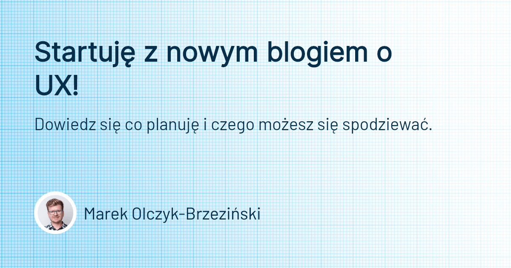
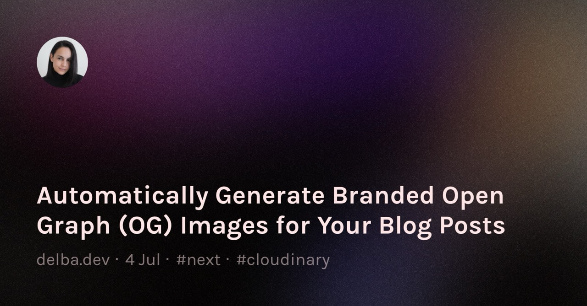
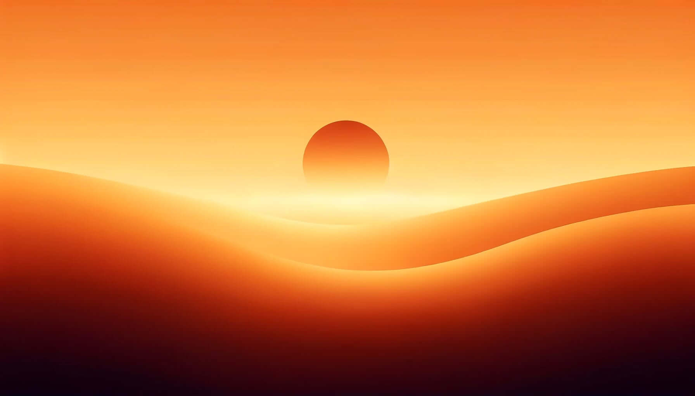
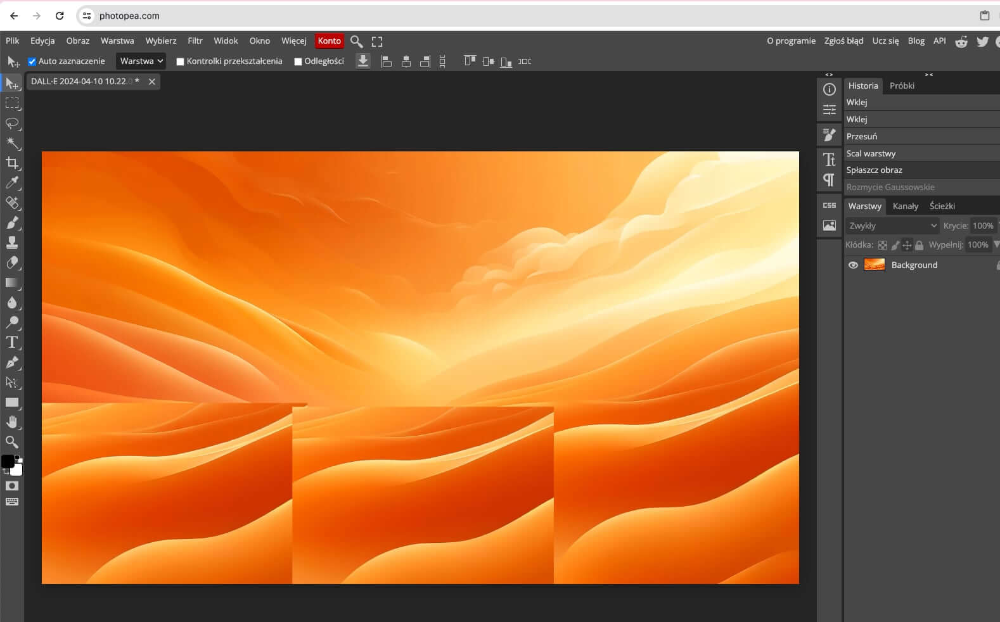
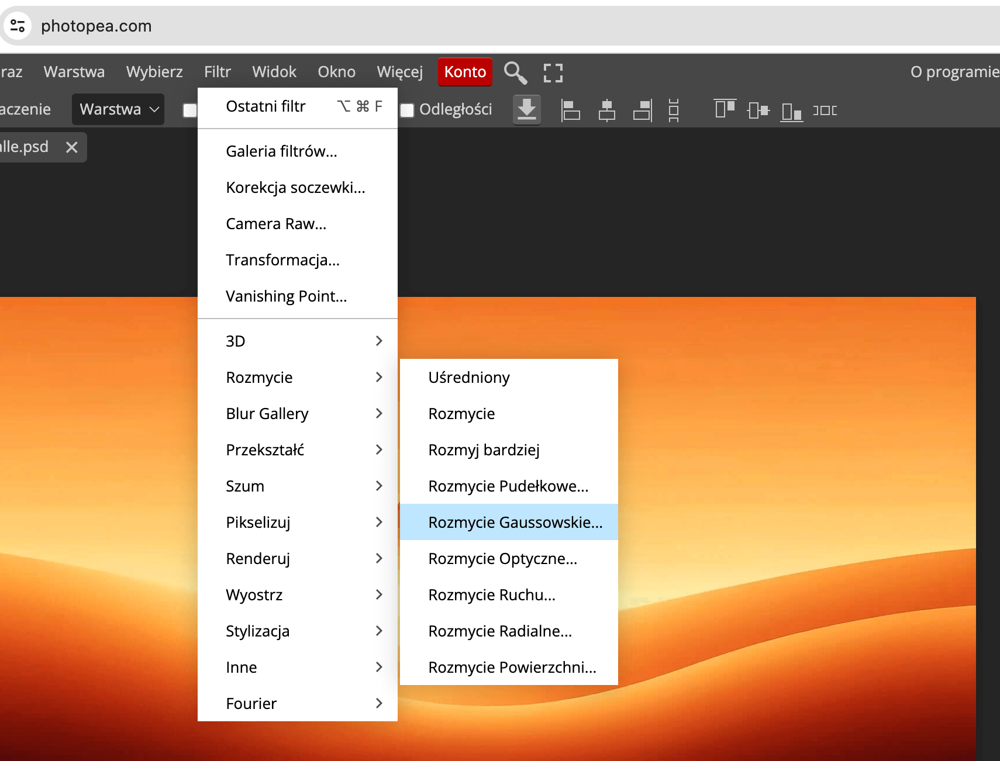
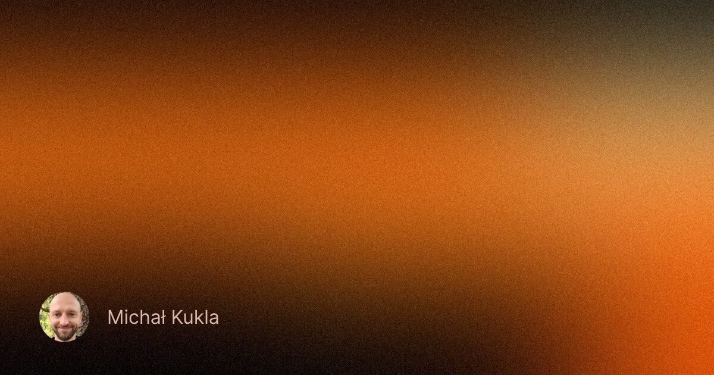

Marek Olczyk-Brzeziński pokazał mi u siebie na [blogu](https://marekbrzezinski.pl/) postawionym na Astro w jaki sposób generuje automatycznie obrazek [Open Graph](https://ogp.me/). (To ten, który pokazuje się w social media jako podgląd linku.)

Oto jego efekt:

Postanowiłem więc zrobić to samo dla mojego bloga (też Astro), bo to ułatwi mi przyciąganie uwagi i zachęcanie ludzi do wejścia na stronę bez konieczności przygotowywania za każdym razem obrazka. 

Zajęło mi to znacznie dłużej niż przypuszczałem.

Marek podesłał mi [link](https://github.com/delucis/astro-og-canvas/tree/latest/packages/astro-og-canvas) do projektu `astro-og-canvas`. Najpierw chciałem użyć sztucznej do wygenerowania konfiguracji, ale ChatGPT dał mi wadliwy kod, który nie uwzględniał ważnych rzeczy z dokumentacji. Zanim się zorientowałem, że rozwiązanie miałem pod ręką, to znalazłem [artykuł](https://aidankinzett.com/blog/astro-open-graph-image/), który naprowadził mnie na trop.

Szukając inspiracji na tło, znalazłem ciekawy [przykład](https://res.cloudinary.com/delba/image/upload/w_1600,h_836,q_100/l_text:Karla_72_bold:Automatically%2520Generate%2520Branded%2520Open%2520Graph%2520(OG)%2520Images%2520for%2520Your%2520Blog%2520Posts,co_rgb:ffe4e6,c_fit,w_1400,h_240/fl_layer_apply,g_south_west,x_100,y_180/l_text:Karla_48:delba.dev%2520%25C2%25B7%25204%2520Jul%2520%25C2%25B7%2520%2523next%2520%25C2%25B7%2520%2523cloudinary,co_rgb:ffe4e680,c_fit,w_1400/fl_layer_apply,g_south_west,x_100,y_100/l_twitter_name:delba_oliveira/c_thumb,g_face,r_max,w_380,h_380,q_100/fl_layer_apply,w_140,g_north_west,x_100,y_100/grain-gradient.png):

Zainspirowany, postanowiłem zrobić gradientowe tło.

Pomyślałem, że być może w [CSS](https://en.wikipedia.org/wiki/CSS) da się coś prosto zrobić. Przetestowałem kilkanaście generatorów i przewertowałem kilka stron z ciekawymi przykładami, ale ostatecznie nie udało mi się uzyskać pożądanego efektu.

Potem użyłem DALL-E do wygenerowania tła, ale nie mogłem go zmusić do zrobienia łagodnych przejść pomiędzy odcieniami.

Przypomniałem sobie jednak o [Photopea](https://photopea.com) (bezpłatnym odpowiedniku Photoshopa). Powklejałem fragmenty jednego z wygenerowanych przez DALL-E obrazków, żeby zasłonić niechciane kolory.

Następnie scaliłem wszystkie warstwy i zastosowałem Gaussowskie rozmycie, które zadziałało dokładnie tak, jak chciałem.

Potem dorzuciłem szumy (Filtr -> Szum), przyciąłem do formatu 1200x630, dodałem swoje zdjęcie oraz imię i nazwisko.

Chciałem jednak zrobić biały tekst na pomarańczowym tle. Sprawdziłem narzędziem [Contrast Checker](https://webaim.org/resources/contrastchecker/) czy tekst nie będzie zbyt mało widoczny i okazało się, że nie spełnia standardów. Powstawiałem więc kilka czarnych prostokątów u góry i dołu ekranu i udało mi się uzyskać taki efekt:

Zostało mi tylko ustawienie parametrów: wielkości czcionek, krojów, odstępów. Do tego musiałem przekazać odpowiednie zmienne w szablonach i przetestować kilka przypadków brzegowych (np. długi tytuł i opis, brakujący opis). 

Namęczyłem się trochę i nie jestem turbozadowolony z efektu. Czcionka z bloga trochę nie pasuje do tego tła. Do tego tło nie pasuje za bardzo do bloga 😅 Cieszę się jednak, że jest i nie muszę sam generować tych obrazków. Tło, fonty i kolorystykę zawsze mogę zmienić.

Chcesz zobaczyć jak wygląda cały wygenerowany obrazek z tekstem nałożonym na tło? Udostępnij ten wpis na social media albo w prywatnej wiadomości komuś, kto prowadzi swojego bloga 😎

A jeśli korzystasz z Astro i chcesz to zaimplementować u siebie, to możesz skorzystać z [publicznego repozytorium tego bloga](https://github.com/degregar/michalkukla-astro).