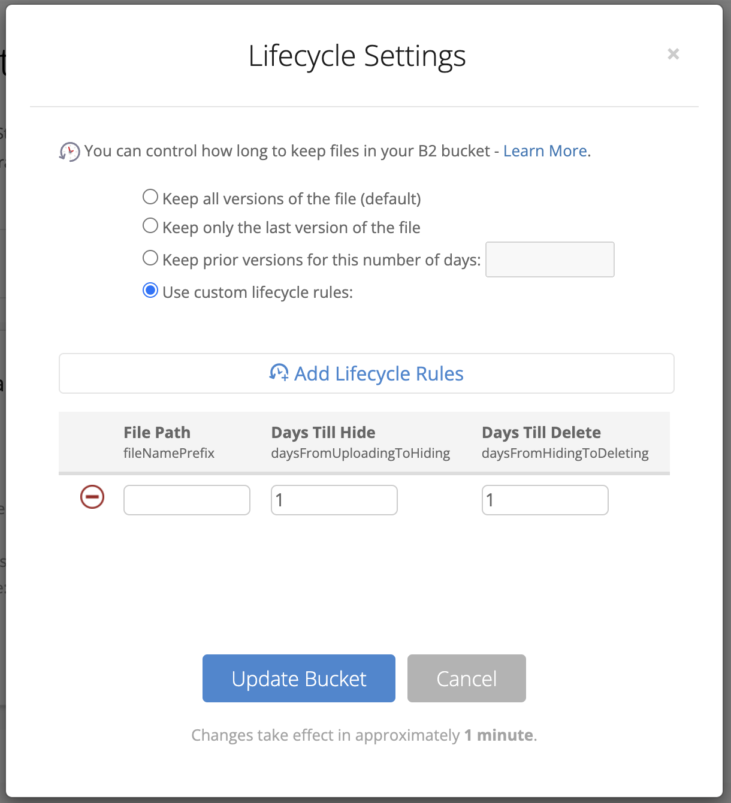

Ostatnio okazało się, że mój serwer, który wrzucał pliki z dyktafonu [[speechzap|SpeechZap]] do AssemblyAI, którego używam do transkrypcji, nie potrafi sobie poradzić z dużymi plikami. I przez *duże* mam na myśli > 40 MB 😅 

Do tej pory wrzucałem plik na swój *endpoint*, stamtąd na AssemblyAI. Nie mogę tego zrobić bezpośrednio z klienta do AssemblyAI, bo musiałbym udostępnić swój klucz API. To zły pomysł. 

Próbowałem strumieniowania, ale coś tam jednak się wykrzacza. Nie udało mi się odkryć co i dlaczego, ani nie chciałem się za bardzo zagłębiać, bo być może nie ma takiej potrzeby.

I faktycznie: odkryłem, że podczas zlecania transkrypcji wystarczy podać URL do zasobu w sieci, aby AssemblyAI poradziło sobie z pobraniem i transkrypcją. Nie muszę wysyłać pliku na ich serwery. 

Dlatego postanowiłem wrzucić te pliki na własny *bucket*, z użyciem *pre-signed URL*. To świetna metoda, bo nie trzeba udostępniać całego *bucketu* ani poszczególnych plików publicznie. A tego byśmy nie chcieli...

Jakub Mrugalski [zarekomendował alternatywę](https://www.linkedin.com/posts/unknow_jak-ogarniam-backupy-na-serwerach-jako-w%C5%82a%C5%9Bciciel-activity-7234831510762135554-6XAl?utm_source=share&utm_medium=member_desktop) dla S3, którego używałem do tej pory: [Backblaze B2](https://www.backblaze.com/). Koszt 5x mniejszy i kompatybilne z S3. W to mi graj! Potrzebuję przecież tylko łatwo przerzucić plik z klienta do AssemblyAI, najlepiej z pominięciem mojego serwera (bo po co mam go dodatkowo obciążać?).

No i udało się! Choć nie było prosto. Problem z CORS, jak zwykle 😅

## Jak ustawić CORS do uploadu na Backblaze B2?

Najpierw próbowałem ustawiać CORS z poziomu panelu w Backblaze. Nie dawało to ŻADNYCH rezultatów, choć dawałem uprawnienia do wszystkiego, niezależnie od *origin*. (Jak ja nienawidzę tych CORSów...)

Okazało się, że przykłady z dokumentacji są liche i trzeba się solidnie wczytać, żeby odkryć co jest nie tak. Można używać paczek AWS do wysyłania plików tak, jakbyśmy wysyłali je do S3 (np. `@aws-sdk/client-s3` i `@aws-sdk/s3-request-presigner`), więc w ustawieniach CORS musiałem wstawić metodę `s3_put`. Dla pewności dodałem wszystkie, które mogły być potrzebne:

```json
[  
  {  
    "corsRuleName": "uploadFromAnyOrigin",  
    "allowedOrigins": ["*"],  
    "allowedHeaders": ["*"],  
    "allowedOperations": [  
      "b2_download_file_by_id",  
      "b2_download_file_by_name",  
      "b2_upload_file",  
      "s3_delete",  
      "s3_get",  
      "s3_head",  
      "s3_post",  
      "s3_put"  
    ],  
    "maxAgeSeconds": 3600  
  }  
]
```

Miałem też problem z komendą do publikacji tych reguł, ostatecznie użyłem takiej:

```bash
b2 bucket update --cors-rules "$(<./cors_rules.json)" speechzap-prod allPublic
```

## Automatyczne usuwanie plików

Nie chciałem komplikować sobie za bardzo zarządzania plikami ani niepotrzebnie trzymać plików klientów na serwerze. AssemblyAI automatycznie usuwa pliki wrzucone na ich serwer po 24 godzinach albo zaraz po zrobieniu transkrypcji.

Na szczęście jest możliwość automatycznego usuwania plików. Co prawda odbywa się to w dwóch krokach:
1. Ukryć plik (min. 1 dzień po utworzeniu)
2. Usunąć ukryty plik (min. 1 dzień po ukryciu)



To już na początek wystarczy. W następnym kroku zrobię automatyczne usuwanie zaraz po zrobieniu transkrypcji. To zwiększy bezpieczeństwo danych moich użytkowników i zmniejszy koszty utrzymywania.

## Podsumowanie

Muszę przyznać, że jestem zadowolony z tego rozwiązania. Pliki z aplikacji znacznie szybciej kończą się wysyłać, a to kluczowe, aby cały plik trafił na serwer jak najszybciej, zanim jeszcze użytkownik wyłączy aplikację. Android i iOS wprowadzają spore ograniczenia na pracę aplikacji w tle.

Nie wiem jakie będą ostatecznie koszty tego rozwiązania, ale póki co z obliczeń wychodzi na to, że w przypadku [[speechzap|SpeechZap]] są one pomijalne w porównaniu do kosztu samej transkrypcji i formatowania.