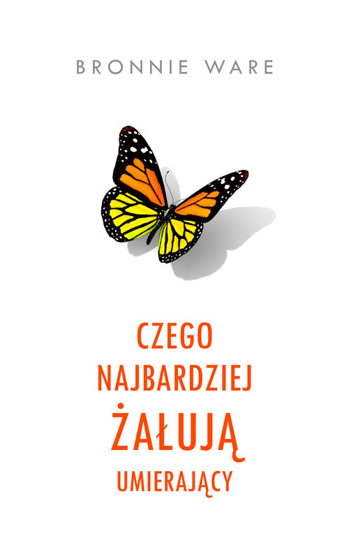

To dla mnie turboważna książka. Przeczytałem ją późno, ale w trakcie bardzo ważnych dla mnie życiowych zmian. Kończyłem wtedy pracę na pełen etat i chodziłem na psychoterapię.

Kiedy zaczynam tracić kontakt ze sobą, martwić się przyszłością, zastanawiać, czy powinienem to, czy tamto, czy ustalam priorytety to często wracam myślami do 5 rzeczy, których najbardziej żałują umierający.

1. **Chciałbym, żebym miał odwagę żyć życiem wiernym sobie, a nie życiem, którego oczekiwali ode mnie inni.** Pierwszy i najczęstszy żal dotyczy braku odwagi do realizacji własnych marzeń i życia zgodnie z własnymi przekonaniami, zamiast kształtować swoje życie pod wpływem oczekiwań innych.
    
2. **Chciałbym, żebym nie pracował tak ciężko.** Ten żal był szczególnie często wyrażany przez mężczyzn, którzy żałowali, że poświęcili zbyt dużo czasu na pracę kosztem czasu spędzonego z rodziną i przyjaciółmi.
    
3. **Chciałbym mieć odwagę wyrazić swoje uczucia.** Wiele osób żałowało, że nie wyraziły swoich prawdziwych uczuć i emocji. Utrzymywanie emocji w sobie przyczyniało się do niespełnienia i gorzkiego żalu.
    
4. **Chciałbym pozostać w kontakcie ze swoimi przyjaciółmi.** Żal dotyczący zaniedbania starych przyjaźni i braku czasu na pielęgnowanie relacji z bliskimi przyjaciółmi był również często wyrażany.
    
5. **Chciałbym, żebym pozwolił sobie być szczęśliwszym.** Ten żal wiązał się z uświadomieniem sobie, że szczęście jest wyborem. Wiele osób żałowało, że pozwoliło trwać w starych wzorcach i przyzwyczajeniach, nie pozwalając sobie na zmiany, które mogłyby przynieść więcej radości do ich życia.

Ta książka jest też w zgodzie z buddyjskimi wartościami i filozofią slow life, którymi staram się kierować w życiu.