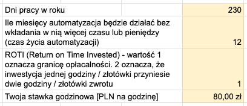

Automatyzacja to jedno z najpotężniejszych narzędzi, jakie mamy do dyspozycji w erze cyfrowej. Pozwala na oszczędność czasu, redukcję błędów i zwiększenie wydajności. 

Oczekuje się, że rynek cyfrowej transformacji wzrośnie z 2.5 tryliona dolarów w 2024 do prawie [4 trylionów dolarów w 2027 roku](https://www.statista.com/statistics/870924/worldwide-digital-transformation-market-size/). Wydaje się to być nieuniknione.

Ale czy zawsze warto automatyzować?

Aby odpowiedzieć na to pytanie, musimy dokładnie przeanalizować, które procesy są odpowiednie do automatyzacji i jakie korzyści możemy z niej uzyskać.

W tym artykule przyjrzymy się, kiedy automatyzacja ma sens, a kiedy lepiej skupić się na ręcznym wykonywaniu zadań. 

Przedstawię konkretne przykłady z różnych branż, takich jak hotelarstwo, SPA, usługi, produkcja, rzemiosło, biznes i usługi profesjonalne, aby pokazać, jak automatyzacja może wpływać na różne sektory.

Na końcu pokażę prosty arkusz kalkulacyjny, który stworzyłem, aby z grubsza szybko ocenić, czy warto inwestować czas i/lub pieniądze w automatyzację.
## Czym jest automatyzacja?

Automatyzacja polega na odciążeniu człowieka z ręcznych, powtarzalnych zadań. Używamy w tym celu systemów komputerowych, oprogramowania lub maszyn, które mogą działać autonomicznie lub z minimalnym nadzorem.

Automatyzacja obejmuje szeroki zakres technologii, od prostych skryptów komputerowych po zaawansowane systemy sztucznej inteligencji i robotyki.

Jako [konsultant](https://michalkukla.pl/konsultacje) skupiam się głównie na dostępnym, popularnym oprogramowaniu, które łatwo integruje się z innymi systemami. Jako programista jestem w stanie połączyć wszystkie narzędzia, aplikacje oraz sztuczną inteligencję, by stworzyć dedykowane rozwiązanie.

## Korzyści z automatyzacji

Automatyzacja przynosi wiele korzyści zarówno w kontekście osobistym, jak i biznesowym. Oto kilka najważniejszych:

1. **Oszczędność czasu**

Jednym z głównych powodów, dla których warto rozważyć automatyzację, jest znacząca oszczędność czasu. Zamiast poświęcać godziny na wykonywanie powtarzalnych zadań, możemy zautomatyzować procesy i skupić się na bardziej strategicznych działaniach.

2. **Zwiększenie wydajności**

Automatyzacja pozwala na wykonywanie zadań szybciej i dokładniej niż w przypadku ręcznej pracy. Systemy automatyczne nie męczą się, nie popełniają błędów wynikających z rutyny i mogą pracować bez przerwy, co znacznie zwiększa wydajność operacyjną.

3. **Redukcja błędów**

Ludzki błąd jest nieunikniony, szczególnie przy rutynowych zadaniach. Automatyzacja minimalizuje ryzyko popełnienia błędów, co jest szczególnie istotne w procesach wymagających precyzji, takich jak obliczenia finansowe czy zarządzanie danymi.

4. **Skalowalność**

Automatyzacja umożliwia łatwe skalowanie operacji. Niezależnie od tego, czy zwiększa się liczba zamówień w sklepie internetowym, czy rośnie ilość danych do przetworzenia, zautomatyzowane systemy mogą szybko dostosować się do nowych wymagań bez konieczności proporcjonalnego zwiększania zasobów ludzkich.

5. **Oszczędność kosztów**

Choć początkowy koszt wdrożenia automatyzacji może być wysoki, długoterminowe oszczędności są znaczące. Mniejsze potrzeby kadrowe, redukcja błędów i zwiększenie wydajności przekładają się na niższe koszty operacyjne.

6. **Poprawa jakości pracy**

Dzięki automatyzacji pracownicy mogą skupić się na bardziej kreatywnych i wymagających zadaniach, co zwiększa ich satysfakcję z pracy i pozwala lepiej wykorzystać ich potencjał.

Podsumowując, automatyzacja to potężne narzędzie, które może znacząco poprawić efektywność, wydajność i jakość pracy. W kolejnych rozdziałach przyjrzymy się dokładniej, kiedy warto automatyzować procesy, a kiedy lepiej pozostawić je w rękach człowieka.

## Kiedy warto automatyzować?

Automatyzacja może przynieść wiele korzyści, ale kluczem do jej skutecznego wdrożenia jest zrozumienie, które procesy są najbardziej odpowiednie do automatyzacji. 

Oto kilka kryteriów, które pomogą zdecydować, kiedy warto zainwestować w automatyzację.

### Powtarzalność procesów

Najlepszymi kandydatami do automatyzacji są procesy powtarzalne. Zadania, które wykonujemy regularnie w ten sam sposób, są idealne do zautomatyzowania. Przykłady to:

- Przetwarzanie faktur
- Generowanie raportów
- Zarządzanie bazami danych
- Monitorowanie systemów IT

Powtarzalność zapewnia, że raz zaprogramowane narzędzia będą mogły działać przez długi czas bez konieczności ciągłych zmian.

### Stabilność procesów

Procesy stabilne, czyli te, które nie ulegają częstym zmianom, są również dobrymi kandydatami do automatyzacji. Jeśli zasady, według których działa proces, są stałe, automatyzacja może działać skutecznie i bezproblemowo przez dłuższy czas. Przykłady obejmują:

- Procedury księgowe
- Standardowe operacje produkcyjne
- Obsługa zamówień w e-commerce

### Wysoka częstotliwość wykonywania zadań

Procesy wykonywane często, nawet jeśli są czasochłonne, mogą przynieść znaczące korzyści z automatyzacji. Im częściej zadanie jest wykonywane, tym większa oszczędność czasu i zasobów. Przykłady to:

- Codzienne tworzenie kopii zapasowych
- Codzienna analiza danych
- Regularne aktualizacje systemów

### Przykłady zadań, które warto automatyzować

1. **Obsługa klienta**: Chatboty mogą automatycznie odpowiadać na często zadawane pytania, co oszczędza czas pracowników i zapewnia szybką pomoc klientom.
2. **Marketing**: Automatyzacja kampanii e-mailowych, postów w mediach społecznościowych i analiz rynkowych pozwala na skuteczniejsze działania marketingowe.
3. **Finanse**: Automatyzacja fakturowania, płatności i raportowania finansowego zapewnia dokładność i terminowość, redukując jednocześnie ryzyko błędów.

### Automatyzacja jako narzędzie przewagi operacyjnej

Automatyzacja może znacząco poprawić efektywność, obniżyć koszty i zwiększyć jakość usług w różnych branżach. Dzięki niej przedsiębiorstwa mogą zyskać przewagę konkurencyjną, koncentrując się na dostarczaniu podstawowej wartości.

Oto przykłady [[co-warto-automatyzowac|co warto automatyzować]] w ramach swojej podstawowej działalności:
#### Branże hospitality i usługowe

- **Zarządzanie rezerwacjami**: Automatyczne systemy rezerwacyjne i powiadomienia poprawiają obsługę klienta i zmniejszają ilość nieodebranych rezerwacji.
- **Zarządzanie zapasami**: Monitorowanie zapasów w czasie rzeczywistym i automatyczne zamawianie składników w restauracjach optymalizuje zarządzanie zasobami.
#### Branże produkcyjne i rzemieślnicze

- **Zarządzanie zleceniami**: Automatyczne przyjmowanie i przetwarzanie zamówień oraz śledzenie postępu realizacji poprawia efektywność.
- **Zarządzanie zapasami i sprzedażą**: Automatyczne monitorowanie stanu zapasów i generowanie raportów sprzedażowych wspiera planowanie i decyzje biznesowe.

#### Branże biznesowe i profesjonalne

- **Zarządzanie rezerwacjami i logistyką**: Systemy CRM i automatyczne harmonogramowanie optymalizują procesy sprzedaży i zarządzania wydarzeniami.
- **Tworzenie raportów i analiz**: Automatyzacja raportowania pomaga w analizie danych i podejmowaniu lepszych decyzji biznesowych.

### Podsumowanie

Automatyzacja jest najskuteczniejsza w przypadku powtarzalnych, stabilnych procesów wykonywanych często. W takich przypadkach może znacznie zwiększyć efektywność, zmniejszyć koszty i poprawić jakość pracy. 

Podane przykłady odciążają pracowników i pozwalają skupić się na kluczowych działaniach i podstawowej wartości, jaką dostarcza firma. 

Jednak automatyzacje nie zawsze mają sens. Przyjrzyjmy się kiedy lepiej nie inwestować czasu ani pieniędzy.

## Kiedy automatyzacja nie ma sensu?

Automatyzacja może przynieść wiele korzyści, ale nie wszystkie procesy są odpowiednie do automatyzacji. W pewnych sytuacjach lepiej jest pozostawić zadania w rękach ludzi. Oto kilka kryteriów, które pomagają zidentyfikować, kiedy automatyzacja może nie mieć sensu.

### Procesy jednorazowe lub rzadko wykonywane

Automatyzacja ma sens przede wszystkim wtedy, gdy proces jest wykonywany regularnie. Jeśli zadanie jest jednorazowe lub rzadko się powtarza, inwestowanie czasu i zasobów w jego automatyzację może nie być opłacalne. Przykłady obejmują:

- **Tworzenie jednorazowych raportów**: Sporadyczne raporty, które nie wymagają regularnych aktualizacji, mogą być szybciej wykonane ręcznie.
- **Jednorazowe projekty**: Projekty, które nie będą powtarzane, takie jak jednorazowa kampania marketingowa czy przeprowadzenie wyjątkowego wydarzenia.

Zamiast automatyzacji warto wtedy zrobić dokładny opis lub checklistę, która pomoże pracownikowi przypomnieć sobie poszczególne kroki.
### Zadania wymagające kreatywności lub ludzkiego osądu

Pewne zadania wymagają ludzkiej kreatywności, empatii i osądu, które są trudne do zautomatyzowania. Chociaż sztuczna inteligencja, w szczególności modele językowe (LLM) jak GPT, znacząco wspierają procesy kreatywne, wciąż istnieją obszary, gdzie ludzki wkład jest niezbędny. Przykłady obejmują:

- **Tworzenie treści**: Pisanie kreatywnych tekstów, projektowanie graficzne czy tworzenie strategii marketingowych często wymaga indywidualnego podejścia i intuicji. Choć LLM mogą generować treści i wspierać w burzy mózgów, ostateczne decyzje i subtelności twórcze często pozostają w gestii człowieka.
- **Obsługa klienta**: Automatyczne systemy mogą odpowiadać na proste pytania, ale skomplikowane problemy i sytuacje wymagające empatii najlepiej obsługują ludzie. LLM mogą wspierać pracowników poprzez sugerowanie odpowiedzi lub analizę sentymentu, ale nie zastąpią w pełni ludzkiej interakcji.

### Procesy zbyt skomplikowane lub zmienne

Jeśli proces jest bardzo złożony lub jego zasady często się zmieniają, automatyzacja może być trudna do wdrożenia i utrzymania. Przykłady obejmują:

- **Złożone decyzje biznesowe**: Procesy decyzyjne, które uwzględniają wiele zmiennych i często się zmieniają, mogą wymagać ludzkiej intuicji i elastyczności. Chociaż sztuczna inteligencja może wspierać analizy i dostarczać rekomendacje, ostateczne decyzje często należą do ludzi.
- **Zmienne procedury operacyjne**: Jeśli procedury w firmie są często modyfikowane, utrzymanie aktualnych systemów automatyzacji może być czasochłonne i kosztowne.

### Niski potencjał oszczędności czasu lub kosztów

Automatyzacja powinna przynieść znaczące oszczędności czasu lub kosztów, aby była opłacalna. Jeśli korzyści z automatyzacji są niewielkie, lepiej skupić się na innych działaniach. Przykłady obejmują:

- **Drobne zadania administracyjne**: Jeśli zadanie zajmuje tylko kilka minut tygodniowo, inwestowanie w jego automatyzację może nie przynieść znaczących korzyści.
- **Niskie koszty pracy**: W sytuacjach, gdzie koszty pracy są bardzo niskie, oszczędności wynikające z automatyzacji mogą nie uzasadniać inwestycji.

### Podsumowanie

Automatyzacja jest potężnym narzędziem, ale nie zawsze jest odpowiednia. Warto dokładnie przeanalizować procesy w firmie, aby zidentyfikować te, które mogą przynieść największe korzyści z automatyzacji, i te, które lepiej pozostawić w rękach ludzi.

W kolejnych rozdziałach omówimy, jak ocenić opłacalność automatyzacji, aby podjąć świadomą decyzję.

## Jak ocenić opłacalność automatyzacji?

Ocena opłacalności automatyzacji jest kluczowa dla podjęcia decyzji o inwestycji w automatyzację procesów. Aby pomóc w tej ocenie, przygotowałem [prosty arkusz kalkulacyjny](https://docs.google.com/spreadsheets/d/1JNkBThPDiliYwiC8k7cujK9iHpv8Pb6TXm8Tm-EPXpY/edit?gid=0#gid=0), który pozwala oszacować, ile czasu i/lub pieniędzy można zainwestować w automatyzację rutynowych zadań.

Poniżej przedstawiam, jak korzystać z tego narzędzia i jak interpretować jego wyniki.

### Krok 1: Wprowadzenie danych

Na początku należy wprowadzić kilka podstawowych danych do arkusza kalkulacyjnego:

- **Dni pracy w roku**: Liczba dni, w których planujemy pracować w ciągu roku (np. 230 dni).
- **Ile miesięcy automatyzacja będzie działać bez dodatkowych inwestycji**: Szacowany czas, przez który automatyzacja będzie działać bez konieczności dodatkowych nakładów pracy lub pieniędzy (np. 12 miesięcy).
- **ROTI (Return on Time Invested)**: Wskaźnik, który określa granicę opłacalności. Wartość 1 oznacza, że inwestycja jednej godziny przyniesie godzinę zwrotu. Wartość 2 oznacza, że inwestycja jednej godziny przyniesie dwie godziny zwrotu (np. 1).
- **Stawka godzinowa pracownika**: Koszt jednej godziny pracy (dla różnych przykładów poniżej).

### Krok 2: Ile CZASU możesz zainwestować w automatyzację?

Tabela "Ile CZASU możesz zainwestować w automatyzację rutynowych zadań?" pozwala oszacować, ile czasu można poświęcić na automatyzację w zależności od tego, jak często wykonujemy zadanie i ile czasu zajmuje jego pojedyncze wykonanie.

Na przykład:

- Jeśli zadanie zajmuje 1 sekundę i jest wykonywane 50 razy dziennie, można poświęcić na automatyzację 3,2 godziny.
- Jeśli zadanie zajmuje 5 minut i jest wykonywane raz w tygodniu, można poświęcić na automatyzację 3,3 godziny.

### Krok 3: Ile PIENIĘDZY możesz zainwestować w automatyzację?

Tabela "Ile PIENIĘDZY możesz zainwestować w automatyzację rutynowych zadań?" przelicza czas na pieniądze, uwzględniając stawkę godzinową pracownika. Dzięki temu można oszacować, ile pieniędzy można przeznaczyć na automatyzację danego zadania.

Na przykład:

- Jeśli zadanie zajmuje 1 sekundę i jest wykonywane 50 razy dziennie, można zainwestować w automatyzację 256 zł.
- Jeśli zadanie zajmuje 5 minut i jest wykonywane raz w tygodniu, można zainwestować w automatyzację 307 zł.

### Przykłady użycia arkusza kalkulacyjnego

#### Branże hospitality i usługowe

**Tworzenie [[wskazniki-spa|raportu przychodów ze SPA]]**:

- **Obecna sytuacja**: Menedżer spędza 3 godziny miesięcznie na generowanie 2 raportów.
- **Po automatyzacji**: Generowanie 7 raportów bez angażowania menedżera.
- **Oszczędność czasu**: 3 godziny miesięcznie.
- **Stawka godzinowa**: 50 zł/h.
- **Oczekiwany czas życia automatyzacji**: 36 miesięcy.
- **Maksymalny czas inwestycji w automatyzację**: Z tabeli wynika, że dla zadania wykonywanego raz w miesiącu przez 3 godziny, można zainwestować około 3 tygodni, czyli około 120 godzin.
- **Maksymalny koszt inwestycji**: Dla stawki 50 zł/h, można zainwestować około 6 000 zł.

**Generowanie raportu kasowego**:

- **Obecna sytuacja**: Właściciel firmy spędza 1 dzień (8 godzin) każdego miesiąca na przygotowanie raportu kasowego z papierowych raportów kasowych z 5 różnych punktów handlowych
- **Po automatyzacji**: Pracownicy wprowadzają dane do systemu, a właściciel tylko weryfikuje zapisy, co zajmuje 2 godziny.
- **Oszczędność czasu**: 6 godzin.
- **Stawka godzinowa**: 100 zł/h.
- **Oczekiwany czas życia automatyzacji**: 24 miesiące.
- **Maksymalny czas inwestycji w automatyzację**: Z tabeli wynika, że dla zadania wykonywanego raz w miesiącu przez 8 godzin, można zainwestować około 3.6 tygodnia, czyli około 144 godziny.
- **Maksymalny koszt inwestycji**: Dla stawki 100 zł/h, można zainwestować około 14 400 zł.

#### Branże produkcyjne i rzemieślnicze

**Automatyczne zamawianie części zamiennych w warsztacie samochodowym**:

- **Obecna sytuacja**: Mechanik spędza 1 godzinę dziennie na zamawianie części.
- **Po automatyzacji**: System automatycznie zamawia części, a mechanik tylko weryfikuje zamówienia.
- **Oszczędność czasu**: 45 minut dziennie.
- **Stawka godzinowa**: 35 zł/h.
- **Oczekiwany czas życia automatyzacji**: 18 miesięcy.
- **Maksymalny czas inwestycji w automatyzację**: Z tabeli wynika, że dla zadania wykonywanego raz dziennie przez 1 godzinę, można zainwestować około 1.7 miesiąca, czyli około 285 godzin.
- **Maksymalny koszt inwestycji**: Dla stawki 35 zł/h, można zainwestować około 10 000 zł.

#### Branże biznesowe i profesjonalne

**Zarządzanie rezerwacjami w agencji nieruchomości**:

- **Obecna sytuacja**: Agent spędza 30 minut dziennie na zarządzanie rezerwacjami.
- **Po automatyzacji**: System automatycznie zarządza rezerwacjami.
- **Oszczędność czasu**: 30 minut dziennie.
- **Stawka godzinowa**: 40 zł/h.
- **Oczekiwany czas życia automatyzacji**: 12 miesięcy.
- **Maksymalny czas inwestycji w automatyzację**: Z tabeli wynika, że dla zadania wykonywanego raz dziennie przez 30 minut, można zainwestować około 2,9 tygodnia, czyli około 116 godzin.
- **Maksymalny koszt inwestycji**: Dla stawki 40 zł/h, można zainwestować około 4 640 zł.

**Automatyczne generowanie raportów dla przychodni**:

- **Obecna sytuacja**: Administrator spędza 1 godzinę dziennie na generowanie raportów.
- **Po automatyzacji**: Raporty są generowane automatycznie, a administrator weryfikuje je tylko raz na jakiś czas.
- **Oszczędność czasu**: 5 godzin tygodniowo.
- **Stawka godzinowa**: 35 zł/h.
- **Oczekiwany czas życia automatyzacji**: 18 miesięcy.
- **Maksymalny czas inwestycji w automatyzację**: Z tabeli wynika, że dla zadania wykonywanego codziennie godzinę, można zainwestować około 2,2 miesiąca, czyli około 370 godzin.
- **Maksymalny koszt inwestycji**: Dla stawki 35 zł/h, można zainwestować około 12 950 zł.

**Organizacja cotygodniowych promocji w sklepie detalicznym**

Sklep detaliczny wpadł na pomysł organizacji promocji na wybrane produkty przez okres 3 miesięcy. Każdego tygodnia menedżer spędza 1 godzinę na przygotowaniu materiałów promocyjnych, aktualizowaniu systemu sprzedaży i informowaniu klientów o nowych promocjach. Proces ten obejmuje ręczne wprowadzanie danych, projektowanie ulotek promocyjnych i zarządzanie kampanią e-mailową.

- **Oczekiwany czas życia automatyzacji**: 3 miesiące.
- **Potencjalna oszczędność czasu**: 1 godzina tygodniowo.
- **Stawka godzinowa menedżera**: 50 zł/h.
- **Maksymalny czas inwestycji w automatyzację**: Z tabeli wynika, że dla zadania wykonywanego raz w tygodniu przez godzinę, można zainwestować około 1.4 dnia, czyli około 11 godzin w automatyzację. Dla stawki 50 zł/h, można zainwestować około 550 zł. 
- **Czy warto?** Automatyzacja tak wielu czynności może być skomplikowana. Jeśli promocje nie będą kontynuowane po trzech miesiącach, to być może na tym etapie nie warto inwestować. Można zastanowić się nad rozbiciem procesu na mniejsze zadania i przeanalizowane ich opłacalności osobno.

#### Podsumowanie

Ten [arkusz kalkulacyjny](https://docs.google.com/spreadsheets/d/1JNkBThPDiliYwiC8k7cujK9iHpv8Pb6TXm8Tm-EPXpY/edit?gid=0#gid=0) to proste, ale skuteczne narzędzie do oceny opłacalności automatyzacji. Dzięki niemu można szybko i łatwo oszacować, ile czasu i pieniędzy można zainwestować w automatyzację, aby była ona opłacalna.

Zachęcam do korzystania z tego narzędzia przy podejmowaniu decyzji o automatyzacji w swojej firmie.

## Konkluzja

Automatyzacja może być potężnym narzędziem, które zwiększa efektywność, redukuje koszty i poprawia jakość usług oraz produktów. Kluczowe jest jednak zrozumienie, kiedy automatyzacja ma sens, a kiedy lepiej pozostawić procesy w rękach ludzi.

W artykule omówiłem kryteria, które pomagają w podjęciu decyzji o automatyzacji, oraz przedstawiłem zarówno pozytywne, jak i negatywne przykłady jej zastosowania.

### Kluczowe wnioski:

1. **Powtarzalność procesów**

Automatyzacja ma największy sens w przypadku powtarzalnych zadań, które są wykonywane regularnie. Procesy te są idealne do zautomatyzowania, ponieważ korzyści z automatyzacji będą rosnąć w miarę ich częstego powtarzania.

2. **Stabilność procesów**

Procesy, które są stabilne i nie ulegają częstym zmianom, są doskonałymi kandydatami do automatyzacji. Automatyzacja niestabilnych lub często zmieniających się procesów może być kosztowna i nieefektywna.

3. **Częstotliwość wykonywania zadań**

Im częściej zadanie jest wykonywane, tym większe korzyści z automatyzacji. Procesy wykonywane codziennie lub kilka razy w tygodniu przyniosą znacznie większe oszczędności czasu i kosztów niż te wykonywane sporadycznie.

4. **Analiza kosztów i zysków**

Przy ocenie opłacalności automatyzacji należy uwzględnić zarówno koszty wdrożenia i utrzymania automatyzacji, jak i oszczędności czasu oraz kosztów operacyjnych. Warto wykorzystać narzędzia, takie jak [mój arkusz kalkulacyjny](https://docs.google.com/spreadsheets/d/1JNkBThPDiliYwiC8k7cujK9iHpv8Pb6TXm8Tm-EPXpY/edit?gid=0#gid=0), do dokładnego oszacowania potencjalnych korzyści.

5. **Unikanie automatyzacji na zapas**

Automatyzacja na zapas, zwłaszcza na wczesnym etapie wdrażania nowych procesów, może być nieefektywna. Procesy często zmieniają się na początku, więc lepiej poczekać, aż staną się stabilne i powtarzalne, zanim zainwestuje się w ich automatyzację.

## Potrzebujesz pomocy w automatyzacji?

Jeśli potrzebujesz konsultacji, czy warto inwestować w automatyzację, lub wsparcia w organizacji pracy, zarządzaniu zadaniami oraz wdrożeniu i przeprowadzeniu całego procesu automatyzacji, jestem tutaj, aby pomóc. 

Dzięki mojej wiedzy i doświadczeniu w integracji narzędzi, dostarczaniu raportów oraz tworzeniu kultury gromadzenia danych, możemy wspólnie zoptymalizować procesy w Twojej firmie, zwiększając jej efektywność i konkurencyjność.

[Skontaktuj się ze mną](https://michalkukla.pl/konsultacje), aby umówić się na konsultację i rozpocząć drogę do bardziej efektywnego biznesu!

