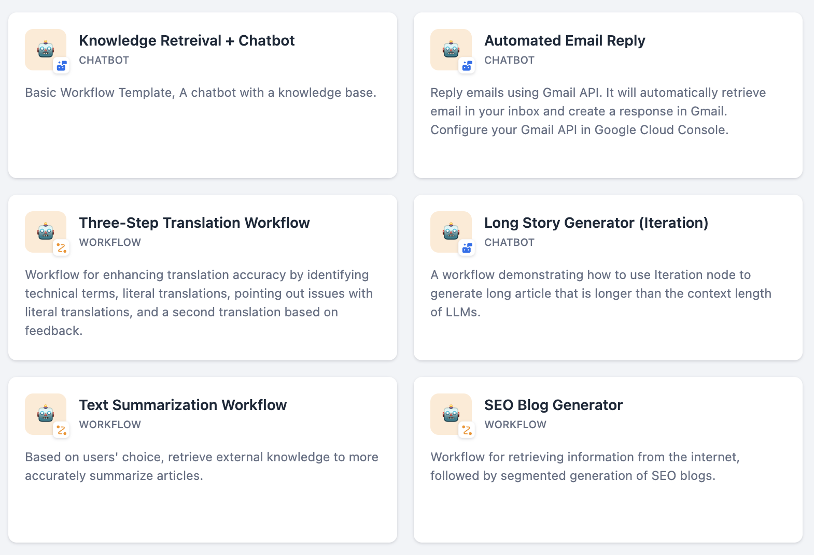
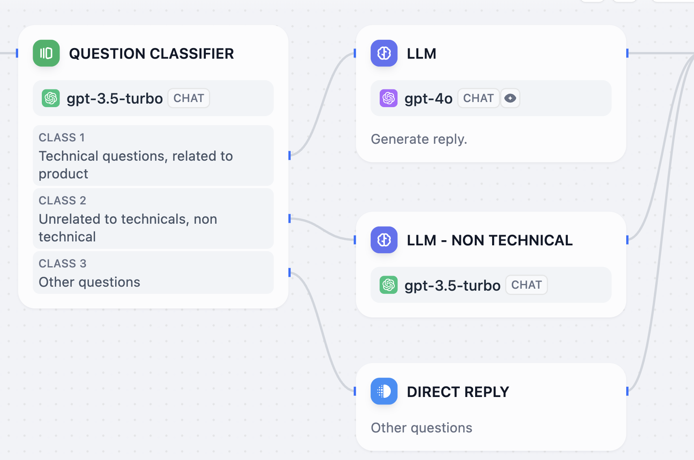

W dzisiejszym świecie, gdzie treść i automatyzacja odgrywają kluczową rolę w biznesie, wiele firm boryka się z wyzwaniami związanymi z tworzeniem treści oraz integracją sztucznej inteligencji w swoich procesach. Tradycyjne metody są często czasochłonne i wymagają dużych zasobów.

Obecnie borykam się z marketingiem aplikacji [[speechzap|SpeechZap]], dlatego postanowiłem przetestować narzędzia, które mi w tym pomogą.

Do tej pory poznałem dwa: [Quivr](https://www.quivr.com/) i [Dify](https://dify.ai/). I o ile opinie o Quivr są bardzo dobre, o tyle wypada blado przy bardziej rozbudowanym i konfigurowalnym Dify.

Dlatego dzisiaj opowiem o tym:
- czym jest to narzędzie,
- jakie możliwości w nim widzę,
- (dla nietechnicznych) jak można korzystać z wersji chmurowej i ...
- (dla programistów) jakie wyzwania napotkałem stawiając to samodzielnie.

## Czym jest Dify?

Dify.ai to platforma do rozwijania aplikacji opartych na dużych modelach językowych (LLM). Umożliwia też automatyzację procesów biznesowych.

Dify.ai oferuje:

- **Orkiestrację aplikacji AI**: Umożliwia wizualne projektowanie aplikacji AI w jednym miejscu, co ułatwia integrację różnych procesów.
- **Budowanie autonomicznych agentów AI**: Użytkownicy mogą tworzyć agentów, którzy samodzielnie wykonują złożone zadania, korzystając z danych i narzędzi zdefiniowanych przez przedsiębiorstwo.
- **Integrację z istniejącymi systemami**: Dify pozwala na płynne włączenie AI w struktury firmy, co zwiększa efektywność i optymalizację procesów.
- **Zarządzanie danymi i modelami**: Narzędzie monitoruje działanie modeli AI, co pozwala na ich ciągłe doskonalenie i dostosowywanie do zmieniających się potrzeb biznesowych.

Dzięki Dify, firmy mogą szybko wprowadzać innowacje, automatyzować procesy oraz tworzyć aplikacje AI, które są dostosowane do ich specyficznych wymagań.

Ten powyższy, ogólny opis przygotowało mi Perplexity i nie bardzo wiadomo co to w praktyce oznacza, dlatego powiem jeszcze jak ja to widzę.

## Po co mi to?

Mam już całkiem sporo artykułów na moim blogu. Do tego tworzę treści na social media (IN, FB, X, wip.co). I mam wiele projektów. Czasami pytam sztuczną (np. ChatGPT) o:
- nowe pomysły na akcje marketingowe,
- sposoby dotarcia do mojej grupy docelowej,
- tematy na nowe posty czy artykuły.

Jednak aby uzyskać sensowne rezultaty, to muszę załadować dużo kontekstu.

A tego kontekstu przecież mam już sporo. Codziennie opisuję (w myśl idei *build-in-public*) postępy w pracach nad moimi projektami. Jednak całego bloga nie załaduję do kontekstu, bo to uciążliwe i zniechęcające.

I tutaj właśnie z pomocą przychodzi Dify. Mogę stworzyć bazę wiedzy (artykuły z bloga, Business Model Canvas, treści postów na socialach, itp.) i rozpocząć konwersację w taki sposób, w jaki korzystałbym z Chat GPT.

Tylko tym razem, na podstawie mojego zapytania, Dify wybierze te fragmenty z bazy wiedzy, które będą istotne dla wykonania zadania, np. przygotowania opisu aplikacji SpeechZap do sklepu.

Taka technologia nazywa się RAG (*Retrieval-Augmented Generation*).

Zastosowań jest oczywiście znacznie więcej. Na tej samej zasadzie działają na przykład chat boty oparte o sztuczną inteligencję, które potrafią odpowiadać na pytania klientów, korzystając z przygotowanej bazy wiedzy.

Można więc powiedzieć, że w obecnych czasach *context is king*, a Dify dostarcza właśnie kontekst.
## Przecież można prościej...

\- Ale dobra - powiesz - przecież jest Chat GPT i można tworzyć swoich agentów w taki właśnie sposób (*custom GPT*).

\- Tak. Można. I tak też robiłem. Tylko tego nie da się zintegrować z niczym. Nie ma API.

\- Ale dobra - powiesz - można stworzyć własnych asystentów i używać API.

\- *Fair enough*. Ale nie można wykorzystywać innych modeli niż te od OpenAI. A przecież rynek *generative AI* jest już ogromny. Poza tym nie da się tworzyć bardziej rozbudowanych automatyzacji...

## Automatyzacje

Dify potrafi jednak znacznie więcej, niż robienie prostego RAG i chatbota opartego na dostarczonej bazie wiedzy. Można połączyć ze sobą [wiele narzędzi](https://cloud.dify.ai/tools) (wyszukiwarki, narzędzia LLM, narzędzia Google, i wiele innych) i stworzyć automatyzacje, które wykonują za Ciebie rzeczy, wymagające specyficznej wiedzy.

Garść inspiracji znajdziesz w [zakładce Explore](https://cloud.dify.ai/explore/apps).

Jak widać, możesz np. stworzyć swojego własnego chat bota i wstawić na stronę. Będzie odpowiadał na pytania klientów na podstawie danych o ofercie.

Inny przykład: automatyczne odpowiadanie na emaile. Dify może najpierw sprawdzić jakiego rodzaju pytanie padło w treści, a następnie wybrać odpowiednią bazę wiedzy i przygotować na jej podstawie odpowiedź.

## Wersja chmurowa

Zacząłem od wersji Cloud, jednak szybko natrafiłem na ograniczenia:
- limit do 50 plików w bazie wiedzy (sama seria [[1-sukces-dziennie|1 sukces dziennie]] na moim blogu ma już ponad 90 postów)
- próbowałem Business Model Canvas dla [[speechzap|SpeechZap]] wrzucić w *chunkach* po jednym na każdy segment (9 sztuk) i okazało się, że to dostępne jest tylko w wersji premium 😞

Ale wiem, że jest wersja [self-hosted](https://docs.dify.ai/getting-started/install-self-hosted), a ja mam własny serwer (w sumie trzy, nie wiedzieć po co 😅). Mógłbym najpierw postawić lokalnie na własnym komputerze, ale zależało mi, żebym już mógł stopniowo zintegrować moje narzędzia z Dify.

## Self-hosted

Do hostowania projektów *open-source* korzystam z [CapRover](https://caprover.com/). Niestety, w przypadku Dify nie ma tzw. *one-click app*, co jest chyba największą zaletą tego narzędzia. Wszystkie serwisy trzeba wyklikać po kolei samemu, ustawiając poszczególne zmienne środowiskowe.

Postawiłem serwisy (w takiej kolejności):
- Postgres
- Redis
- Weaviate
- API
- Web

Obrazy dockerowe wziąłem z pliku `docker-compose.yml` z repozytorium.

## Serwer

Przy pierwszej próbie uruchomienia wywalił mi się serwer VPS hostowany w Hetzner. *Deploy* zajął mi na 10 minut 200% procesora (oba vCPU jakie miałem dostępne) i uznałem, że może warto coś pozmieniać w konfiguracji serwera.

Ku mojemu zaskoczeniu okazało się, że mam dostępny lepszy VPS za mniej hajsu! Do tej pory miałem 2vCPU, 4GB RAM, 80GB SSD i zrobiłem *rescale* do 4vCPU (reszta to samo). Wcześniej kosztowało 9.7 € teraz 6.3 € 😲
## Migracje

Dłuższą chwilę walczyłem z migracjami. Podczas próby instalacji wywalało mi błąd dostępu do nieistniejącej tabeli. Okazało się, że muszę włączyć migrację za pomocą flagi `MIGRATION_ENABLED` 😲 Dopiero wtedy przy starcie apki odpaliły się migracje i mogłem instalować.

## Inne problemy

Następnym problemem był komunikat:
> Setup failed: Could not connect to the endpoint URL (...) private.pem

Wynikało to z źle ustawionego URL do S3, w którym trzymam pliki.

Wywaliło mi się też podczas indeksowania pliku, bo host serwera Redis był nieprawidłowy (ale to już moja nieuwaga).

## Bez workera?

Uznałem, że będę stawiał to, co jest konieczne. Jeśli coś wybuchnie, to dopiero wtedy będę dokładał kolejne serwisy. I w ten sposób, po postawieniu podstawowej aplikacji (co było dla mnie źródłem dużej satysfakcji), okazało się, że nie działa indeksowanie plików dodawanych do bazy wiedzy. Cały czas wisiało na statusie `Queuing`. 

W [docsach](https://docs.dify.ai/getting-started/install-self-hosted/docker-compose) doczytałem, że potrzebny jest jeszcze `worker`. Ma to sens. Postawiłem szybko kolejny serwis, kopiując wszystkie zmienne środowiskowe i zmieniając jedynie `MODE` z `api` na `worker`. Indeksowanie poszło od kopa.

## Ile to kosztuje?

Sam RAG, oparty o *embeddings* nie jest bardzo kosztowny. Oczywiście, im większy model i im więcej treści, tym drożej. Gdy przy poprzednich, droższych i słabszych modelach OpenAI indeksowałem całą moją bazę wiedzy w Obsidian (ponad 2.5mln znaków), kosztowało ok. \$0.60, czyli jakieś 2.5 zł.

Znacznie więcej będzie kosztować oczywiście generowanie treści z użyciem droższych modeli typu `gpt-4o`, bo do kontekstu będą trafiać fragmenty treści z bazy wiedzy, trzeba doliczyć *prompt* i zwrotka z modelu językowego zazwyczaj jest kilkukrotnie droższa od tego, co do modelu wprowadzamy.

## Podsumowanie

Dify pozwala zintegrować mojego aplikacje z LLM. Dzięki temu mogę za pomocą API stworzyć bazę wiedzy, uruchomić zaawansowany *workflow* i odblokować nowe możliwości.

Do tej pory korzystałem z ChatGPT Plus, więc płaciłem \$20 miesięcznie i musiałem ręcznie załadować bazę wiedzy, a potem ręcznie wprowadzać komendy.

W Dify płacę za wygenerowane tokeny, ale:
- nie mam limitów konwersacji,
- mogę zautomatyzować moje procesy,
- mogę użyć dowolnego modelu dostępnego na rynku.

Im więcej będę korzystał z Dify, tym mniej będzie mi się chciało wracać do ChatGPT. Łatwiej będzie wtedy przesiąść się zupełnie.