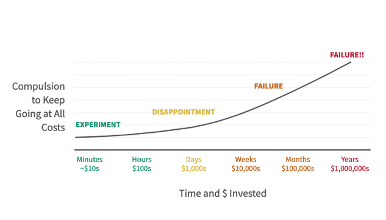
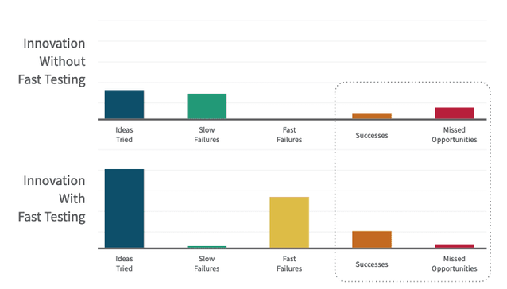

Nie lubię straszyć, ale czasem trudno uniknąć pokazywania negatywnych konsekwencji, od których raczej wolelibyśmy stronić. Wolę uczyć jak w zgodzie ze slow life wprowadzać produkty na rynek.

Więc mam nadzieję, że potraktujesz ten post bardziej jako UŚWIADAMIANIE, które pozwoli Ci podjąć samodzielną decyzję, w miarę na chłodno.

Poniżej znajdziesz listę negatywnych konsekwencji nietestowania pomysłów biznesowych.

Większość z nich odczułem sam na sobie, realizując [[moje-startupy|różne projekty]]. Pozostałe są wynikiem researchu w internetach i [[polecane-ksiazki|książkach]].

Na końcu tej listy zastanowimy się jeszcze czy są jakieś pozytywy z nietestowania pomysłów biznesowych.

## Negatywne konsekwencje nietestowania pomysłów biznesowych

Efekty nietestowania pomysłów biznesowych możemy podzielić na kilka kategorii, choć łączą się one ściśle ze sobą.

### Biznesowe konsekwencje

#### 1. Marnowanie zasobów

Inwestowanie czasu, energii i pieniędzy w nieprzetestowany pomysł może prowadzić do strat, jeśli okazuje się, że pomysł nie przyciąga klientów lub nie spełnia ich oczekiwań.

Skąd te straty?

Po pierwsze, z samego **kosztu stworzenia produktu**. Zdarzyło mi się dwukrotnie poświęcić rok na development, po czym rynek zaorał pomysł w tydzień po starcie (patrz: [[kuznia-spotkan|Kuźnia Spotkań]]).

Po drugie, z powodu **efektu kosztów utopionych**.

Popatrz na poniższy wykres. Pokazuje „Przymus kontynuowania za wszelką cenę” w zależności od zainwestowanych zasobów.

Źródło: https://www.pretotyping.org/

Na początku, kiedy poświęcacasz minuty, godziny i góra kilkaset dolarów, to jeszcze jest eksperyment. Nie przywiązujesz się aż tak bardzo do tego projektu.

Po zainwestowanych dniach i tysiącach dolarów zaczynasz odczuwać rozczarowanie i frustrację.

Im dalej w las, im więcej pieniędzy i czasu zainwestowane, tym większy odczuwamy PRZYMUS do kontynuowania, bo przecież już tyle zainwestowaliśmy.

**To pułapka**, którą funduje nam nasz własny umysł.

A jeśli pomysł nie wypali, to ostatecznie kończymy spektakularną porażką.

Wg Alberto Savoia, **porażka to najbardziej prawdopodobny scenariusz** 🤷

Bardziej sprawdza się tutaj podejście: fail fast.

#### 2. Brak produktu/market fit

Bez testowania pomysłów biznesowych istnieje ryzyko, że produkt nie będzie odpowiadał na rzeczywiste potrzeby rynku, co może prowadzić do niepowodzenia przedsięwzięcia.

Brak produktu/market fit oznacza sytuację, w której firma nie jest w stanie zaspokoić potrzeb konkretnego segmentu rynku, a produkt nie ma wystarczającej wartości dla klientów, aby cieszyć się trwałym sukcesem. W rezultacie, pomysł może okazać się nieopłacalny, a firma może nie przetrwać długoterminowo.

Oto kilka negatywnych konsekwencji braku produktu/market fit:

1. **Słaba retencja klientów**: Jeśli produkt nie spełnia oczekiwań klientów, prawdopodobieństwo, że zdecydują się na ponowny zakup, znacznie maleje. To może prowadzić do braku stałego dochodu dla firmy i trudności w osiągnięciu rentowności.
2. **Trudności w pozyskiwaniu nowych klientów**: Brak produktu/market fit może utrudniać pozyskiwanie nowych klientów, ponieważ niezadowoleni użytkownicy mogą przekazywać negatywne opinie, które zniechęcają potencjalnych klientów do próby produktu.
3. **Wysokie koszty marketingowe**: Firma może być zmuszona do ponoszenia wysokich kosztów marketingowych, aby przekonać klientów do wypróbowania produktu. W przypadku braku produktu/market fit, te działania mogą okazać się marnotrawstwem zasobów, gdyż pozyskani klienci szybko zrezygnują z produktu.
4. **Niskie morale w zespole**: Brak sukcesów na rynku może wpłynąć negatywnie na morale zespołu, co może prowadzić do spadku produktywności, utraty zaangażowania i nawet rezygnacji pracowników.
5. **Utrata konkurencyjności**: Jeśli firma nie jest w stanie szybko dostosować się do potrzeb rynku i znaleźć produktu/market fit, konkurenci mogą wykorzystać tę sytuację, wprowadzając na rynek produkty lepiej dostosowane do oczekiwań klientów.

#### 3. Mniej sukcesów, więcej straconych okazji

Przyjrzyj się teraz tym dwóm wykresom, które pokazują sytuacje w obliczu nietestowania i testowania pomysłów biznesowych:

Źródło: https://www.pretotyping.org/

BEZ TESTOWANIA mamy mało wypróbowanych pomysłów, dużo projektów umiera pomału, mamy mało szybkich porażek, mało sukcesów i dużo niewykorzystanych okazji.

JEŚLI TESTUJEMY, to jesteśmy w stanie wypróbować wiele pomysłów, mało z nich kończy się powolną śmiercią, wiele z nich szybko odrzucamy, no i osiągamy więcej sukcesów i mamy mało niewykorzystanych okazji.

Im bardziej brniemy w realizację projektów, których nie przetestowaliśmy, tym mniej zasobów mamy na przeprowadzanie eksperymentów i testowanie różnych nowych produktów, pomysłów i innowacji.

Nieprzetestowane pomysły mogą sprawić, że nie zauważysz niewykorzystanych nisz rynkowych, co może przyczynić się do utraty potencjalnych korzyści.

Nie dasz rady zrobić wszystkiego. Rozwadnianie uwagi na różne projekty i pomysły może prowadzić do niedokończenia tego projektu, który ma największą szansę na sukces.

#### 4. Trudności w przyciągnięciu inwestorów

Przedsiębiorcy mogą mieć trudności z przekonaniem inwestorów do wsparcia ich pomysłu, jeśli nie mogą przedstawić **dowodów** na jego atrakcyjność rynkową i weryfikacji hipotez.

Zdarzały się oczywiście w przeszłości czasy, w których inwestorzy rzucali się na wszystko, co miało związek z jakimś trendem czy popularną technologią.

Tak było w czasach bańki dotcomów (kilka ciekawych historii znajdziesz w książce _The Four Steps to Epiphany_) i tak jest ostatnio z inwestycjami w projekty oparte na sztucznej inteligencji.

Szaleństwo. Chciwość. Ślepota.

Mocne słowa? Oceniające? Zgadzam się. Wskazują jednak na niewłaściwe intencje i nieracjonalność w podejmowaniu decyzji.

Nawet w obliczu hype’u, można pozyskać dużo przekonujących danych, które dają szansę na to, że nie skończymy z negatywnymi konsekwencjami PSYCHOLOGICZNYMI.

A oto one.

### Psychologiczne konsekwencje

1. Wypalenie zawodowe

Praca nad nieprzetestowanym pomysłem może prowadzić do frustracji i długotrwałego stresu, gdy założyciele poświęcają dużo czasu i energii na przedsięwzięcie, które nie przynosi oczekiwanych wyników. Może to prowadzić do wypalenia zawodowego i pogorszenia zdrowia psychicznego.

To dla mnie szczególnie istotne w kontekście filozofii slow life, którą staram się wprowadzać na każdym kroku mojej biznesowej drogi.

2. Utrata motywacji

Gdy pomysł nie zdobywa rynku, założyciele mogą zacząć tracić wiarę w powodzenie projektu i motywację do kontynuowania pracy nad projektem.

3. Utrata wiary w siebie, niska samoocena

Niepowodzenie pomysłu może prowadzić do obniżenia poczucia własnej wartości założyciela, gdy zaczyna wątpić we własne umiejętności i talent.

4. Wzrost konfliktów wewnętrznych

Brak jasności co do wartości i potencjału pomysłu może prowadzić do konfliktów między założycielami, gdy próbują zdecydować, w którym kierunku powinno zmierzać przedsięwzięcie.

U siebie pamiętam jeden taki bardzo jaskrawy przykład: potrzeby-ua.org. Z drugim co-founderem nie mieliśmy zgody co do wizji i ja ciągnąłem w jednym kierunku, on w drugim. Nie mogliśmy zrobić wszystkiego i ostatecznie nie zrobiliśmy nic, sfrustrowani i z nadszarpniętym zaufaniem.

5. Poczucie izolacji

Jeśli pomysł nie sprawdza się, założyciele mogą odczuwać poczucie izolacji, gdy inni przedsiębiorcy odnoszą sukcesy, co może wpłynąć na ich zdolność do nawiązywania relacji biznesowych i społecznych.

Porównywanie się z innymi to w ogóle temat rzeka i powód wielu cierpień w naszym życiu. Samo nietestowanie może jeszcze dodatkowo podsycać te uczucia.

6. Zawód

Gdy pomysł nie spełnia oczekiwań, założyciele mogą doświadczać głębokiego zawodu, zwłaszcza jeśli zainwestowali dużo czasu, energii i zasobów w przedsięwzięcie.

To wywołuje zniechęcenie przed realizacją kolejnych przedsięwzięć, które mogłyby się okazać sukcesem.

7. Lęk przed przyszłością

Brak testowania pomysłu może zwiększyć lęk przed przyszłością, gdy założyciele zaczynają się martwić o swoje perspektywy zawodowe i finansowe, jeśli ich pomysł ostatecznie nie odniesie sukcesu.

Wielokrotnie czułem w sobie właśnie taki niepokój z tego powodu, że już któryś tydzień czy miesiąc pracuję nad projektem, na który nadal nie ma założonego popytu, nie mówiąc już o przychodach, które pozwoliłyby reinwestować środki w rozwój produktu.

8. Niewłaściwe priorytety

Skupienie się na nieprzetestowanym pomyśle może prowadzić do zaniedbywania innych obszarów życia, takich jak rodzina, przyjaciele czy zdrowie, co może wpłynąć na ogólną jakość życia założyciela.

I to znowu w kontekście slow life i szukania harmonii, równowagi w życiu, ma ogromne znaczenie.

9. Strach przed porażką

Brak testowania pomysłów może prowadzić do lęku przed niepowodzeniem, zwłaszcza jeśli inwestuje się dużo czasu i energii w projekt, który może nie odnieść sukcesu.

Co ciekawe, to też powód, dla którego NIE testujemy pomysłów. Boimy się, że nasz pomysł, może być mało wartościowy, zwłaszcza na etapie weryfikacji hipotez, kiedy jeszcze nasza wizja nie jest w pełni zrealizowana i trudno jest nam przedstawić klientom to, co mamy w głowie.

Z drugiej strony…

10. Nadmierna pewność siebie

Bez testowania pomysłów można łatwo ulec pułapce nadmiernej pewności siebie, wierząc, że pomysł na pewno się sprawdzi. To może prowadzić do podejmowania błędnych decyzji.

O ile pewność siebie jest potrzebna, chociażby po to, aby mieć motywację do działania, to powinna wynikać raczej z danych i wiedzy o rynku, czyli potrzebach klientów, niż z ego założyciela.

11. Trudności w podejmowaniu decyzji

Gdy pomysł nie jest testowany, założyciele mogą napotykać trudności w podejmowaniu decyzji, gdy brakuje im informacji zwrotnej na temat tego, co działa, a co nie.

12. Sabotaż

Brak skupienia prowadzi do zmniejszenia szansy na sukces projektu, który ma obecnie największe szanse. O skupieniu poczytasz więcej w książce _[[esencjalista-greg-mckeown|Esencjalista]]_.

To tyle z takich psychologicznych negatywnych konsekwencji, choć pewnie znalazłoby się jeszcze kilka, których tutaj nie wymieniłem.

Są jeszcze inne: długofalowe, organizacyjne, komunikacyjne i strategiczne konsekwencje, które zebrałem poniżej w krótkiej formie.

### Organizacyjne konsekwencje

1. Kultura organizacyjna

Nietestowanie pomysłów może prowadzić do niezdrowej kultury organizacyjnej, w której nie promuje się eksperymentów i uczenia się.

2. Brak współpracy

Jeśli pomysły nie są testowane, mogą powstać bariery między działami, co prowadzi do braku współpracy i komunikacji w organizacji.

3. Niewłaściwe zarządzanie ryzykiem

Nietestowanie pomysłów może prowadzić do niedoceniania potencjalnych zagrożeń związanych z danym przedsięwzięciem, co może wpłynąć na zdolność firmy do radzenia sobie z ryzykiem.

### Strategiczne konsekwencje

1. Słaba konkurencyjność

Firmy, które nie testują swoich pomysłów, mogą nie być w stanie szybko dostosować się do zmieniającego się rynku i konkurencji, co może wpłynąć na ich pozycję na rynku.

2. Błędne przewidywania rynkowe

Brak testowania pomysłów może prowadzić do błędnych prognoz dotyczących popytu na produkty lub usługi, co może skutkować złymi decyzjami strategicznymi.

### Prawne i regulacyjne konsekwencje

1. Naruszenie przepisów

Nietestowanie pomysłów może prowadzić do przypadkowego wprowadzenia produktów lub usług, które nie spełniają wymogów prawnych i regulacyjnych, co może prowadzić do kar finansowych i reputacyjnych.

2. Odpowiedzialność

W przypadku problemów z produktem lub usługą, które wynikają z braku testowania, przedsiębiorstwo może być pociągnięte do odpowiedzialności prawnej.

### Komunikacyjne i marketingowe konsekwencje

1. Niewłaściwe pozycjonowanie produktu

Nietestowanie pomysłów może prowadzić do błędów w pozycjonowaniu produktu na rynku, co może wpłynąć na skuteczność strategii marketingowych.

2. Słaba reputacja

Jeśli przedsiębiorstwo wprowadza na rynek nieskuteczny lub problematyczny produkt, może to wpłynąć negatywnie na jego reputację i zniechęcić potencjalnych klientów do korzystania z jego oferty.

## Pozytywy braku testowania pomysłów biznesowych – realne czy pozorne?

Niestestowanie pomysłów biznesowych, pozornie, ma swoje dobre strony. To często pułapka, w którą sam wielokrotnie wpadałem, więc przyjrzyjmy się bliżej tym konsekwencjom.

### 1. Pewność siebie

Pozwala szybko wystartować i przyciągnąć do siebie współzałożycieli. Nie zapalisz innych, jeśli samemu nie płoniesz.

Brak wiedzy na temat konkurencji i potencjalnych problemów związanych z pomysłem może prowadzić do większej pewności siebie założycieli. Mogą oni być bardziej zdecydowani i skoncentrowani na swoim pomyśle, nie przejmując się tym, co robią inni na rynku.

Jednak większa pewność siebie może prowadzić do arogancji i braku otwartości na krytykę oraz nowe pomysły, co może utrudnić rozwój przedsięwzięcia.

Pewność siebie oparta na braku wiedzy na temat konkurencji i potencjalnych problemów może prowadzić do błędnych przekonań i złych decyzji biznesowych.

### 2. Mniejsza obawa przed porażką i większa determinacja

Nie zawsze się pojawia. To raczej wynika ze struktury psychicznej. W każdym razie mniej uwagi poświęcasz potencjalnym zagrożeniom, więcej energii wkładasz w przebijanie się do przodu. Determinacja jest potrzebna w realizacji projektu.

Brak testowania pomysłu może prowadzić do mniejszej obawy przed porażką, ponieważ założyciele mogą być nieświadomi potencjalnych trudności i ryzyka związanego z ich pomysłem.

Choć brak obaw przed porażką może wydawać się korzystny, może prowadzić do lekceważenia ryzyka i niewłaściwego zarządzania nim, co zwiększa prawdopodobieństwo niepowodzenia przedsięwzięcia.

**Obawa przed porażką ma swoją pozytywną stronę**. Może być silną motywacją do poprawy, testowania i optymalizacji pomysłu, co zwiększa szanse na sukces.

### 3. Oszczędność czasu i zasobów

Testowanie również wymaga jakichś zasobów. Eksperyment często przeprowadza się w nieco sztucznych warunkach, stworzonych na potrzeby testu, albo ręcznie wykonuje operacje, które docelowo mają być zautomatyzowane (patrz: [[przepisywanie-paragonow-eksperyment|eksperyment z paragonami]]).

W teorii, omijanie testowania pomysłów może zaoszczędzić czas i zasoby, które można by wykorzystać na rozwijanie produktu czy usługi.

Jednak jest to krótkoterminowe podejście, które może prowadzić do długoterminowych strat, gdy przedsięwzięcie ostatecznie nie sprawdzi się na rynku.

Pojawia się tutaj efekt kosztów utopionych.

### 4. Szybsze wprowadzenie produktu na rynek

Nietestowanie pomysłów może pozwolić na szybsze wprowadzenie produktu na rynek, co w teorii może dać przewagę konkurencyjną.

Jednakże, jeśli produkt nie jest dobrze dopasowany do potrzeb klientów, może to prowadzić do niepowodzenia, zmniejszenia konkurencyjności lub dużego ograniczenia biznesu w postaci szklanego sufitu (operacyjnie nie zrobimy więcej lub rynek jest za mały) albo niewykorzystanego potencjału.

### 5. Przyciągnięcie uwagi dzięki zaskakującemu efektowi

Nietestowany pomysł może wzbudzić zainteresowanie mediów lub klientów dzięki swojemu zaskakującemu i innowacyjnemu charakterowi.

Jednak **taka sytuacja jest rzadkością**, raczej wynika z przypadku niż przemyślanej strategii i może być trudna do utrzymania, gdy rynek zaczyna oczekiwać coraz lepszych wyników.

### 6. Ochrona przed kradzieżą pomysłu

Słyszałem tę obiekcję wiele razy. Sam też padałem jej ofiarą.

Wstrzymanie się od testowania pomysłu może prowadzić do mniejszego ryzyka ujawnienia szczegółów przedsięwzięcia konkurencji, co zmniejsza prawdopodobieństwo kradzieży pomysłu.

Nieujawnianie pomysłu w celu uniknięcia kradzieży **może prowadzić do braku informacji zwrotnej od klientów i inwestorów**, co może utrudnić opracowanie skutecznego produktu.

W rzeczywistości, wiele pomysłów nie jest tak unikalnych, jak się wydaje, a ich **sukces zależy bardziej od wykonania i zdolności do dostosowania się do potrzeb rynku niż od samego pomysłu**.

### 7. Większa kreatywność

W niektórych przypadkach brak testowania pomysłów może prowadzić do większej kreatywności, gdy założyciele pozwalają sobie na eksperymentowanie i rozwijanie swojego pomysłu bez obaw o negatywną ocenę ze strony klientów czy inwestorów.

Choć brak testowania może prowadzić do większej kreatywności, może również prowadzić do opracowywania produktów, które nie są dopasowane do potrzeb rynku i klientów, co ostatecznie może prowadzić do niepowodzenia przedsięwzięcia.

Kreatywność może być również stymulowana przez informacje zwrotne i testowanie, które prowadzą do iteracji i rozwoju pomysłu w oparciu o rzeczywiste potrzeby klientów.

### 8. Skupienie na własnej wizji

Nietestowanie pomysłu może pozwolić założycielom na realizację własnej wizji bez konieczności dostosowywania się do oczekiwań rynku czy klientów. W niektórych przypadkach może to prowadzić do unikatowego i innowacyjnego rozwiązania.

Ale wizja założyciela może nie być zgodna z rzeczywistymi potrzebami rynku, co może prowadzić do opracowania produktów czy usług, które nie znajdują nabywców.

Ograniczenie się tylko do własnej wizji może prowadzić do braku innowacji i elastyczności, co jest kluczowe dla utrzymania konkurencyjności na dynamicznie zmieniających się rynkach.

---

## Podsumowanie

Jak widzisz, raczej nie starałem się na siłę znaleźć pozytywów. Może to efekt potwierdzania? 🙂

W podejściu, którego sam się uczę i którego uczę innych, wolę jednak przeprowadzać eksperymenty i testować pomysły biznesowe.

Wiedząc jednak o tych argumentach przemawiających za testowaniem pomysłów biznesowych, i tak wpadam w te same pułapki raz za razem. Czasami trudno jest mi przezwyciężyć moje nawyki myślowe.

Taka sytuacja ma miejsce zwłaszcza wtedy, kiedy uczę się nowego podejścia do biznesu, takiego jak na przykład budowanie marki osobistej albo build in public. Wtedy testuję różne techniki i formaty dzielenia się wiedzą (relacje, rolki, vlogi, blogi, live’y), a to wymaga to ode mnie wieeele pracy.

Czasami robię coś tylko dlatego, że to dla mnie ogromna frajda!

Wciąż na nowo wracam do rozważania nad tym **co jest dla mnie najważniejsze**, zwłaszcza w kontekście **slow life**. Rewiduję moje myśli, próbując wychwycić pułapki umysłu i emocje, które skłaniają mnie do brnięcia w czasochłonne projekty.