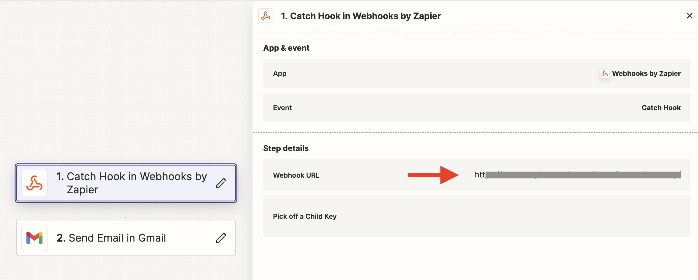

Zintegrowałem [Zapierem](https://zapier.com/) w kilka minut [[speechzap|SpeechZap]] i aplikację do zarządzania zadaniami [Remember The Milk](https://www.rememberthemilk.com/), pomimo, że RTM dopiero w wersji Pro umożliwia integrację z Zapierem i dostęp do API. Wystarczyło wysłać maila na specjalny adres.

Za chwilę pokażę Ci krok po kroku jak to zrobiłem.
## Dlaczego takie narzędzia?

W [[moj-system-zarzadzania-zadaniami|moim systemie do zarządzania zadaniami]] RTM służy często jako skrzynka odbiorcza (*inbox*): tam wpadają rzeczy, z którymi jeszcze nie wiem co zrobić, ale nie chciałbym, żeby mi uciekły.

Z kolei często takie rzeczy przychodzą mi do głowy wtedy, kiedy nie mogę ich zanotować lub jest to nieporęczne: na spacerze (chcę patrzeć na las, chmury, rzekę i góry, a nie w telefon) lub podczas jazdy samochodem (nie chcę zabić siebie ani kogoś).

Dlatego zadania nagrywam na [[speechzap|dyktafonie SpeechZap]]. Jednak tych nagrań nie przeglądam tak często jak RTM, maila czy codziennej notatki w Obsidian.

Mógłbym uruchomić integrację w SpeechZap w podobny sposób, w jaki [[integracja-speechzap-obsidian|integrowałem Obsidian]]. Niestety, w wersji bezpłatnej RTM nie ma integracji z Zapierem.

Ma jednak inną świetną funkcję, z której można skorzystać: **zadania dodawane przez email**.

## Jak zintegrować SpeechZap i Remember The Milk - krok po kroku

1. Przejdź do swojego konta Remember The Milk - na komputerze (na mobilce nie znalazłem tego).

2. Przejdź do strony *Ustawienia* (w prawym górnym rogu), sekcja *[Email tasks](https://www.rememberthemilk.com/app/#settings/email)* i skopiuj pierwszy email.

3. Utwórz w Zapier (lub Make) nowy zap z *webhookiem* i wysyłką emaili, np. przez Gmail.

4. Pobierz adres *webhooka* i dodaj go w SpeechZap w zakładce *[Akcje](https://app.speechzap.com/webhook-actions)* (nazwij np. *RTM*)

5. Nagraj testową notatkę, zrób transkrypcję i wywołaj akcję *RTM*, aby wysłać dane na *webhook* w Zapierze.

6. W Zapierze w kroku 2. z wysyłką emaili, podaj skopiowany z RTM adres email oraz *subject* i *body*, podając tam treść transkrypcji lub inne dane.

I to w zasadzie wszystko. 

Jeśli chcesz, możesz też od razu ustawić różne opcje w zadaniach, jak np. lista, tagi, priorytet, itd. Informacje na ten temat znajdziesz w dokumentacji [Remember The Milk for Email](https://www.rememberthemilk.com/services/email/).

Jeszcze podpowiedź na koniec: jeśli wolisz, możesz wysyłać maile do siebie i wykorzystywać swoją skrzynkę pocztową jako *inbox* zadań. Czasem też tak robię. Wystarczy wysłać wtedy na swój adres email.

Zazwyczaj, aby uniknąć kłopotów z dostarczaniem w niektórych programach i móc to dalej automatyzować (np. zrobić filtry w Gmail), dodaję do adresu email jeszcze specjalny dopisek, np. zamiast `michal@kukla.tech` wysyłam na `michal+self@kukla.tech`. Wtedy email trafia do skrzynki głównej: `michal@kukla.tech`.

Przydaje się to też do testowania aplikacji, żeby nie trzeba było zakładać wielu kont pocztowych.
