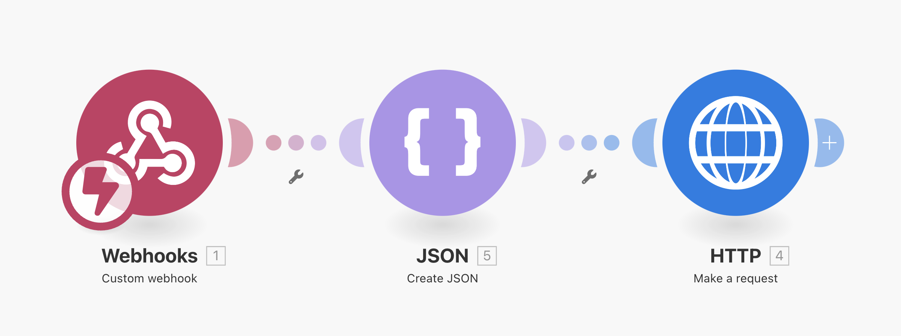
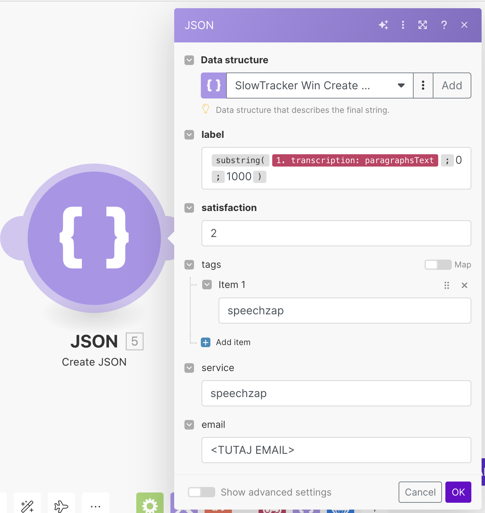
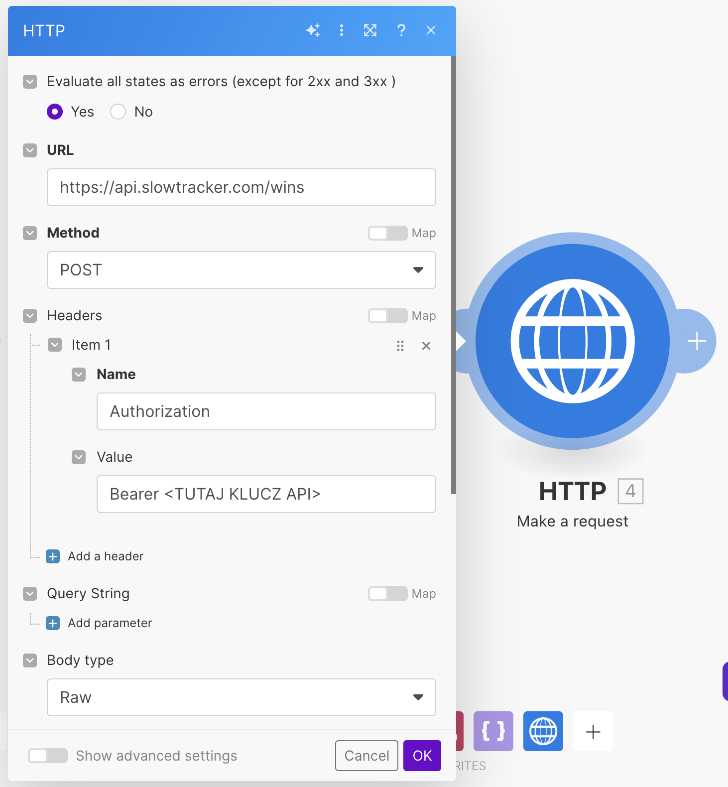

Aż dziwne, że dopiero teraz się za to zabrałem. Korzystam ze [[slowtracker|SlowTracker]] codziennie, bo z niego potem tworzę treści. Dyktafon [[speechzap|SpeechZap]] zrobiłem już półtorej miesiąca temu, ale wysyłanie transkrypcji z dyktafonu do SlowTracker zrobiłem dopiero wczoraj.

Dzisiaj pokażę jak jednym kliknięciem przesyłać notatki nagrane dyktafonem SpeechZap do aplikacji SlowTracker.
## Jak stworzyć scenariusz w Make?

Sprawa jest dość prosta. Wystarczy bezpłatne konto w Make i zaimportować [ten blueprint](https://michalkukla.pl/blueprints/speechzap-slowtracker.json). Jedyne, co trzeba zrobić, to:

1. Podać swój adres email w module JSON (wiem, to trochę głupie, ale to zaszłość z pierwszej wersji SlowTrackera)

2.  Podać klucz API do SlowTracker, który znajdziesz [tutaj](https://app.slowtracker.com/api-keys)

Jeśli chcesz, możesz stworzyć więcej scenariuszy, żeby móc wybrać poziom satysfakcji (od 1 do 3) na etapie wysyłania ze SpeechZap.

Możesz też użyć OpenAI lub innego LLM, aby na podstawie treści przygotować tagi, które dodasz do wpisu. Nie będę jednak komplikował tego przykładu, za to odsyłam Cię do wpisu [[messy-thoughts-workflow|Zautomatyzowane notatki z chaotycznych myśli]], gdzie wyjaśniam jak to osiągnąć.