Buduję wiele narzędzi biurowych z użyciem Arkuszy Google, bo łatwo jest na nich pracować w kilka osób, są potężne i darmowe.

Jednak użytkownikami zbudowanych przeze mnie narzędzi są często osoby mało techniczne, które nie zauważają, że nadpisały przygotowane przeze mnie formuły lub wprowadzają wadliwe lub niepełne dane.

Tak zdarzyło mi się ostatnio, gdy mój arkusz do tworzenia grafików dla pracowników przestał się aktualizować po zmianie pracownika i miesiąca.

Nie mam pretensji. Błędy ludzkie się zdarzają. Jako programista wolę oprogramowanie, które bije po łapkach za każdym razem, gdy użytkownik próbuje wpisać nieprawidłową wartość lub wejść nieprawidłowy stan (przykładowo [wpisać ujemną kwotę przelewu w więziennym sklepiku](https://www.facebook.com/sekurak/posts/pfbid0j8SuZNKhf2j4SbJKyZ5y78nKbRF6ac5jCssevXB14Fm4z8Q4Xmc6CmEfMZSfm8tvl) 😉). Jednak napisanie programu jest wielokrotnie droższe, niż zrobienie arkusza kalkulacyjnego.

Arkusz przyjmie wszystko. Ale czy musimy narażać się na niekompletne, niespójne dane i zepsute raporty?

Z pomocą przychodzi kilka metod:
- walidacja danych
- formatowanie warunkowe
- zabezpieczanie zakresów

Dzisiaj pokażę na [prostym arkuszu](https://docs.google.com/spreadsheets/d/1e6HYXe6Y91NLeS7oUWKiEu-wiRG5leMhxQUVdEDj9po/edit?usp=sharing) z danymi i raportem w jaki sposób można łatwo wprowadzić całkiem solidne zabezpieczenia przed zepsuciem sobie raportów, formuł i bazy danych.

## Omówienie arkusza

W przykładowym arkuszu mamy listę transakcji różnych osób, na wzór transakcji bankowych. Mamy więc dane takie jak:
- (A) data transakcji
- (B) wartość
- (C) typ operacji (uznanie lub obciążenie)
- (D) osoba, której dotyczy transakcja
- (E) tytuł operacji
- (F) opcjonalna notatka
- (G) data w formacie RRRR-MM

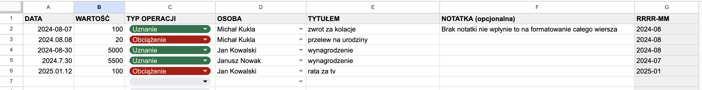

## Walidacja danych

Walidacja danych to sprawdzanie ich poprawności. Jeśli w każdej kolumnie żądamy od użytkownika danych w konkretnym formacie (np. liczba, data, prawda/fałsz, lista wyboru, itp.), wtedy możemy ograniczyć liczbę możliwości czy wariantów do wprowadzenia i uchronić nas przed błędami.
### Data

Możemy zacząć od sprawdzenia poprawności danych w kolumnie daty. To często przydaje się do zrobienia bardziej skomplikowanych tabel przestawnych. Możemy wyciągnąć rok i miesiąc (kolumna G) i zrobić np. raport miesięczny wszystkich transakcji (arkusz `RAPORT MIESIĘCZNY`):


Jednak jeśli data będzie nieprawidłowa, to rozwali nam to formułę wyciągającą rok i miesiąc, a tym samym cały raport:

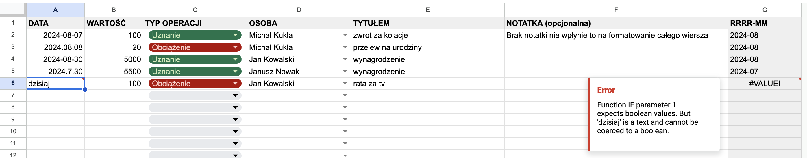

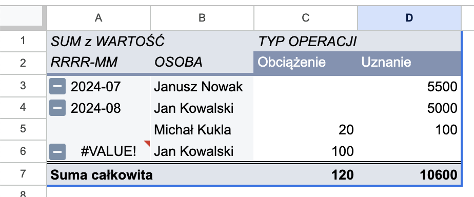

Możemy jednak ustawić regułę sprawdzania poprawności danych i upewnić się, że to, co wprowadzimy w kolumnie z datą jest na pewno datą. Do tego mamy wbudowaną regułę (w menu *Dane* -> *Sprawdzanie poprawności danych* -> panel po prawej stronie):

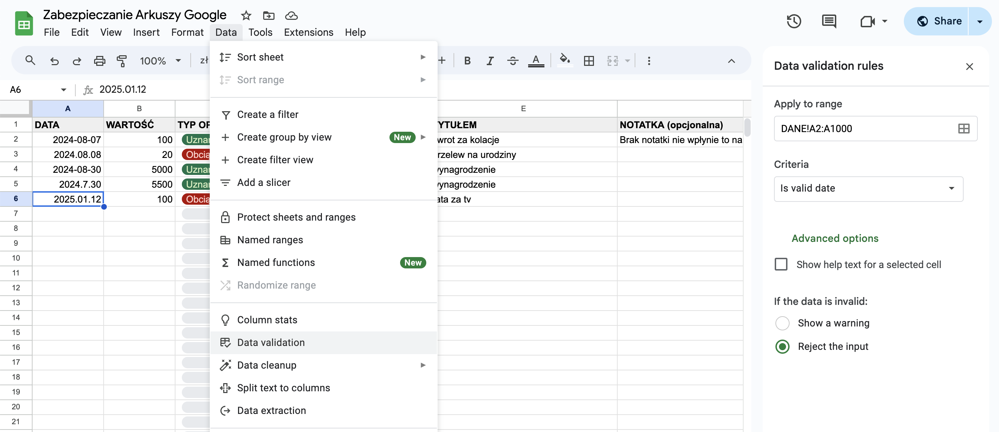

> [!tip] Pełny zakres danych
> Podając zakres `A2:A` reguła automatycznie ustawi nam zakres do ostatniego możliwego wiersza.

> [!tip] Dwa warianty informacji o błędzie
> Można wybrać co ma się zadziać, gdy wprowadzimy nieprawidłowe dane (pole *If the data is invalid*). Domyślnie jest pokazywanie ostrzeżenia (*Show a warning*), ale mało techniczny użytkownik naszego narzędzia może go nie zauważyć (przecież tyle się dzieje na ekranie!). 
> 
> Dlatego warto wybrać *Reject the input*. Wtedy program nie pozwoli wprowadzić nieprawidłowej wartości.
> 
> Domyślny komunikat jest mało czytelny, dlatego warto podać więcej informacji po zaznaczeniu pola *Show help text for a selected cell* (zobacz przykład z walidacją wartości 👇).

### Wartość

Nasz arkusz skonstruowaliśmy w taki sposób, że podajemy zawsze wartości dodatnie, a znak operacji (czy na plus, czy na minus) określamy wybierając typ operacji (uznanie lub obciążenie).

Błędem będzie więc, jeśli wprowadzimy wartość ujemną. Aby to zabezpieczyć dodajemy kolejną regułę, tym razem na zakres `B2:B`, sprawdzając, czy wartość jest większa lub równa 0:

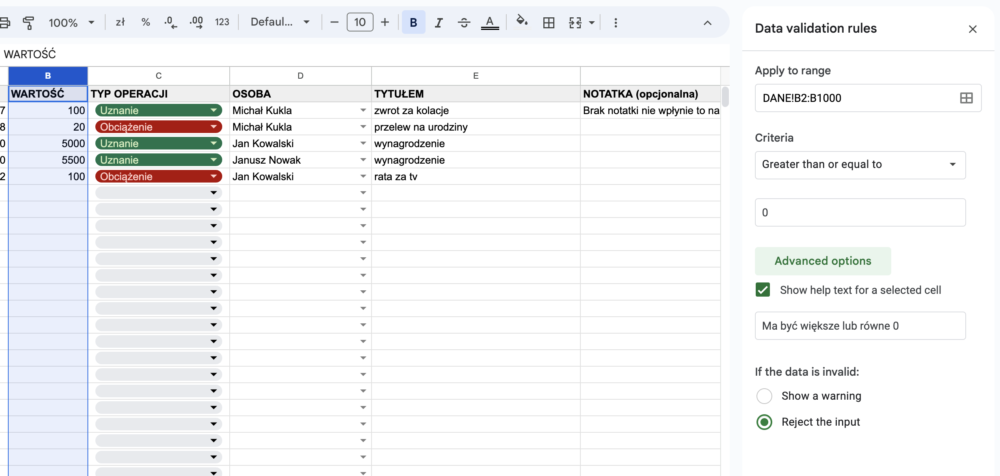

Gdy wprowadzimy wartość `-1` zobaczymy coś takiego:

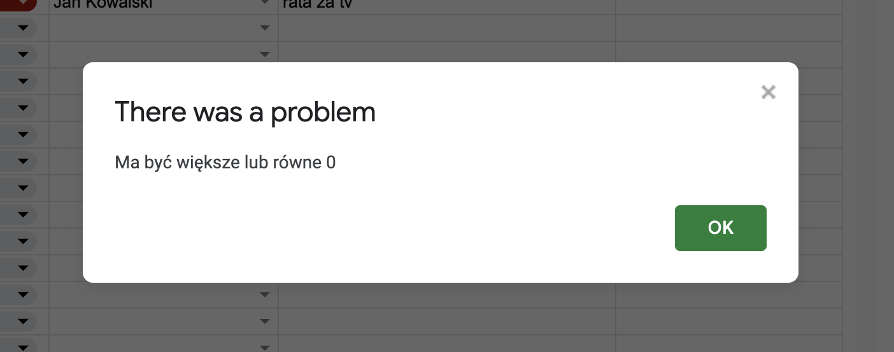

### Typ operacji

Mamy do wyboru dwie operacje: uznanie lub obciążenie. Nie ma innej możliwości. Do sprawdzenia poprawności danych świetnie nada się tutaj lista wyboru (*dropdown*):

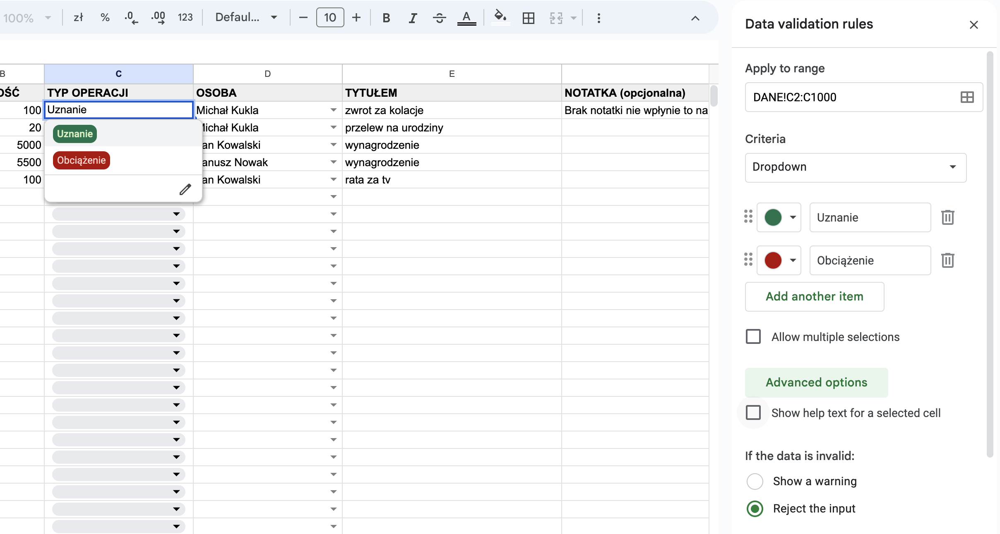

> [!tip] Co jeszcze nam daje lista wyboru?
> Warto wykorzystywać listę wyboru do przyspieszenia wprowadzania danych. Jeśli mamy często używane dane (np. godziny zabiegów i nazwy zabiegów w [[wskazniki-spa|arkuszu wskaźników SPA]]), to dodanie ich do takiej listy przyspieszy znacznie wprowadzanie danych. Tym samym zwiększy szansę na to, że użytkownicy będą z tego korzystać.

### Osoba

W poprzednim przykładzie użyliśmy statycznej listy, bo mieliśmy tylko dwie możliwości i wiedzieliśmy, że nigdy nie będzie ich więcej. Czasami jednak potrzebujemy wybrać pozycję z bardziej dynamicznej listy.

Często używam tego podejścia do listy pracowników czy produktów, które trzymam w osobnej tabeli. W naszym przypadku wstawiłem listę osób do arkusza `OSOBY`:

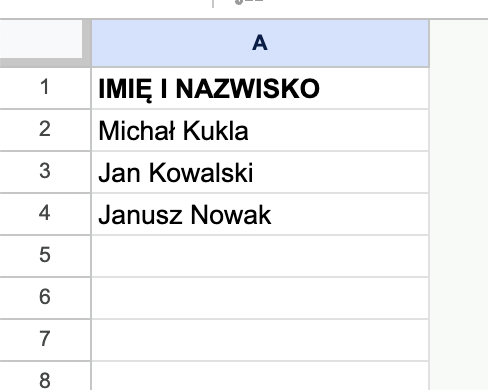

Teraz możemy wykorzystać tę listę, aby zrobić dynamiczne sprawdzanie poprawności danych:

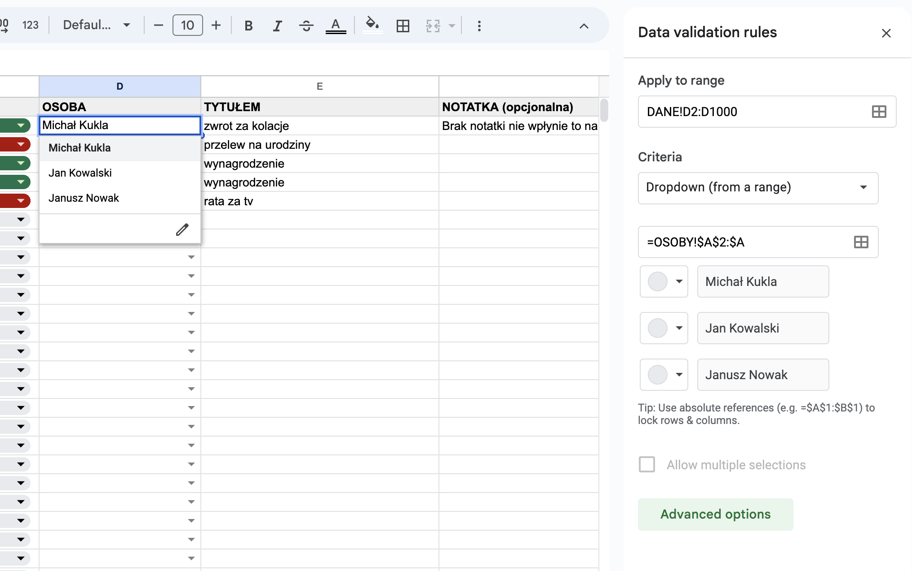

Wystarczy wybrać *Dropdown (from a range)* i podać zakres, z którego będziemy czerpać opcje do naszej listy wyboru:

```
=OSOBY!$A$2:$A
```

To przydaje się też, gdy to użytkownicy naszego arkusza zarządzają dostępnymi opcjami. Wolimy, żeby nie grzebali w ustawieniach walidacji, bo jeszcze niechcący zepsują nasze zabezpieczenia.

Na tym kończymy nasze podstawowe metody sprawdzania poprawności danych poszczególnych komórek. Oczywiście opcji jest więcej, ale omówienie ich wykracza poza podstawowy zakres tego artykułu.

Ale to jeszcze nie koniec metod zabezpieczania arkuszy.

## Formatowanie warunkowe

Na poziomie poszczególnych komórek zabezpieczyliśmy dane. Chcielibyśmy teraz upewnić się, że użytkownicy wprowadzają do bazy wszystkie wymagane przez nas informacje. Bo co nam po tym, że wiemy kiedy była transakcja, ale nie wiemy na jaką wartość? Albo którego użytkownika dotyczyła?

Jak upewnić się, że użytkownicy wprowadzą wszystkie kluczowe informacje?

Można do tego wykorzystać formularze Google, które sprawdzają takie rzeczy, a potem dodają nowe rekordy do arkusza. Skupię się jednak na pracy wewnątrz arkusza.

Możemy użytkownikowi pokazać, że wprowadził za mało danych, np. podświetlając cały wiersz na czerwono, gdy nie wypełni wymaganych przez nas pól. Oto jak to zrobić:
1. `Format` -> `Formatowanie warunkowe`
2. Dodaj nową regułę
3. Wybierz zakres `A2:G`
4. Wybierz `Custom formula`
5. Wprowadź formułę
```
=AND(COUNTA($A2:$E2)>0; COUNTA($A2:$E2)<5)
```
6. Ustaw style.

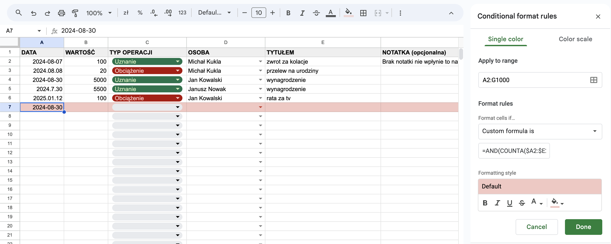

W powyższym przykładzie wprowadziłem jedynie datę, a resztę kolumn pozostawiłem pustą.

Formuła działa w ten sposób, że sprawdza, czy którakolwiek wymagana kolumna (od A do E) została wypełniona w danym wierszu (`COUNTA($A2:$E2)>0`) i czy któraś kolumna nie została wypełniona (`COUNTA($A2:$E2)<5`).  Wtedy, i tylko wtedy, podświetla cały wiersz na czerwono. 

W ten sposób jeden rzut oka użytkownika (lub menedżera) wystarczy, żeby zobaczyć, że coś jest nie tak.

Możemy oczywiście zrobić bardziej zaawansowane reguły i podświetlać tylko niektóre komórki. Formatowanie warunkowe przydaje się w wielu sytuacjach, więc warto je sobie przetrenować.

## Zabezpieczenia zakresu

Ostatnio użytkownik mojego arkusza do tworzenia grafików dostał formatkę do kopiowania danych. Było tam pełno formuł. Wyglądało to tak:
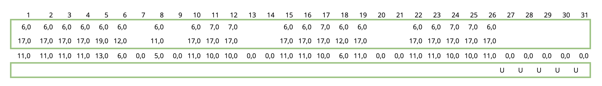

Dane zmieniały się w zależności od ustawionych powyżej warunków (pracownik i miesiąc).

Wystarczyło więc:
1. zaznaczyć zakres w zielonej ramce,
2. skopiować (`CTRL+C`) i...
3. wkleić do innego arkusza same wartości, ale bez formuł (`CTRL+SHIFT+V`). 

Czy coś mogło pójść nie tak?

Otóż mogło. Użytkownik skopiował całość, a następnie wkleił w to samo miejsce, nadpisując przygotowane przeze mnie formuły. Potem beztrosko zmieniał pracowników i kopiował zapisane przez niego na stałe wartości. Gdy naprawiłem formuły, musiał tę całą pracę wykonać ponownie.

Jak można było tego uniknąć?

Wystarczyło:
1. zaznaczyć całą tabelkę,
2. z menu wybrać `Dane` -> `Zabezpiecz arkusze i zakresy` (ang. *Protect sheets and ranges*)
3. ustawić uprawnienia do edycji komórek

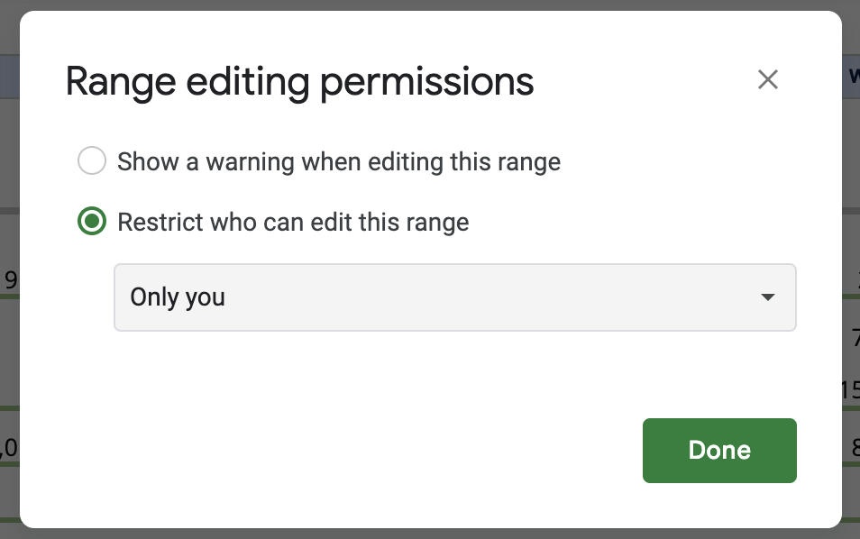

Masz tu dwie opcje do wyboru:
1. zabronić edycji (np. tylko ty, albo konkretne osoby mogą modyfikować chroniony zakres),
2. pokazać ostrzeżenie podczas edycji.

Zazwyczaj wybieram opcję `tylko ja`, bo ostrzeżenie może nie być czytelne dla użytkownika i nie powstrzyma go przed zepsuciem. (Zwłaszcza, jeśli nie umie cofnąć operacji 🙈 - przypominam: `CTRL+Z`).

W przypadku naszego arkusza z danymi warto ustawić zabezpieczenie na wiersz z nagłówkami. Nie zliczę ile razy widziałem wpisaną datę w pierwszym wierszu, gdzie powinna być nazwa kolumny.

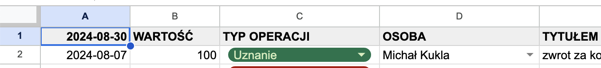

Jeśli używamy tabel przestawnych, to zmiana nazwy może zepsuć tabelę, choć będzie to efekt bardziej wizualny. Jeśli wklejamy raporty do menedżerów, to ktoś może mieć trudność z rozczytaniem raportu.

Gorzej, jeśli stosujemy bardziej skomplikowane formuły, które wyszukują danych po numerach kolumn albo filtrują po zawartości poszczególnych komórek. Takie rzeczy zdarzają się rzadko, ale są bardzo kłopotliwe do naprawienia.

W każdym razie jeśli ograniczymy edycję zakresu tylko dla siebie, wtedy nie będziemy mieli pretensji do nikogo poza sobą. A to znacznie ułatwia i przyspiesza naprawienie arkusza, gdy użytkownik coś popsuje.

> [!warning] Zabezpieczanie kolumn
> Jeśli zdarzy się, że masz ważne formuły w całej kolumnie, np. przetwarzające datę na format `RRRR-MM`, i nie chcesz, aby użytkownik tam coś mieszał, to ochrona przed edycją może uniemożliwić mu filtrowanie danych w arkuszu. Każda taka próba skończy się odrzuceniem zmiany lub ostrzeżeniem. 
> 
> I dowiesz się o tym często dopiero od użytkownika, który nie będzie w stanie powiedzieć co mu się wyświetla na ekranie. A u Ciebie będzie przecież działać, więc odkrycie problemu może być trudne.
> 
> Dlatego zamiast chronienia kolumny wystarczą ją po prostu ukryć: prawym na kolumnę -> *Ukryj*.

> [!warning] Nie widać funkcji ochrony zakresów?
> Jeśli Twój arkusz jest kompatybilny z XLSX, to zabezpieczanie zakresów może nie być w ogóle dostępne. Poznasz to po tym, że obok nazwy pokaże się zielona ikonka:
> 
> 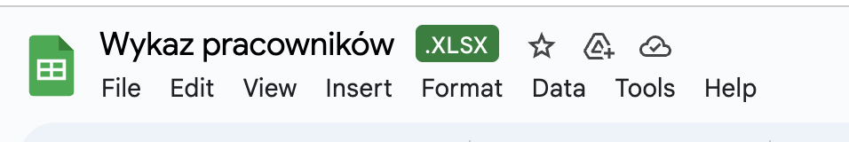
> 
> Aby umożliwić zabezpieczanie zakresów musisz zapisać dokument jako Arkusz Google (*Plik* -> *Zapisz jako Arkusz Google*):
> 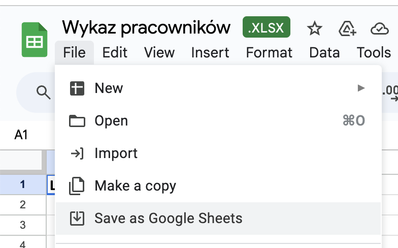

## Czy wprowadzam zabezpieczenia od razu?

Część zabezpieczeń tak, ale nie wszystkie. Dlaczego? Bo to kosztowne. 

Na początku często nie wiadomo jeszcze jak będzie wyglądał finalny arkusz. Wymagania klientów zmieniają się z czasem. Tu by się przydało to, tu tamto, a to nie jest w gruncie rzeczy potrzebne, bo mam to i to.

Więc dopiero gdy popracujemy chwilę na arkuszu, dopracuję wygląd i formuły, sprawdzę na jakie "pomysły" wpadają użytkownicy, to dopiero wtedy zabezpieczam dodatkowo krytyczne miejsca.

## Podsumowanie

Arkusze kalkulacyjne są potężne i umożliwiają stworzenie rozbudowanych, zaawansowanych narzędzi. Ale łatwo je przez przypadek zepsuć. Jeśli pracuje na nich wiele osób, z których część jest mało techniczna, to warto pomyśleć o zabezpieczeniach.

Jest wiele metod ochrony przed uszkodzeniem danych i raportów: od prostej walidacji danych i formatowanie warunkowe, przez zabezpieczanie zakresów przed edycją i ukrywanie kolumn, aż po skomplikowane reguły, makra i skrypty.

Warto zacząć od prostej walidacji danych, bo to przyspiesza nam też ich wprowadzanie, a to bywa kluczowe dla nas i naszych pracowników w codziennej pracy z arkuszami.