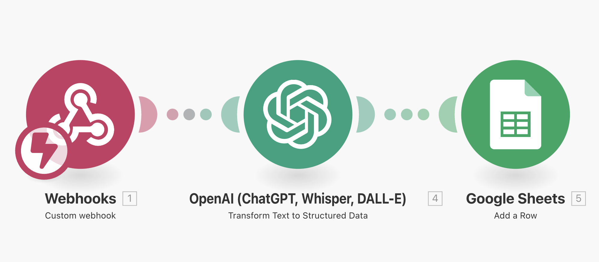
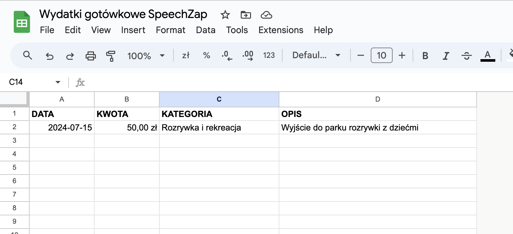
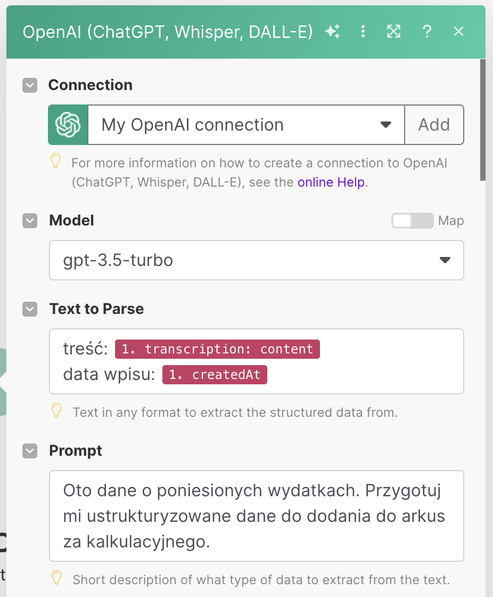
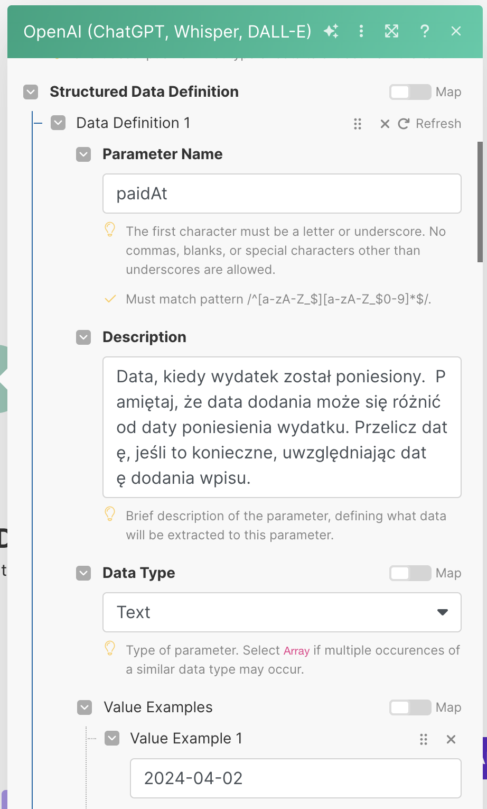
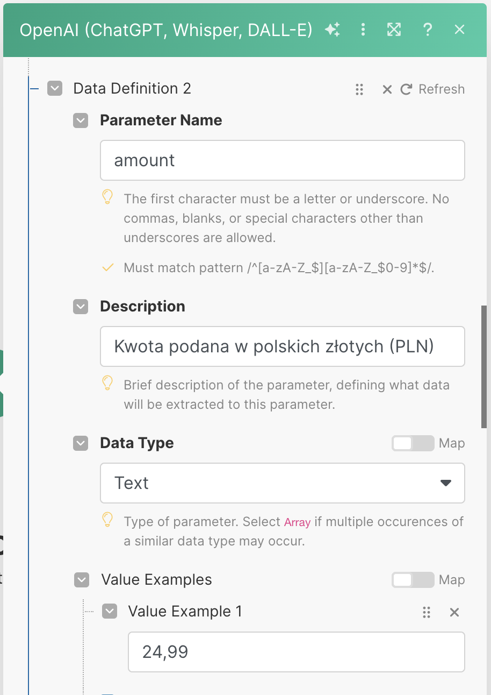
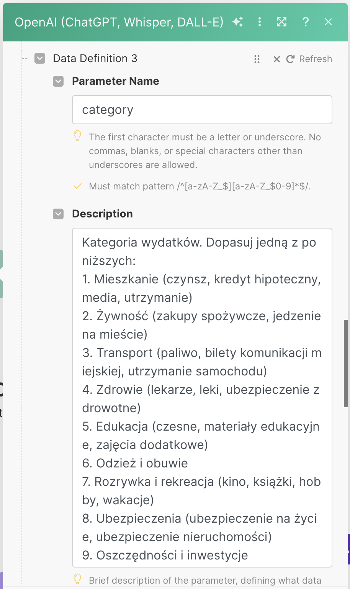
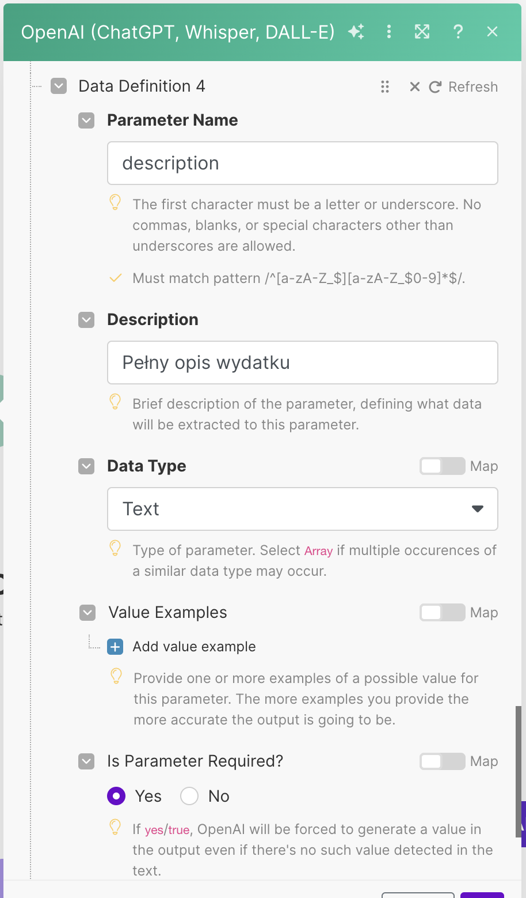
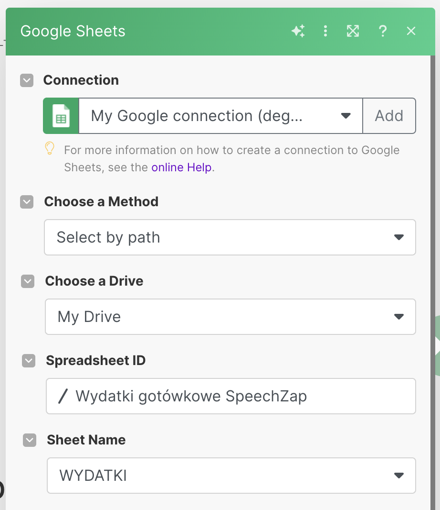
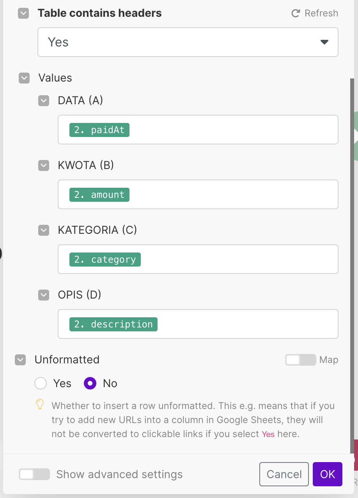

Zainspirowany opisem aplikacji [Andrzeja Wineckiego](https://www.linkedin.com/in/andywinecki/) do zarządzania wydatkami, postanowiłem nagrać wideo o tym jak ze [[speechzap|SpeechZap]] zapisywać wydatki gotówkowe do arkuszy Google, który można wykorzystać jako źródło danych do takiej aplikacji.

Zastosowań tego podejścia jest znacznie więcej. Przykładowo, jeśli jesteś handlowcem, który notuje wizyty lub konsultantem, który spisuje godziny spędzone u klienta, to możesz takie podsumowanie dyktafonem zapisać do arkuszy Google w ten sam sposób, podając np.:
- czas trwania spotkania,
- uzyskane efekty,
- następne kroki,
- przemyślenia i obserwacje.

<iframe width="560" height="315" src="https://www.youtube.com/embed/aPCaspElYGo?si=kYSN9HL28DktWpwi" title="YouTube video player" frameborder="0" allow="accelerometer; autoplay; clipboard-write; encrypted-media; gyroscope; picture-in-picture; web-share" referrerpolicy="strict-origin-when-cross-origin" allowfullscreen></iframe>

## Jak spisać ustrukturyzowane dane z nagrania w SpeechZap?

Będziemy potrzebowali za pomocą Make stworzyć 3 moduły:
- Custom Webhook: do odbierania danych ze SpeechZap
- OpenAI: do ustrukturyzowania danych
- Google Sheets: do dodania kolejnego wiersza do arkusza

### Arkusz Kalkulacyjny

W pierwszej kolejności przygotujmy sobie arkusz, który będzie zawierał np. 4 kolumny:
- data
- kwota
- kategoria
- opis

Teraz zalogujmy się do https://make.com
### Webhook

Po utworzeniu w Make modułu *webhooka* musimy skopiować jego adres i dodać do akcji w SpeechZap, a następnie wysłać przykładowe nagranie na ten *webhook*. Wtedy możemy przejść do konfiguracji OpenAI.

### OpenAI
Będziemy potrzebować klucza API, który utworzysz na ich platformie w sekcji [API Keys](https://platform.openai.com/api-keys).

Po utworzeniu połączenia (*connection*) musimy ustawić:
- model (`gpt-3.5-turbo` jest bardzo dobre do tego),
- treść transkrypcji do wysłania do GPT (warto dodać datę wpisu)
- ogólny *prompt*, np.:

> Oto dane o poniesionych wydatkach. Przygotuj mi ustrukturyzowane dane do dodania do arkusza kalkulacyjnego.

Teraz potrzebujemy wyklikać ustrukturyzowane dane, czyli dodać 4 parametry, które OpenAI wyciągnie dla nas z treści transkrypcji. 

**paidAt** - data poniesienia wydatku

Prompt:
> Data, kiedy wydatek został poniesiony.  Pamiętaj, że data dodania może się różnić od daty poniesienia wydatku. Przelicz datę, jeśli to konieczne, uwzględniając datę dodania wpisu.

**amount** - kwota wydatku
Prompt:
> Kwota podana w polskich złotych (PLN)

**category** - kategoria, do jakiej ma być przypisany wydatek

Prompt:
> Kategoria wydatków. Dopasuj jedną z poniższych:
> 1. Mieszkanie (czynsz, kredyt hipoteczny, media, utrzymanie)
> 2. Żywność (zakupy spożywcze, jedzenie na mieście)
> 3. Transport (paliwo, bilety komunikacji miejskiej, utrzymanie samochodu)
> 4. Zdrowie (lekarze, leki, ubezpieczenie zdrowotne)
> 5. Edukacja (czesne, materiały edukacyjne, zajęcia dodatkowe)
> 6. Odzież i obuwie
> 7. Rozrywka i rekreacja (kino, książki, hobby, wakacje)
> 8. Ubezpieczenia (ubezpieczenie na życie, ubezpieczenie nieruchomości)
> 9. Oszczędności i inwestycje
> 10. Inne wydatki (prezenty, dobroczynność, opłaty bankowe)
> 
> Podaj tylko nazwę kategorii.

**description** - opis wydatku, abyśmy wiedzieli za co zapłaciliśmy

Prompt:
> Pełny opis wydatku

Wszystkie pola można ustawić jako wymagane (*required*). 

### Google Sheets

W tym module najpierw musimy utworzyć połączenie, które przeprowadzi nas przez proces logowania do Google i nadawania odpowiednich uprawnień dla Make.

Potem wskazujemy gdzie chcemy zapisać dane:

I wreszcie wykorzystamy utworzone przez OpenAI parametry do wypełnienia arkusza danymi:

> [!tip] Protip
> Kiedy próbowałem ustrukturyzować dane za pomocą modułu OpenAI w Make, to typ *number* wymagał przykładu z kropką (np. `24.99`). Arkusz mi tego nie rozpoznał jako liczbę, tylko jako tekst. Naprawiłem to zmianą typu danych na *text* zamiast *number* i jako przykład podałem `24,99`.
> 
> Prawdopodobnie można było to zrobić jeszcze jakiegoś rodzaju transformatą w Make, ale to rozwiązanie jest proste i działa. 

## Podsumowanie

W dzisiejszych czasach potężne modele językowe są tanie i łatwe w użyciu, więc mamy nieograniczone możliwości przetwarzania i wprowadzania rekordów do baz danych z prostych notatek głosowych.

Czasem trzeba potestować kilka kombinacji *promptów*, aby uzyskać pożądane rezultaty, ale zazwyczaj jest to banalnie proste.

Jeśli chcesz poznać więcej takich integracji lub masz trudności ze zmuszeniem GPT czy Make do zrobienia tego, czego potrzebujesz, to napisz do mnie np. na support@speechzap.com