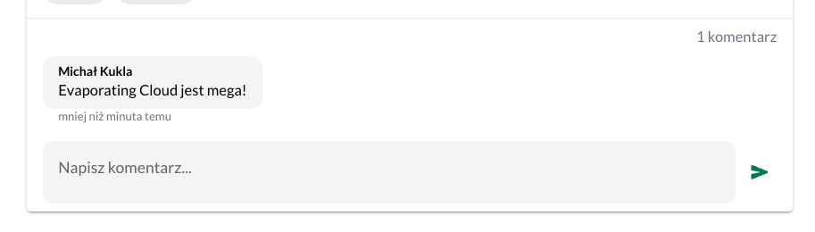

Zrobiłem komentarze! 🚀

To jeden z najważniejszych kroków, aby stworzyć zaangażowaną, wspierającą się społeczność wokół wyzwań w [[slowtracker|SlowTracker]]. Teraz udostępnianie sukcesów ma większy sens, bo będzie można uzyskać wsparcie i dodatkowe pytania od innych osób, które mają podobny cel.

Bardzo się cieszę, bo zrobiłem podstawową funkcjonalność, która jest konieczna. [[Jak ograniczyć scope projektu do MVP|Nie robiłem dodatkowych funkcji]], tylko absolutne minimum.

Wzorowałem się na Facebooku i zrobiłem edycję komentarza wykorzystując istniejący formularz. Jestem zadowolony z tego, że udało mi się dość sprawnie zrobić w miarę przyzwoity interfejs.

Zajęło mi to ok. 6 godzin.

W pierwszym etapie dostępne są w wersji webowej oraz dla użytkowników testowych na Android. Jeśli chcesz dołączyć do osób, które w pierwszej kolejności dostają najnowsze funkcje, to napisz do mnie na jednym z moich social media (linki na dole strony).