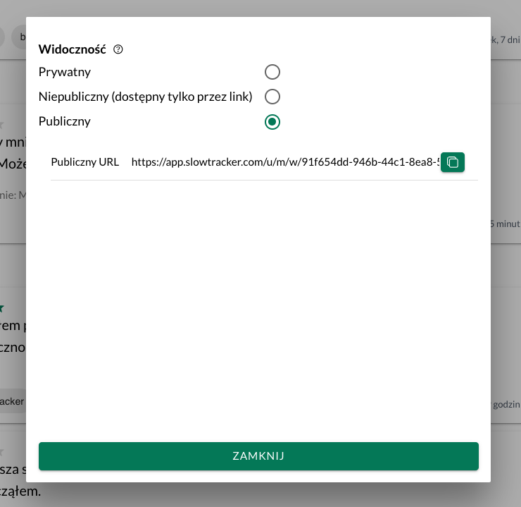
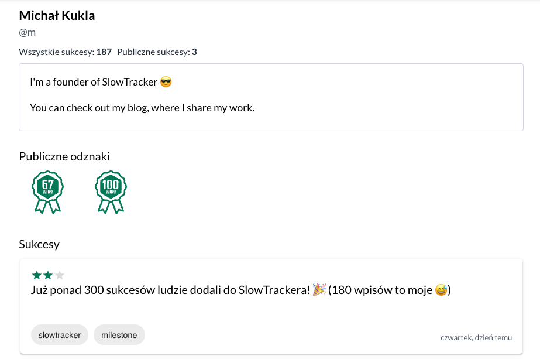

Sukces: po dwóch miesiącach pracy nad [[slowtracker|SlowTracker]], poznałem wreszcie moją konkurencję. [Andrzej Winecki](https://andywine.io/) podesłał mi kilka linków, które z jednej strony trochę mnie zdołowały (jak zawsze, gdy dowiaduję się, że ktoś robi coś podobnego i nie jestem taki innowacyjny jak myślałem 😅), a z drugiej strony dały mi przekonanie, że jest rynek na to, co tworzę.

Po pierwsze, istnieje taka koncepcja jak *[[Tada-list]]*. O tym mówi też Daniel Pink (ten od książki [[drive-daniel-pink|Drive]], o motywacji) w swoim *[[2-lists-better-than-todo-list|Pinkcast 1.16: 2 lists better than a to-do list]]*.

Wspomina w nim książkę [[the-progress-principle|The Progress Principle]], w której autorzy - na podstawie badań - stwierdzili, że **największy motywatorem w codziennym życiu jest robienie postępów w ważnej pracy**. Problem polega na tym, że nie śledzimy naszych postępów.

Po drugie, Andrzej pokazały mi dwa serwisy, które są moją konkurencją:
1. [wip.co](https://wip.co) - publiczne dzielenie się postępami, w ramach wzajemnej motywacji.
2. [I Done This](https://idonethis.com) - prywatne zapisywanie postępów, za to można się tym dzielić wewnątrz swojego zespołu.

Oba serwisy trochę się pozmieniały od czasu ich powstania i mocniej poszły w kierunku grupowego dzielenia się postępami.

Dlatego też SlowTracker idzie w kierunku społeczności. Nie jest to nic nowego. Plany na to miałem niemal od samego początku. Nabrałem jednak większej pewności, że to dobry i potrzebny kierunek, aby aplikacja mogła pomóc większemu gronu odbiorców.

Kilka dni temu zrobiłem udostępnianie sukcesów za pomocą linku. Wczoraj dopisałem publiczny profil, ustawianie publicznych danych i publiczne udostępnianie sukcesów. 

Przede mną jeszcze sporo pracy, ale czuję, że idę w dobrym kierunku. I do tego nie spieszę się - mam zrobione [MVP](https://en.wikipedia.org/wiki/Minimum_viable_product) i mogę bez pośpiechu dokładać kolejne funkcje.
