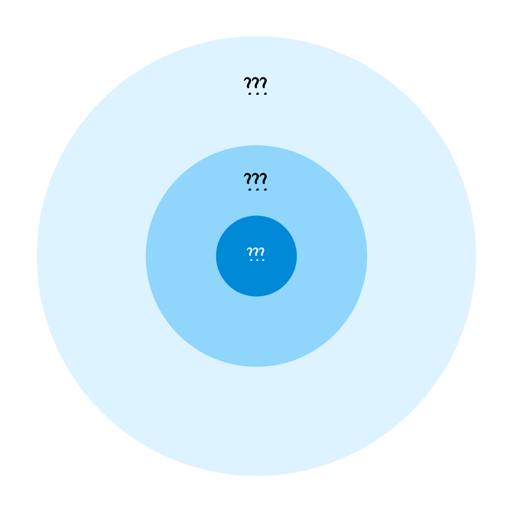
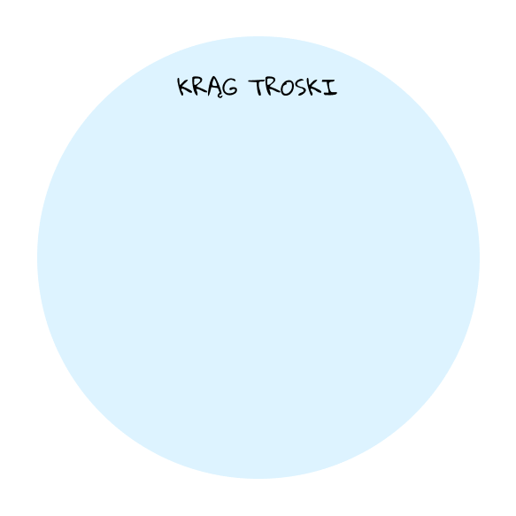
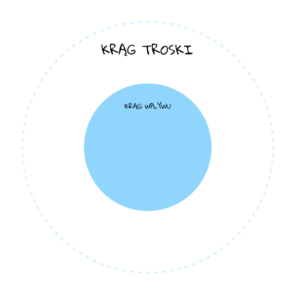
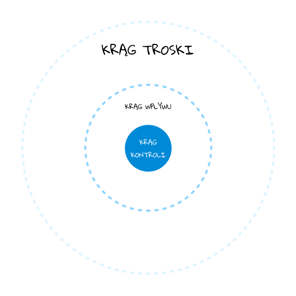

Czy zastanawialiście się kiedyś, dlaczego niektórzy ludzie są bardziej efektywni i spokojniejsi niż inni?

Podczas moich ostatnich badań nad modelami mentalnymi przypomniałem sobie o modelu kręgu wpływu i kontroli, który **rozwalił mi czachę kilka lat temu**, dlatego dzisiaj opowiem o tym właśnie modelu i na koniec podrzucę kilka ciekawych zapytań do chata GPT.

Ten model pochodzi z koncepcji przedstawionych przez Stephena Coveya w jego książce _7 nawyków skutecznego działania_. Covey mówi, że nasze zmartwienia i aktywności można podzielić na trzy kategorie:

### **1. Krąg troski**

Obejmuje wszystkie sprawy, które nas niepokoją, ale na które nie mamy bezpośredniego wpływu (np. polityka światowa, katastrofy naturalne, przeszłe wydarzenia).

W tym kręgu nasza energia do działania łatwo się rozprasza, bo często martwimy się, narzekamy, ale tak naprawdę niewiele jesteśmy w stanie zrobić i wpłynąć jakoś na te sprawy.

Energia rozproszona jest na wiele spraw, na które nie mamy wpływu

Ja zazwyczaj skutecznie się odcinam od wiadomości w telewizji i social media, a najważniejsze informacje dostaję od żony lub innych osób, które śledzą to za mnie.

### **2. Krąg wpływu**

Obejmuje sprawy, na które mamy pewien wpływ, ale nie mamy nad nimi pełnej kontroli (np. relacje z innymi ludźmi, swoją rolę w pracy).

Jeśli zrezygnujemy z rozpraszania energii w kręgu troski, to będziemy mieli więcej energii do skutecznego działania w tym kręgu.

Energia jest skoncentrowana na rzeczach, na które mamy jakiś wpływ

### **3. Krąg kontroli**

Obejmuje sprawy, które możemy całkowicie kontrolować (np. nasze myśli, zachowania, decyzje).

Na to kładli właśnie nacisk Budda i starożytni filozofie, jak Epiktet i inni stoicy.

Model ten sugeruje, że skoncentrowanie się na kręgu kontroli i wpływu, zamiast na kręgu troski, prowadzi do bardziej efektywnego i spełniającego życia, bo skupiamy się na tym, na co mamy wpływ i **nie tracimy czasu i energii na sprawy, na które nie mamy wpływu**.

Energia skupiona jak promień lasera na rzeczach, nad którymi mamy kontrolę

### **Pytania do refleksji**:

- Jak możesz zastosować to w swoim życiu jeszcze dzisiaj?
- Co należy do Twojego kręgu troski i jak możesz to ograniczyć?

### Zapytania do chat GPT

Pomogą Ci **więcej wyciągnąć z tego modelu mentalnego:**

- W jaki sposób rozpoznać co należy do mojego kręgu troski?
- W jaki sposób ograniczyć poświęcanie czasu i energii na sprawy z kręgu troski?
- W jaki sposób rozpoznać myśli o kręgach troski?

Możesz dopisać, że chodzi o model kręgu wpływu i kontroli [[stephen-covey|Stephena Coveya]].