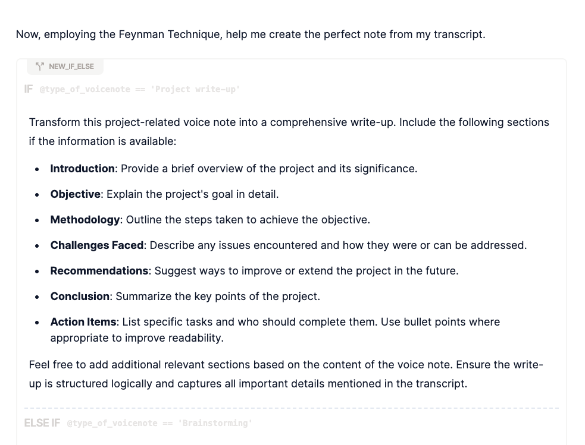

Zainspirowany projektem [AudioScribe](https://audioscribe.wordware.ai/) zrobiłem integrację do [[speechzap|dyktafonu SpeechZap]], która tworzy zredagowane notatki na podstawie dłuższej refleksji.

Hasło tego projektu dobrze oddaje ideę:
> Clean notes from scrambled thoughts

Na początku omówię jak działa ta automatyzacja, a na koniec otrzymasz ode mnie plik do zaimportowania do Make.
## Jak działa AudioScribe?

To rozwiązanie *open-source* korzysta z Wordware.ai. Jest to narzędzie do stworzenia *workflow* opartego o LLM. Można podpinać wiele różnych modeli językowych i tworzyć prostą ścieżkę decyzyjną.

Pierwszym zadaniem w tym procesie jest poproszenie LLM o rozpoznanie charakteru notatki:


Powstały w ten sposób parametr `type_of_voicenote` jest potem wykorzystywany do przygotowania szczegółowego *promptu*:



I po całym łańcuszku *ifów* dokleja na końcu komendę, która strukturyzuje dane na potrzeby wykorzystania potem w aplikacji:


Z kodu źródłowego AudioScribe dowiedziałem się, że Wordware ma REST API, ale [dokumentację](https://wordware.notion.site/d603670c4819487fa75185380c885007?v=91206410afab40dc8d92c189284cdb18) znalazłem po dłuższym czasie i przypadkiem. Spróbowałem sklonować tego tzw. agenta i podpiąć wywołanie do Make.com, ale API zwraca strumień, zamiast gotowych danych. Nie znalazłem w Make metody, aby tych danych użyć.
## Implementacja Make

Postanowiłem, że po prostu przeniosę cały *workflow* do Make. W końcu i tak chciałem uruchomić całość w ten sposób.

Oto on:


Być może wygląda trochę skomplikowanie, ale sprawa jest dość prosta. Drugi moduł od lewej rozpoznaje charakter notatki. Trzeci moduł (*router*) przekierowuje do jednego z rodzajów notatek.


Przykładów przygotowanych przez autora AudioScribe było dużo, stąd też dużo różnych wariantów.

Jednak już na pierwszy rzut oka powinno być widać przewagę Make.com nad Wordware. Otóż z tymi przeredagowanymi notatkami jeszcze coś chcemy zazwyczaj zrobić. Moglibyśmy je ręcznie skopiować i gdzieś przenieść, ale po co, skoro możemy to zautomatyzować?

I tak w moim przykładzie widać na samej górze akcję *Gmail*:


Jak to działa?

Będąc na spacerze mogę zastanowić się nad wiadomością do wysłania do mojego klienta albo współpracownika. Mówię z grubsza o co mi chodzi, np. co potrzebujemy w następnej kolejności zrobić, żeby móc wypuścić aplikację SpeechZap na [[przygotowania-speechzap-product-hunt|Product Hunt]]. 

Mówię, że chcę z tego zrobić email i wstępna analiza za pomocą GPT przekierowuje do akcji, które odpowiedzialne są za przygotowanie treści wiadomości.

Następnie GPT dostaje już konkretną komendę:
```
Structure this voice note into a coherent email format. Follow these guidelines:

- Subject: Create a clear, concise subject line based on the main topic.

- Main Content: Keep it concise while covering all key points. Use bullet points where it can improve readability.

- Action Items: Clearly highlight and segment any tasks that the recipient should be aware of or act upon. Include who is responsible and any deadlines if mentioned.

- Conclusion: End with a brief wrap-up or a call to action, if necessary. Ensure the email is structured to quickly convey the main points and is easy for the recipient to understand and act upon.

Keep it short and to the point. Maintain a professional tone while preserving the voice note's original intent and key information.


Transcript:
\`\`\`
{{1.transcription.paragraphsText}}
\`\`\`

Format the provided transcript according to the specified requirements.

Output the result as valid JSON, strictly adhering to the defined schema. Ensure there are no markdown codes or additional elements included in the output.

\`\`\`
{
"recipient": "[valid email of the recipient or empty if invalid]",
"subject": "[subject]",
"body": "[body of the email, you can use html tags but keep it simple]"
}
\`\`\`

Do not add anything else. Do not add markdown. Do not add "```markdown" nor "```". Return ONLY plain JSON.

Recognize language of the transcript and use the same language.

In my signature use only my name "Michał"
```

Na tej podstawie zwraca dane w formacie JSON, który w kolejnym module *JSON Parse* przetwarzam na dane do wykorzystania przez moduł *Gmail*, którego zadaniem jest utworzenie wersji roboczej emaila.

Jeśli jednak adres email nie zostanie poprawnie rozpoznany, wtedy pierwszy moduł *Gmail* ulegnie awarii i musiałbym wykonać to znów ręcznie. Dlatego jeśli tak się stanie, to drugi moduł *Gmail* (wywoływany, gdy pierwszy zakończy się błędem) utworzy wersję roboczą, ale już bez podanego adresu email.

Pozostaje wejść do Gmail (podać adres email, jeśli brakuje) i wysłać.

Oto przykład maila do Gosi na podstawie naszej ostatniej rozmowy w sprawie pomocy marketingowej:


## Pełna automatyzacja Gmail?

Można by to próbować w pełni zautomatyzować, jednak musielibyśmy wprowadzić kilka kroków. Pierwszym jest przygotowanie poprawnego adresu email. W pierwszym teście nie udało mi się otrzymać poprawnego adresu email. Tutaj nie kombinowałem zbytnio, bo jeszcze nie chcę tego w pełni automatyzować, ale myślę, że trzeba będzie przeprowadzić kilka prób. 

Czemu nie otrzymałem poprawnego adresu? LLMy mają wbudowane zabezpieczenia przed nadużyciami i utratą prywatności, co nie pozwala tworzyć adresów email czy innych identyfikatorów. Stąd konieczność różnych obejść i upewnienia się, że mamy to, czego potrzebowaliśmy.

Można zrobić białą listę adresów email i zrobić dodatkowy moduł GPT, który z tej listy wybierze jeden, który jest dostępny, albo żadnego. 

Emaile można też pobierać z innego źródła, np. z kontaktów Google, CRM, czy bazy wiedzy w [[dify|Dify]]. Do tego celu można zrobić przeszukiwanie danych z użyciem samego imienia i nazwiska.

Ja w tym scenariuszu użyłem wbudowanych w Make [narzędzi](https://www.make.com/en/help/errors/introduction-to-errors-and-warnings-in-make) do zarządzania błędami.

Są to jednak bardziej zaawansowane metody i być może nie chcemy tego w całości automatyzować. Przeredagowanie treści, by była zwięzła i konkretna może być wystarczająco pomocne na start.

## Po co mi Dropbox?

W moim *workflow* w Make pełno jest modułów z Dropboxem. Dlaczego? Przyjrzyjmy się jednej z nich, dotyczącej *Task planning*:


Gdy realizuję projekt, to staram się robić to, co konieczne, żeby jak najszybciej osiągnąć najbliższy krok milowy. Dla SpeechZap to teraz [[przygotowania-speechzap-product-hunt|publikacja na Product Hunt]].

Planowanie najbliższych działań robię na głos. Zapisuję na dyktafonie wszystko co mi przychodzi do głowy, plusy i minusy, obiekcje, zależności pomiędzy zadaniami i inne ograniczenia.

Do takiej notatki pasuje komenda *Task planning*:

```
Convert this voice note into a structured task list. Format the content as follows:

- Project Description: If available, provide a brief overview of the project.

- Task List: Create a numbered or bulleted list of tasks.

For each task:

- Clearly state the action to be taken.
- Include any of the following details mentioned in the voice note:
  - Priority level (High, Medium, Low)
  - Person responsible
  - Deadline or due date

Organize tasks logically, grouping related items if applicable. Use clear, action-oriented language for each task. Include any additional context or notes about the tasks as sub-points under the relevant task if mentioned in the voice note.
```


Natomiast cała notatka służy mi przez kilka najbliższych dni i chcę ją mieć blisko tego, co wykorzystuję do codziennego planowania: Obsidian.

Dropbox służy więc do stworzenia pliku o rozszerzeniu `.md` (tutaj przydaje się `nameSlug`, czyli nazwa przerobiona do formatu bez spacji i innych znaków specjalnych). W tym pliku wstawiam cały kod *markdown* razem z *frontmatter*, w którym dodaję pomocne tagi i inne parametry.

Notatkę tworzę w folderze `SpeechZap` (i podfolderze `tasks`), który jest zsynchronizowany z moim lokalnym Obsidian. To sprawia, że treść w kilka sekund pojawia się na moim komputerze i jest dostępna również z poziomu chmury.

Oto widok takiej notatki w Obsidian:
![[Pasted image 20240724114206.png]]

### Jak mógłbym to dalej zautomatyzować?

Do zarządzania projektami używam Shortcut, więc mógłbym tam rozpisać sobie epiki albo *milestone'y* oraz zadania w formie *user stories*. Mógłbym automatycznie przypisać zadania do konkretnych osób, gdybym miał zespół, który może te zadania realizować.

W sytuacji idealnej, gdy jestem na urlopie a mój zespół jest obciążony na maksymalnie 70-80%, te zadania mogłyby być rozpoczęte jeszcze zanim wróciłbym z plaży do komputera.

## Nie walcz z ograniczeniami

Jak już wspomniałem przy omówieniu integracji z wysyłką emaili, jest jeszcze sporo innych ograniczeń tych automatyzacji. Wszystko da się zrobić, tylko czasem nie warto się męczyć, jeśli można osiągnąć 80% automatyzacji 20% nakładem pracy.

To oczywiście zasada Pareto, która dobrze sprawdza się w przypadku podejmowania decyzji o inwestycji w automatyzację. Warto też skorzystać z [[czy-warto-automatyzowac|tego arkusza]], aby ocenić ile czasu i pieniędzy można zainwestować w automatyzację, by ROI było dodatnie.

## Podsumowanie

W dobie sztucznej inteligencji łatwo jest tworzyć zautomatyzowane procesy, które zaoszczędzą Ci dużo czasu i zachodu. Możesz pracować tak, jak lubisz (np. spacerując, zamiast łamać sobie kręgosłup od pracy przy kompie) i oszczędzać mnóstwo czasu na powtarzalnych czynnościach. 

A nawet rozpocząć robienie wartościowych rzeczy, na które normalnie nie starczałoby Ci czasu lub motywacji (np. u mnie było to [[automatyczny-newsletter|tworzenie cotygodniowego newslettera]] czy przygotowanie postów na wip.co z moich sukcesów w [[slowtracker|SlowTracker]]).

Przygotowanie tego scenariusza w Make.com zajęło mi ponad godzinę, więc wiem, że nie jest to takie proste i może być uciążliwe. (Dodatkowym utrudnieniem było przygotowanie konfiguracji Gmail, która wymaga wykonania długiej serii kroków - na szczęście dobrze opisanych w [dokumentacji Make](https://www.make.com/en/help/app/gmail)).

Dlatego wyeksportowałem dla Ciebie [do pobrania blueprint](https://michalkukla.pl/blueprints/messy-thoughts.json), który możesz w Make.com zaimportować, będąc w widoku scenariusza:


