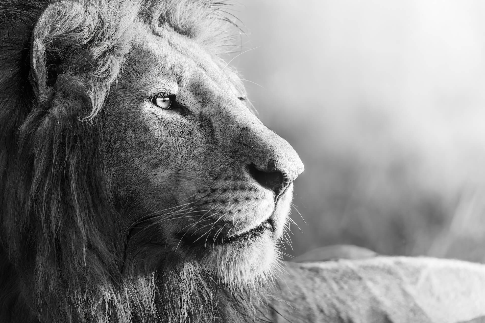

Za oknem mokra ściana przygasłej już nieco zieleni przypomina, że właśnie rozpoczęło się lato. Ból gardła nie daje zapomnieć o moich pierwszych dniach pracy jako trener. Przede mną deszczowy dzień w domu z trójką dzieci.

Papierowy aligator łaskocze w łysą czaszkę. Prawie łysą. Gdy spojrzałem rano w lustro, zanotowałem gdzieś z tyłu głowy, że wieczorem będę musiał spojrzeć jeszcze raz, by przypomnieć sobie o maszynce w szufladzie.

Czekając, aż przestanie bulgotać ryż (brązowy, bo pracuję nad obniżeniem indeksu glikemicznego w mojej diecie), przyglądam się swojej ciekawości i niepokojowi, które rodzą się z szurania, kichania, stuków, rozmów, kłótni oraz sporadycznych krzyków, pisków i marudzeń.

Jak zwykle trochę boli. Nie uczestniczę. Korci mnie jednak, żeby wywołać po imieniu, ale gdy tylko wykręcam i wydłużam szyję, by dojrzeć agresywne ruchy, przypominam sobie scenę z filmu przyrodniczego. Stary wilk, bez pośpiechu, omija skaczącą i szarpiącą się gromadkę małych, zwinnych szczeniaków, i podchodzi do wodopoju.

Inna scena: lwice dopadły antylopę gnu i w tumanach kurzu przegryzły jej gardło. Stary lew zaczął ucztę jako pierwszy. To jego prawo. Wokół młode lwiątka wyciągają się, by coś dla siebie zgarnąć. Gdy stary lew gwałtownie ryczy, błyskając białymi kłami, lwiątka zwinnie odskakują. Ich kolej będzie później.

Czemu młode wilki szarpią się i skaczą po sobie, a stary lew odgania młode lwiątka od świeżej zdobyczy? To nauka zachowań stadnych i nabywanie umiejętności, które przydadzą się później, gdy młode dorosną i same będą musiały polować i ustalić hierarchię w stadzie. Ten najsilniejszy, będzie przewodził całej grupie. Będzie ich chronił. Hierarchia pozwala zwiększyć szanse na przetrwanie całego stada. Najsilniejszy daje więc największe szanse.

W Azji Wschodniej dzieci są uczone, że każdy ma swoją rolę i swoje miejsce w społeczności. Szacunek, powściągliwość i usłużność stoją na podium w systemie wartości. Ich kultura zorientowana jest wokół grupy, a nie jednostki, jak na Zachodzie. Członkowie tych grup podporządkowują swoje własne ambicje i pragnienia interesowi całej grupy.

Susan Cain, w książce _[[ciszej-prosze-susan-cain|Ciszej proszę]]_ wyjaśnia:

> Jeśli dana osoba czuje się przede wszystkim częścią kolektywu, to żyje jej się w nim lepiej i przyjemniej, kiedy zachowuje ona daleko posuniętą powściągliwość, a czasami wręcz uległość i posłuszeństwo wobec innych.

Żyjemy więc trochę za bardzo w swojej bańce. Zachłyśnięci lub nasiąknięci kulturą amerykańską, która powstała stosunkowo niedawno i w dodatku z populacji imigrantów z całego świata. Jednostek, które miały wystarczająco odwagi, aby przezwyciężyć trudy podróży i adaptacji do nowego otoczenia. Może trochę stąd ten Ideał Ekstrawertyka, o którym mówi Susan Cain?

Młody wilk odłączył się od swojej rodziny. Poradzi sobie. Umie upolować sarnę i zająca, wyciem znaleźć samicę. Za kilka miesięcy też będzie ignorował przepychanki przy wodopoju.

Uczymy się pomału naszych korzeni i wpływów. Uczymy się akceptować nasze ograniczenia, miejsce na ziemi i to, co nami kieruje. Uczymy się rozpoznawać i pozwalać sobie przeżywać emocje, jak choćby gniew.

Czemu go tępimy, skoro od tysiącleci pozwalał nam rozróżniać co jest dla nas ważne i gdzie są nasze granice? Granice wyznawane nie przez władców i imperialistów, ale przez nasze potrzeby i szacunek dla godności drugiego człowieka.

Wciąż jednak słyszę, że świadomość jest dobra… ale nie zawsze. Niewygodna prawda o nas samych w oczy kole, ale jest na wagę złota. Choć nie sądzę, by te młode lwy obrażały się po walce o pozycję, że nie są jeszcze tak silne, by pomóc stadu przetrwać. Kolejne doświadczenie to szansa na lekcję.

A my mamy przecież korę nową i sumienie, które co prawda mówi cicho, ale odróżnia się w hałaśliwym, przebodźcowanym umyśle. Nawet jeśli wydobyliśmy coś niewygodnego, trudnego czy rozdrapaliśmy ranę, to to minie. Zaakceptujemy, zaleczymy, zintegrujemy i urośniemy. Może nauczymy czegoś wartościowego kolejne pokolenie?

Stary lew zatrzymał się i spojrzał po raz ostatni na jego lwice i młode. Przedzierali się w pośpiechu przez rzekę pełną krokodyli na drugi brzeg. Tam będą bezpieczni, zwłaszcza młode samce.

Odwrócił się i stanął twarzą w twarz z samotnym lwem.

Syn u jego boku jeszcze nie wiedział, że to właśnie on będzie od teraz musiał nauczyć się korzystać z energii agresji. Za chwilę zostanie przywódcą stada.