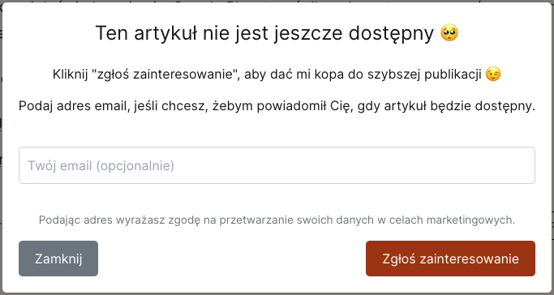
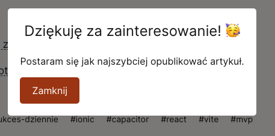

Zrobiłem mega ficzer, który może pomóc mi zdobyć więcej informacji o tym, co warto w moim *digital garden* publikować.

## Czemu te linki nie działają?

Wielokrotnie już [[markdown-rzadzi|wspominałem]] o tym, że mogę w Obsidian linkować wszystkie treści ze sobą, a publikować tylko część mojego *second brain* i linki będą tworzyć się automatycznie. Jeśli podlinkowana treść jest również opublikowana, to link się pojawi. 

W przeciwnym razie będzie w takim samym stylu jak reszta tekstu. Dlatego w sytuacji, gdy niedziałający link jest w środku akapitu (tak jak w poprzednim), to czytając nawet nie zauważysz, że brakuje jakiegoś linku.

Ale zdarza mi się, że pod koniec artykułu tworzę sekcję *Zobacz też*, w której od myślników wypisuję wszystkie artykuły. I to wygląda dziwnie, jeśli nie ma żadnych linków. Gdy nie możesz w niego kliknąć, to potraktujesz to jako błąd z mojej strony.

Potencjalnie może to odstraszyć od dalszego czytania, więc chciałbym tego uniknąć.
## Inne style?

Mógłbym tej sekcji z listą powiązanych wpisów nie wstawiać w artykułach publikowanych, ale cały ten myk z linkowaniem pozwalał mi właśnie na to, żebym nigdy nie musiał się przejmować edycją opublikowanych wpisów, a żebym cały czas miał linki wewnętrzne na swoje potrzeby.

Nie chciałbym więc wywalać tej sekcji, bo to stanowi dużą wartość dla mnie. 

Mógłbym po prostu walnąć komunikat, że ta strona jeszcze nie istnieje. Taki link mogę inaczej oznaczyć, żeby Cię nauczyć, że pod tym adresem nie znajdziesz na razie żadnych treści.

Ale to nie daje mi wtedy żadnego wglądu w to co czytasz, co Cię interesuje i co warto opublikować w następnej kolejności. Treści mam wiele, nie wszystkie artykuły są skończone, znaczna część z nich to krótkie notatki z linkiem do źródła. Przed publikacją chcę je jeszcze przejrzeć, obrobić, czasem poświęcić wiele godzin na doczytanie i dopracowanie materiału.
## Informacja zwrotna

Mam jeden sposób odnajdywania notatek, który pozwala mi decydować [[jak-wracac-do-notatek|co mam publikować w następnej kolejności]]. Niestety jest to bardziej widok z mojej własnej perspektywy. A to, czego najbardziej mi brakuje w działalności internetowej, to [[Informacja zwrotna w działaniach online jest na wagę złota|informacja zwrotna]].

Dlatego pomyślałem, że oprócz pokazania Tobie, że artykuł jeszcze nie jest dostępny, to poproszę Cię o sygnał, który powie mi, czy chcesz, abym opublikował brakującą treść.

Mógłbym zbierać zdarzenia po każdym kliku w nieistniejący artykuł, ale jeśli nauczę Cię, że nie warto klikać w linki do nieopublikowanych treści, to nie będę wiedział, czy chcesz, żebym ją opublikował, czy nie. Różni Czytelnicy będą uczyć się tego na różnych artykułach. Łatwo więc o zaburzenie informacji zwrotnej zbyt dużą losowością.

Postanowiłem, że dodam drugi krok: pokażę okienko (*modal*), w którym wyjaśnię sytuację i poproszę o potwierdzenie, że ta treść Cię interesuje. 

Chciałem jednak, żeby to było proste do implementacji i nie wymagało jakiegoś skomplikowanego *backendu*.
## Prosta implementacja z mega opcją

Korzystam z [[umami|Umami]] do analityki ruchu na stronie internetowej. Zazwyczaj takie narzędzia pozwalają na wysyłanie własnych zdarzeń (*eventów*) na podstawie różnych akcji.

Dlatego w tym drugim kroku (w tym *modalu*) wystarczyłoby, że po kliku w przycisk wysłałbym taki *event* z jedną informacją: jaki był link do strony, którą chcesz przeczytać.

No dobra, załóżmy, że klikasz mi elegancko w linki, ja dostaję info i po jakimś czasie publikuję brakujące treści. Ale skąd masz się dowiedzieć, że ta treść została opublikowana? Jeśli jesteś w moim newsletterze, to co tydzień we wtorek [[automatyczny-newsletter|wysyłam maila z artykułami z zeszłego tygodnia]].

Ale jeśli w tym newsletterze nie jesteś, to nie dowiesz się o tym. Poza tym w takim newsletterze dostaniesz wszystkie wpisy zbiorczo, a niekoniecznie ten jeden, który Cię interesuje.

Dlatego postanowiłem, że dodam też pole do wpisania opcjonalnego emaila, jeśli zechcesz dostać powiadomienie o publikacji tego konkretnego artykułu.

I wygląda to tak:

Aby stworzyć ten *modal*, opisałem sztucznej cały proces i oczekiwany rezultat, prosząc również o to, żeby w `localStorage` skrypt zapisywał ostatnio wprowadzony adres email. Dzięki temu użytkownik nie będzie musiał go podawać za każdym razem, kiedy zgłasza zainteresowanie jakimś artykułem.

Oczywiście musiałem trochę samodzielnie jeszcze popracować. Pierwszy draft nie zawierał żadnych stylów, a potem pomyślałem, że brakuje jeszcze ekranu z podziękowaniem:

I musiałem poprawić jeszcze trochę drobnych błędów. (Nawet teraz, jak piszę o tym, to zauważyłem jeszcze błąd z brakującym *modalem* po przejściu na inną stronę 😅 To dodatkowa korzyść z pisania artykułów z serii [[1-sukces-dziennie|1 sukces dziennie]] 😉)

## Co robię z danymi?

Gromadzę je zbiorczo w Umami, ale to nie pozwala mi zobaczyć na jaki adres email mam wysłać info o pojawieniu się artykułu. 

Jednak Umami działa na bazie Postgres, dlatego bez większego problemu można sobie te dane wyciągnąć bezpośrednio z bazy. A to już pozwala na kolejne automatyzowanie tworzenia treści.

## Podsumowanie

Informacja zwrotna, a zwłaszcza o popycie, jest na wagę złota. Mogę wyciągać dużo wartościowych danych o tym co warto publikować i to z poszanowaniem prywatności moich Czytelników.

Pomysł na zbieranie danych za pomocą Umami wydał mi się cudowny: prosty w implementacji i może robić efekt "wow" (albo efekt "o boże, co to za praktyka rodem z lat \'90" 😅). W każdym razie daje większą interakcję niż do tej pory (ciepło myślę o sekcji dyskusji).

Jeśli chcesz zobaczyć jak zrobić to u siebie, to kod źródłowy rozwiązania znajdziesz oczywiście w repozytorium mojego *digital garden*: [tutaj](https://github.com/degregar/michalkukla-astro/commit/439d86296dabea201926d1b10705ec9b527509f2#diff-f92436f2731d300438cc6e3ea7c33583ec435c787cb226ff6fdd8f8a72f048fa) jest pierwszy *commit* oraz [drugi](https://github.com/degregar/michalkukla-astro/commit/82b742fba929b17aff389cc226625bd3ac562111) z poprawkami.