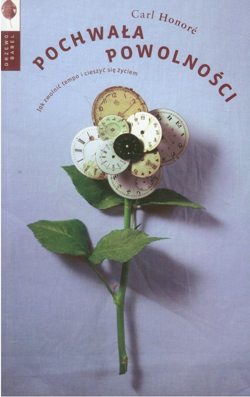

<iframe width="560" height="315" src="https://www.youtube.com/embed/sT84OY-3a7M?si=qOJOQcniY-0OHFGW" title="YouTube video player" frameborder="0" allow="accelerometer; autoplay; clipboard-write; encrypted-media; gyroscope; picture-in-picture; web-share" referrerpolicy="strict-origin-when-cross-origin" allowfullscreen></iframe>

> Szybkimi krokami zmierzamy ku powszechnemu wypaleniu. Cierpimy na tak dotkliwy brak czasu, że zaniedbujemy znajomych, rodziny i partnerów. Już prawie nie potrafimy się cieszyć z niczego, bo zawsze wybiegamy myślą do tego, co czeka nas później. Jemy niezdrowo i niesmacznie. A ponieważ nasze dzieci wpadły w ten sam wir, przyszłość maluje się niewesoło.
> 
> Carl Honoré, Pochwała Powolności

Książka zaczyna się od pokazania przyczyn i kosztów dużego tempa życia, a potem przechodzi przez poszczególne sfery życia, jak jedzenie, życie w mieście, zdrowie, seks, praca, wypoczynek i wychowanie dzieci.

Jest napisana solidnie. Widać w niej dobry, dziennikarski sznyt. Autor nie wychwala pod niebiosa powolnego życia. Pokazuje oczywiście plusy, ale zwraca uwagę na cały szereg problemów związanych z próbą wprowadzania wolniejszego trybu życia.

Jeździ w tym celu po całym świecie i próbuje wszystkiego, co proponują mu rozmówcy, jak 4-godzinną kolację we włoskich górach, trening siłowy SuperSlow, a nawet praktyki reiki i tantry, do których podchodzi, jak większość Zachodu, bardzo sceptycznie. Pokazuje zarówno ogólne nastawienie społeczeństwa do nowych idei, opinie zwolenników i przeciwników, jak i swoje własne przekonania i doświadczenia.

Kiedy omawia wprowadzenie we Francji 35-godzinnego tygodnia pracy, to wskazuje jak dużo to zmieniło w poziomie zadowolenia pracowników i ich produktywności.

Nie omija jednak ani nie próbuje bagatelizować problemu dziury budżetowej, która powstała na skutek wprowadzenia tego planu w życie, czy zmniejszenia inwestycji zagranicznych spowodowanych wyższymi kosztami pracy.

Nie bagatelizuje różnic w poczuciu zadowolenia z nowego systemu wśród pracowników: podczas gdy młodzi, ambitni mężczyźni-single chcą piąć się po szczeblach kariery i pracować znacznie więcej, matki kilkorga dzieci wolałyby mniejsze pensje, za to mieć czas, żeby z dziećmi rano zjeść śniadanie, a wieczorem poczytać im do spania.

Zastanawiasz się pewnie czy po przeczytaniu tej książki zwolniłem?

Z pewnością potwierdziły się moje przypuszczenia o zaletach powolnego życia i uzupełniłem zestaw argumentów, potrzebnych mi do zmiany podejścia przedsiębiorców, którzy mierzą się z wysoką konkurencyjnością i chcą szybciej wprowadzać swoje produkty na rynek.

Ponadto lepiej zrozumiałem skąd bierze się nasz pośpiech i czemu tak trudno nam jest przestać gonić:

> Nawet tęskniąc za spowolnieniem, czujemy, że powstrzymuje nas mieszanina chciwości, inercji i strachu przed niedotrzymaniem kroku innym.

Gdy poszukać mechanizmów znanych psychologii, to okazuje się, że można znaleźć na siebie haka i faktycznie dać się przekonać, żeby zwolnić. Zwłaszcza, gdy autor podaje tak wiele przykładów tego, że wolniej wcale nie znaczy mniej czy gorzej. Wręcz przeciwnie.

Wskazuje na tak wiele sytuacji, w których spowolnienie daje ogrom korzyści, że nie sposób nie zacząć sobie przypominać podobnych historii ze swojego własnej życia i zastanowić się w jaki sposób przełożyć to na swoje własne życie.

Jedna z jego rozmówczyni mówi:

> Kiedy w pracy człowiek przestaje sobie powtarzać „jedziesz, nie przestajesz”, to szybko wyzbywa się tego nastawienia we wszystkich innych sferach życia (…) Ma się wtedy ochotę głębiej doświadczać różnych rzeczy, a nie tylko prześlizgiwać się po powierzchni.

A więc czy dzięki tej książce zwolniłem? Myślę, że nie aż tak bardzo, bo nie była to dla mnie radykalna zmiana myślenia. Już od miesięcy prowadzę bardziej zwolniony (czy może bardziej dopasowany do mojego rytmu) styl życia.

Do momentu przeczytania tej książki, ze slow life miałem już trochę do czynienia, jednak odświeżyłem sobie i utrwaliłem listę zasad, którymi kieruje się ta filozofia.

Zaliczyć do nich należy przede wszystkim minimalizm i uważność. Kupowanie mniej, ale lepszej jakości rzeczy, otaczanie się tylko tymi przedmiotami, których naprawdę potrzebujemy, bardziej ze względów pragmatycznych, niż aby zakomunikować osiągnięcie wysokiej pozycji społecznej – to zmniejsza konsumpcjonizm i wywoływanie poczucia mniejszości wśród osób, które obserwują nas na social media.

Mniej rzeczy, to mniej bodźców, i to większy spokój umysłu. Temu służy uważność, która pomaga oczyścić umysł ze zbędnych myśli i mniej angażować się w nie emocjonalnie.

Większy spokój umysłu, mniej negatywnych myśli i większa klarowność, prowadzą do lepszych decyzji i większej produktywności.

I te myśli pomagały mi z większym spokojem podchodzić do huśtawki emocjonalnej, którą zaserwował mi autor. Podczas lektury wahałem się pomiędzy nadzieją a rozpaczą, gdy wsłuchiwałem się w opowiadane historie, argumenty za i przeciw, listę korzyści i wad oraz prognozy na przyszłość.

Ewidentnie przyspieszyliśmy i widać to na przykładzie muzyki. Kiedyś 120 uderzeń na minutę było tempem optymalnym do pobudzenia słuchaczy. Teraz często jest to 170 i więcej.

Wyznawcy _tempo giusto_ (działania we właściwym tempie) sugerują, że muzyków klasycznych powinniśmy grać o połowę wolniej, aby wydobyć zamysł kompozytorów, poruszającą głębię i fascynujące niuanse.

Na zakończenie Carl Honoré zauważa, że tempo jego życia **jest** szybkie i docenia spowolnienie w każdej dziedzinie. Jest to – bez dwóch zdań – _Pochwała Powolności_. Zauważa jednak, że nadal lubi słuchać muzyki klasycznej w nowoczesnym wydaniu czy szybko jeździć samochodem.

To, co przewija się przez całą książkę, to pokazanie jak wiele prób podejmuje się na świecie w każdej dziedzinie życia i branży, aby zwolnić – mniej lub bardziej – i znaleźć właściwe tempo, w jakim działanie i życie mają głębię oraz sens. Bez narzucania rytmu innym, za to z akceptacją różnorodności.

Co jest jednak kluczem do tego, aby działać w swoim rytmie?

Być może odpowiedź jest zupełnie inna, niż nam się zdaje. Być może znajdziemy ją wtedy, kiedy przestaniemy na chwilę działać, robić i kontrolować.

W solidnym, napełniającym nadzieją podsumowaniu (które prawdopodobnie wystarczyłoby przeczytać z tej książki, aby wyciągnąć jej esencję) możemy przeczytać:

> Szybkość też bywa miła, produktywna i ważna, i bylibyśmy bez niej ubożsi. Świat potrzebuje czegoś innego i właśnie tu ogromna role ma do odegrania ruch powolnościowy, który proponuje coś w pół drogi, przepis na pożenienie _la dolce vita_ z dynamizmem ery informacji.
> 
> Sekret tkwi w równowadze: zamiast robić wszystko szybciej, róbcie to w odpowiednim tempie. Czasem szybko. Czasem wolno. Czasem jakoś pomiędzy. Być Powolnym lub Powolną znaczy nigdy się nie spieszyć, nigdy nie silić się, by oszczędzać czas dla samego oszczędzania. Znaczy to zachować spokój i nie tracić głowy nawet wtedy, gdy okoliczności zmuszają nas, by przyspieszyć.
> 
> Jednym ze sposobów na rozwijanie wewnętrznej Powolności jest znalezienie czasu na zajęcia, które stanowią sprzeciw wobec przyspieszania – medytację, robienie na drutach, ogrodnictwo, jogę, malowanie, czytanie, spacerowanie, chi kung.
> 
> Nie istnieje jedna recepta na spowolnienie, uniwersalny poradnik właściwego tempa. Każda osoba, każde działanie i każdy moment maja własny Eigenzeit. Niektórzy są szczęśliwi, żyjąc na takich obrotach, które resztę z nas doprowadziłyby przedwcześnie na cmentarz. Każdy musi mieć prawo wyboru tempa, które mu odpowiada. Jak mówi niemiecki pianista Uwe Kliemt: „Świat jest bogatszy, kiedy znajdujemy w nim miejsce na różne szybkości”.

