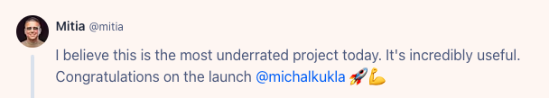

Ostrzegali mnie, że Product Hunt jest przereklamowany. Niektórzy zgłaszają obawy, że konieczne jest wydanie sporego budżetu, aby uzyskać efekty, i twierdzą, że prawdziwych *early adopterów* na tej platformie już nie ma. Są za to marketerzy, którzy podbijają swoje produkty.

Krótko mówiąc: nie ma co liczyć na pozyskanie klientów.

Pomimo tego zdecydowałem się uruchomić kampanię, której celem było zdobycie tych pierwszych użytkowników na [[speechzap|SpeechZap]] i sprawdzenie, czy komunikat marketingowy trafia do ludzi.

W tym wpisie opowiadam jak to zrobiłem i przedstawiam moje doświadczenia z pierwszego dnia promocji.
## Promocja na socialach

Całą kampanię skoordynowałem z publikacją na moich socialach, które raczej nie mają zasięgów (powiedzmy taka średnia zwykłego prywatnego profilu). Nigdy specjalnie się nie udzielałem, ale to temat na inny post.

Nagrałem [[speechzap-wideo-promocyjne|filmik promocyjny]], który był tylko w języku angielskim, więc trochę obawiałem się jaki będzie odbiór w Polsce. Wykorzystałem go jako wabik do zwiększenia zaangażowania i tym samym poszerzenia zasięgów. Uważałem, że jest na tyle krótki (i nawet momentami zabawny), żeby ktoś chciał go obejrzeć i zobaczyć zajawkę produktu.

W treści postów wkleiłem prośbę o wsparcie na Product Hunt.

Opublikowałem post na prywatnym FB oraz IN, a potem jeszcze:
- na mojej grupie prawie 14 tys. osób (jest z ogłoszeniami o pracę, ale wrzucam tam czasem zajawki moich produktów, bo czemu nie, skoro moderuję bezpłatnie od lat?)
- na grupie *Rozmowy o startupach*, z linkiem do Product Hunt i pytaniem o inne platformy (poznałem w ten sposób radarpremier.pl)
- na grupie *Twórcy aplikacji SaaS*, gdzie dostałem najwięcej wsparcia, głównie od innych twórców, także będzie trzeba się odwdzięczyć 🤟
- na wip.co, gdzie chwalę się postępami w rozwoju projektów (tam też opublikowałem dwie prośby o wsparcie mnie na Product Hunt z celem dobicia do 100 głosów)

Do kilku osób napisałem też prywatną wiadomość, żeby mi pomogli nieco rozbuchać wstępnie posty, żeby nie umarły za godzinę bez żadnych komentarzy czy polubień. Nie ma smutniejszego widoku, niż post o nowym produkcie, który nie ma żadnej aktywności 😅
## Oferty

Dostałem grubo ponad 10 zaproszeń na LinkedIn i maili z natychmiastową ofertą podbicia postów (nawet ponad 400 *upvotes* na Product Hunt). Na ceny za bardzo nie patrzyłem, bo nie interesują mnie sztuczne lajki. O ile to oczywiście pomogłoby mi dotrzeć do top10, które jest w codziennym newsletterze wysyłane, o tyle uważam to za nieetyczne działanie.

Dlatego nie będę podawał też cen, jakie dostałem w ofertach.

Oprócz sztucznych, ponoć legitnych *upvotes*, oferowali mi też wzmianki w newsletterach, tweetach i postach na LinkedIn. Ceny zaczynały się od kilkudziesięciu USD do grup od kilkunastu do kilkudziesięciu tysięcy odbiorców. Nie dostałem żadnej opcji weryfikacji na start, a sam nie prosiłem, więc nie wiem, czy warto.
## Komentarze

Początkowo dostałem kilka sensownych komentarzy, z pytaniem o funkcje, więc było to dość merytoryczne i dawało nadzieje, że rozkręci się temat. Zwłaszcza, że tempo pojawiania się głosów wskazywało, że do końca premiery dobiję spokojnie do poziomu ponad 300.

Gdy przeglądałem wcześniej kilku konkurentów, to zwróciłem uwagę, że niektóre są jakieś dziwne. Pisane ewidentnie przez GPT, więc wyglądały jak kupne. Ale u mnie też się takie pojawiły. Być może były skorelowane z jakąś ofertą, którą dostałem na maila lub IN, ale może nie połączyłem kropek.

W międzyczasie zwróciłem uwagę, że można dawać komentującym nagrody, coś w stylu "pomysł na funkcję", albo "zgłoszenie błędu". Te nagrody najwidoczniej trafiają do profilu komentującego, co prawdopodobnie podbija im zasięgi albo wiarygodność - nie wiem. Nie wygląda jednak na to, żeby były to osoby, które są zainteresowane produktem. Raczej auto-promocją.

Na profil takiej osoby można wejść i najczęściej zobaczymy, że promuje coś własnego.

Dostałem też wiadomość od jednej osoby, że podbiła mój post i prosi o to samo, bo dzisiaj też ma premierę. Była na trzecim miejscu.
## Efekty

Od 9 rano czasu polskiego (kiedy zmienia się data w Stanach Zjednoczonych) do godziny 17:00 dobiłem do 52 głosów i zatrzymałem się gdzieś w okolicy 23. miejsca. Ostatecznie dobiłem do ponad 70 głosów.

Dostałem jednak podnoszące na duchu komentarze, np. ten:

Przypomniał mi się jeden z odcinków *Newsroomu*, w którym jeden z redaktorów ochrzanił kolegów z pracy, którzy robili listę najbardziej przereklamowanych filmów. Zasugerował, żeby zrobili listę najbardziej **niedocenianych** filmów. To wnosi wartość.

*Anyway*, takie słabe wyniki mogą wskazywać na słaby interfejs, marketing i brak *landing page*, który wyjaśniałby co jest takiego super w tej apce.

Do końca dnia premiery zarejestrowało się 8 nowych osób, co uważam za niezły wynik, jak na tak słabą widoczność w Product Hunt. Jednak większość z nich, to były osoby z moich własnych sociali.
## Wnioski

Popełniłem na pewno kilka błędów. 

Zmieniłem tło na FB oraz rozpocząłem nową pracę na IN (jako twórca aplikacji SpeechZap) i przez to trochę lajków poszło w gwizdek. Zamiast podbijać posty, na których mi najbardziej zależało, to ludzie lajkowali i komentowali treści, które nie miały żadnego CTA.

Na początku przybywało sporo głosów, ale z czasem tempo zaczęło mocno spadać. Mogło to być związane z ustaleniem już rankingu. Spadnięcie na 23. pozycję mogło wywołać efekt taki, jak w przypadku wyników wyszukiwania w Google. Pierwsze miejsca zgarniają 90% ruchu, a na te pozostałe mało kto patrzy.

Niemniej dla mnie to wartościowe doświadczenie. Poznałem nową platformę i specyfikę promocji w niej. Jeśli będę zabierał się za następną taką kampanię, to prawdopodobnie najpierw zgromadzę większą publiczność i postaram się poszukać klientów w bardziej niszowych miejscach, gdzie być może nieco łatwiej się wybić. Dopiero gdy zbuduję sobie bazę, z dopracowanym marketingiem i produktem, wejdę na Product Hunt.

Albo odwrotnie: wejść od razu na Product Hunt bardziej z ideą niż czymś gotowym, dać się poznać i zobaczyć, czy na produkt jest wzięcie, a dopiero potem robić. Prawdopodobnie spróbuję też tą metodą, bo może się okazać, że wyniki będą zupełnie inne i PH nie będzie nadawało się do tego typu testów. 

PH ustawia ranking po kilku godzinach od startu, więc jeśli ktoś trenduje, to będzie trendować prawdopodobnie już do końca. Nikt nie ma tyle czasu, żeby przetestować każde narzędzie, więc te pierwsze kilka godzin (lub baza lojalnych klientów) jest kluczowa.
## Podsumowanie

Cieszę się, że zrobiłem tę promocję, pomimo niezadowalających efektów. Lepiej żałować, że nie przyniosło rezultatów, jakich oczekiwałem, niż że nie zrobiłem promocji wcale. Premiera powinna być jednym z punktów na *checkliście* marketingowej aplikacji typu SaaS, ale nie ma co pokładać wszystkich nadziei w tej jednej platformie.

Ostatecznie premiera zajęła mi cały dzień i nauczyła nowych rzeczy. Cenne doświadczenie.