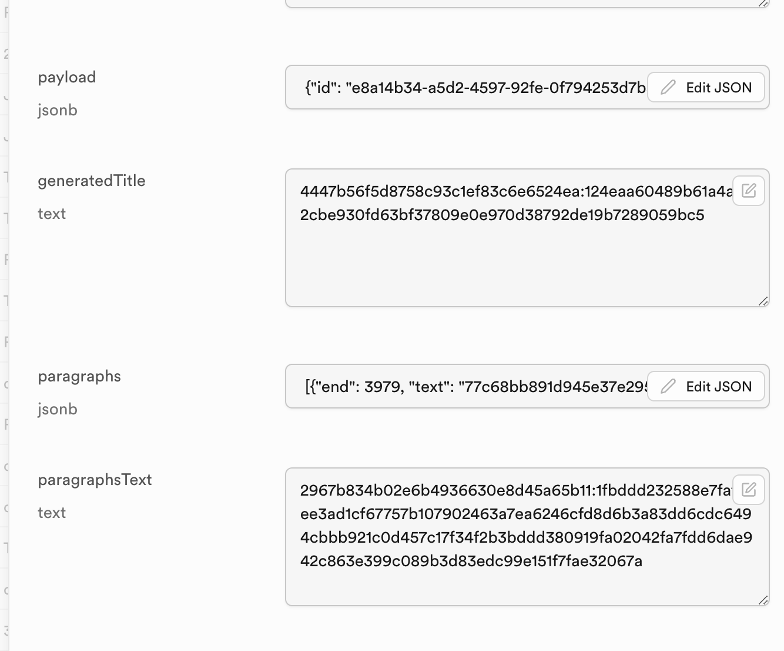
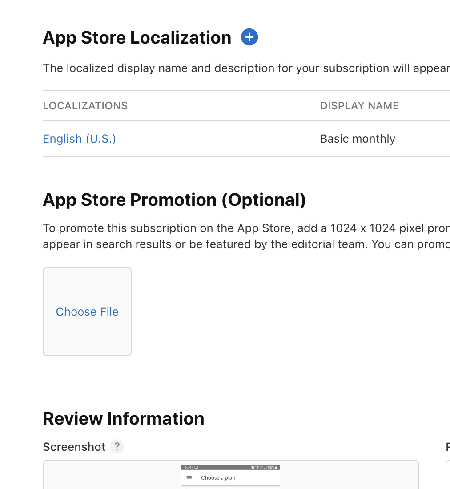
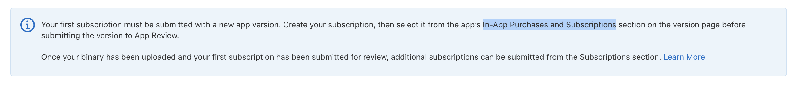

Reklama dyktafonu [[speechzap|SpeechZap]] w Google Ads nie przyniosła oczekiwanych rezultatów. Choć dzięki temu [[zly-i-dobry-ux|poprawiłem UX]] testowania aplikacji, co zaowocowało czterema kontami testowymi. To już coś!

Wyłączyłem jednak kampanię i postanowiłem przyspieszyć prace nad inną metodą pozyskania pierwszych użytkowników: publikacją na Product Hunt.
## Czym jest Product Hunt?

To platforma, w której nowe produkty są oceniane i komentowane przez uczestników.  Użytkownicy Product Hunt to głównie miłośnicy technologii, innowacji i nowych rozwiązań. Dla SpeechZap - dyktafonu z transkrypcją AI i integracjami - jest to więc idealne miejsce do znalezienia pierwszych klientów.

Ostatnio Michał Parkoła podesłał mi link do wpisu na LinkedIn, gdzie ktoś chwalił się, że swoją aplikację nakodował w 16 godzin i następnego dnia zamierza wrzucić właśnie na Product Hunt. 

Gdy w rozmowie zauważyłem, że gość się nie ociąga, to skomentował:
> Do odważnych świat należy!

Kilka dni później zauważyłem tę samą aplikację wymienioną w Superhuman AI - newsletterze wysyłanym do kilkuset tysięcy ludzi.

Nie wiem, czy trafił tam za pomocą pieniędzy czy nie. (W tej sekcji, gdzie się pojawiła wzmianka, podobno tylko jedna aplikacja jest sponsorowana - i to nie była ta.)

## Buduję dźwignię

Publikacja na Product Hunt, jeśli będzie udana, to dotrze do szerokiego grona odbiorców - głównie anglojęzycznych i z krajów rozwiniętych. Im więcej osób będzie mogło przetestować, tym większa szansa, że pozytywnie ocenią aplikację. Im więcej pozytywnych ocen, tym większa szansa, że dotrę do kolejnych użytkowników.

Dźwignią nazywam wszystkie te działania, które przyczynią się do łatwego zwiększenia dostępności aplikacji.

Do tej pory testowałem apkę na rynku polskim i tylko na Android, dlatego ruszyłem z pracami, które mają zaowocować największą możliwą dźwignią:
- publikacja aplikacji w sklepie AppStore,
- szyfrowanie danych,
- dodanie sekcji FAQ, wyjaśniającej największe obiekcje,
- nagranie wideo w języku angielskim.

## Gdzie kończy się MVP?

To moment, w którym najbardziej obawiam się, że przeinwestowuję. Być może tak jest. MVP wcale nie musi być dostępne dla wszystkich, żeby przetestować ideę.

Wydaje mi się oczywiście, że koncepcja jest dobra, ale może próbuję rozwiązać nieistniejący problem, albo problem, który mam tylko ja?

Zainwestowałem już miesiąc pracy w tę aplikację, choć PoC, które było dla mnie wystarczające na początek, zrobiłem raptem w kilka dni. Znacznie więcej czasu musiałem poświęcić na wdrożenie subskrypcji, postawienie *backendu*, autentykacji i wszystkich tych rzeczy, które nie przyczyniają się bezpośrednio do wniesienia wartości dla użytkowników.

(Choć dzięki temu mogłem zrobić kolejkowanie akcji, co stanowi dla mnie dużą wartość.)

Są też przeszkody, które mogą stanowić barierę w dotarciu do wielu użytkowników, ale nie jestem pewien, czy są nimi w rzeczywistości.

Na przykład...
## Obawy o prywatność - czy to przeszkoda?

W rozmowach z niektórymi osobami dwukrotnie natrafiłem na obawy o prywatność:
> Kto będzie miał dostęp do potencjalnie wrażliwych danych i mojego *know-how*?

Miałem już wcześniej doświadczenia z wdrażaniem [[wjechalo-szyfrowanie-w-slowtracker|szyfrowania danych]], więc uznałem, że warto to zrobić. (Zwłaszcza, że nie wymaga zmiany w samej aplikacji, a jedynie na moim serwerze.)

I wdrożyłem. Teraz wszystkie dane trzymane na serwerze są automatycznie szyfrowane osobnymi kluczami dla każdego użytkownika. Dzięki temu ewentualny wyciek bazy danych nie ujawni żadnych danych użytkowników ani treści ich transkrypcji.

Oto dowód:

## AppStore

Chcę opublikować aplikację w przyszłym tygodniu. Kapnąłem się jednak podczas wtorkowego *mastermindu* z Gosią, że Apple będzie potrzebowało kilku dni na akceptację. Przyspieszyłem więc prace nad wystawieniem apki dla użytkowników iPhone'ów, na co składa się:
- uruchomienie aplikacji na iOS,
- przygotowanie kont testowych dla pracowników Apple,
- wyklikanie w sklepie wszystkich formularzy, *listingów*, zrzutów ekranu, itd.,
- wyklikanie subskrypcji i cen,
- przygotowanie *backendu* na obsługę subskrypcji przez Apple (kilka linijek kodu, ale przypomniałem sobie o tym dopiero jak mi odrzucili apkę 😅),
- oczekiwanie na akceptację.

Dopasowanie aplikacji do iOS poszło szybko: nie działało tylko odtwarzanie nagrania i musiałem dorzucić odpowiednie uprawnienia w kilku miejscach. *Easy!*

Wyklikanie tego w sklepie zajęło mi 4 godziny. 

Najwięcej zamieszania miałem z subskrypcjami, bo kompletnie nie rozumiałem przeliczania cen. Przykładowo, gdy przeliczałem z USD na PLN, to \$1,19 ustawiło cenę 4,99 PLN, a \$11,90 ustawiło 69,99 zł. Nie mam pojęcia czemu. Jak się dowiem, to pewnie o tym napiszę.

Na pewno trzeba wziąć pod uwagę, że w niektórych krajach nie ma podatku VAT (np. w USA, moim głównym rynku), a w wielu innych stawki są inne niż w Polsce (choć różnica nie jest aż tak widoczna).

Dodatkowo nie umiałem zrozumieć komunikatu o dołączaniu subskrypcji do *review*. Dzięki pomocy Szymona z mojego *mastermindu* doszedłem do przyczyny: nie wypełniłem wszystkich wymaganych pól.

Jak widać na powyższym obrazku, `App Store Localization` i `Review Information` są wymagane. Albo inaczej: `App Store Promotion (Optional)` jest opcjonalne, czyli tamte pozostałe są wymagane. I niestety, przy zapisie tego planu subskrypcji nie dostaniesz żadnego komunikatu o brakujących danych. Ani nigdzie indziej tej informacji nie dostaniesz!

Objawia się to natomiast w ten sposób, że **nie widzisz sekcji**, o której piszą w niebieskiej ramce na górze strony (tej, i kilku innych, dla "ułatwienia"):

Panel AppStore jest więc czasami krystalicznie **nieintuicyjny** 😞

## Co dalej?

Nie udało mi się jeszcze opublikować aplikacji w AppStore. Po [[przeprawa-speechzap-google-play|przeprawie z Google Play]] wiem już, że nie mam co liczyć na sensowną informację zwrotną. Tak jest też w tym przypadku, ale o tym może napiszę kolejnym razem (jak już będę wiedział co było **prawdopodobną** przyczyną odrzucania).

W następnych krokach będę chciał zrobić FAQ oraz instrukcje używania aplikacji, aby łatwo było zobaczyć możliwości i korzyści.

Szymon podpowiedział mi jeszcze kilka sensownych poprawek UXowych do samego widoku subskrypcji, więc razem z tymi, które sam planowałem wziąć na warsztat, będę miał jeszcze kilka godzin kodowania.

*Wish me luck* 🤞