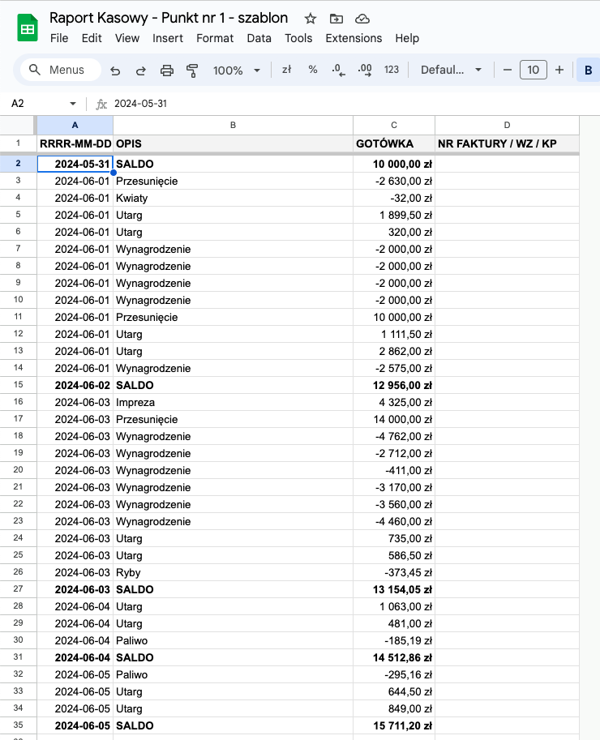

W hotelu, w którym pomagam jako konsultant i uwalniam od przykrych, powtarzalnych zadań administracyjno-księgowych, właściciele muszą przygotowywać raport kasowy.

Do tego raportu trafiają:
- codzienne utargi z 5 punktów (restauracja, wypożyczalnia, klub nocny z kręgielnią, recepcja i karczma)
- faktury i paragony opłacane gotówką
- inne wydatki gotówkowe, jak np. wynagrodzenia

Przy okazji właściciele chcieliby znać stan kasy na bieżąco. No i wreszcie, nie wszyscy powinni mieć do tego dostęp.

Kiedyś właściciel wpisywał wszystkie pozycje ręcznie, co było uciążliwe, zbędne i podatne na błędy.

Teraz stworzyłem arkusz, który pozwala na ograniczenie całej tej żmudnej pracy.
## Jak to działa?

Opieramy się głównie na arkuszach Google, bo są bezpłatne, dostępne z każdego urządzenia i można je zintegrować z wieloma narzędziami.

Każdy punkt handlowy, który obraca gotówką, ma swój arkusz, do którego wpisuje poszczególne operacje oraz utargi z danego dnia.

Oto arkusz wszystkich poszczególnych operacji gotówkowych w kasie punktu handlowego. Pozycja "SALDO" przyspiesza sumowanie i weryfikowanie stanu z zapisami księgowymi.

A poniżej szablon codziennych utargów z podziałem na płatności gotówką, kartą i przelewem. W kolumnie "Terminal" wpisujemy raport z terminala, a w kolumnie "karta" raport z systemu POS. Wtedy kolumna "terminal kontr." można nam wykazać błędy.

Podobnie z utargami, w kolumnie "utarg" wpisujemy raport z systemu POS, a kolumna "Kontrolne" sprawdzi, czy zsumowane poszczególne pozycje dają nam kwotę utargu z raportu.

Następnie wszystkie arkusze każdego punktu importujemy do jednego arkusza zbiorczego, do którego dostęp mają **tylko osoby upoważnione**.

W tym celu podajemy adresy arkuszy kalkulacyjnych poszczególnych punktów handlowych. W obecnej wersji można dodać maksymalnie 5 punktów, ale można to łatwo rozszerzyć.

W oryginalnej wersji faktury gotówkowe były pobierane z programu wFirma (zrobiłem sobie do tego osobny skrypt, który codziennie rano importował dane). Możemy jednak wpisywać je ręcznie lub pobrać z raportów kasowych poszczególnych punktów.

Jeśli, np. jako właściciele, prowadzimy jeszcze osobną ewidencję wydatków, które nie przechodzą przez ręce pracowników, to możemy:
1. Stworzyć osobny arkusz do swoich operacji, jako kolejny punkt, albo...
2. Użyć specjalnego arkusza wewnątrz Raportu Kasowego, z którego będziemy importować dane do docelowego RK.

Docelowy arkusz RK gromadzi wszystkie dane w jednym miejscu i pozwala na zorientowanie się jaki jest aktualny stan kasy. Taki raport można wydrukować i/lub przesłać w formie elektronicznej do księgowości.

W hotelu, którym zarządzałem kilka lat temu, taki raport miał jeszcze **kategorie**, które służyły nam dodatkowo do rachunkowości zarządczej: mogliśmy zgromadzić wszystkie koszty i przychody w jednym miejscu i wygenerować raport miesięczny z podziałem na punkty handlowe lub centra kosztów i przychodów.
## Potrzebujesz podobnego rozwiązania?

Zajmuję się takimi automatyzacjami na co dzień, bo lubię tworzyć przydatne narzędzia, które uwalniają od przykrych, powtarzalnych zadań.

Dlatego jeśli czujesz, że można by uwolnić również Twój czas i kreatywność, to napisz do mnie na michal@kukla.tech lub zadzwoń pod nr <a href="tel:+48 691 059 529">+48 691 059 529</a>.
