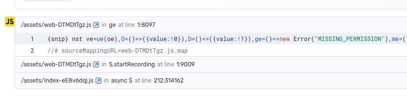
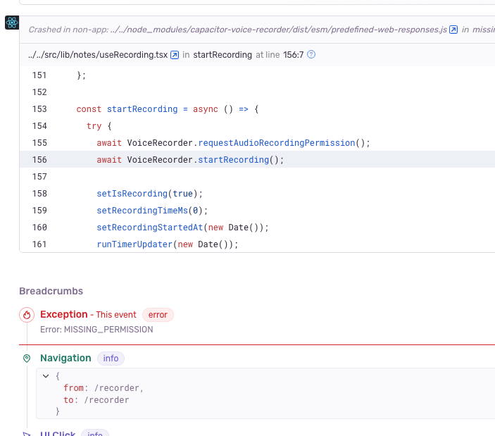
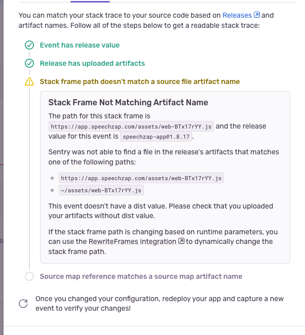
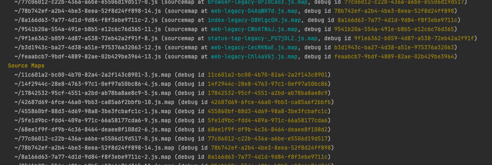

Szymon z mojego *mastermind* powiedział celnie, że *observability* jest ważniejsze od CI/CD. O ile kłócimy się o zasadność konfigurowania tego ostatniego (zwłaszcza w jednoosobowych projektach), o tyle informacje o błędach *na produkcji* są krytyczne.Dzięki temu możemy reagować na błędy, które napotykają użytkownicy. Zwłaszcza na początku projektu to szalenie ważne, aby czuli się zaopiekowani, bo łatwo ich stracić.

Dlatego dzisiaj o tym czym jest *observability* i jak zainstalowałem [Sentry](https://sentry.io/) w mojej aplikacji mobilnej [[speechzap|SpeechZap]], aby wychwycić błędy na urządzeniach użytkowników.
## Czym jest *observability*?

Pokrótce, dla tych, którzy zaczynają swoją przygodę z programowaniem, sztuczna tłumaczy, że to praktyka umożliwiająca zrozumienie stanu wewnętrznego systemu na podstawie jego zewnętrznych *outputów*. Obejmuje trzy główne filary:

1. **Logowanie (*Logging*)** - zapisywanie zdarzeń i wiadomości systemowych, które mogą być później analizowane.
2. **Metryki (*Metrics*)** - zbieranie i monitorowanie danych liczbowych, takich jak czas odpowiedzi, użycie pamięci, czy liczba żądań na sekundę.
3. **Śledzenie (*Tracing*)** - śledzenie przepływu żądań przez różne komponenty systemu, co pomaga zrozumieć, gdzie mogą występować opóźnienia lub błędy.

*Observability* pozwala na szybkie identyfikowanie, diagnozowanie i naprawianie problemów, co jest kluczowe dla utrzymania wysokiej jakości i dostępności aplikacji.

## Przygoda z narzędziami do monitoringu błędów

W mojej aplikacji [[slowtracker|SlowTracker]] zrobiłem jedno podejście do instalacji Sentry - narzędzia do zapisywania błędów i innych zdarzeń występujących na urządzeniach użytkowników. Znałem je z pracy w dużym polskim startupie, ale próba *deployu* tego u mnie zakończyła się awarią aplikacji. 

Nie wnikałem, zainstalowałem alternatywę - [Bugsnag](https://www.bugsnag.com/). Podobnie jak Sentry, gromadził *breadcrumbs*, dzięki czemu widać było jakie logi pojawiły się w konsoli i w co użytkownik klikał przed wystąpieniem awarii, dzięki czemu można było znacznie łatwiej zrozumieć i zreprodukować błąd.

Niestety Bugsnag coś słabo działało i rzadko dostawałem informacje o błędach, choć czułem, że powinienem był coś dostać. Odnosiłem wrażenie, że tylko w [wersji webowej](https://app.slowtracker.com) dostaję jakieś komunikaty.

Gdy rozpocząłem pracę nad [[speechzap|dyktafonem SpeechZap]], to skopiowałem *codebase* z poprzedniego projektu, więc Bugsnag został.

Jednak ostatnio znów miałem [[przeprawa-speechzap-google-play|przeprawę z Google Play]]. Aplikacja na moich urządzeniach i emulatorach działała, testy automatycznie w Google przeszły (*pre-launch report*), dostałem nawet zrzuty ekranu świadczące o tym, że apka działa. Jednak manualni testerzy odrzucili publikację, twierdząc, że aplikacja się instaluje, ale się nie ładuje.

Złożyłem apelację, przede wszystkim pytając na jakim urządzeniu testowali i jak mogę zreprodukować u siebie ten problem. Odpisali, że zaakceptowali apelację i mam zgłosić ponownie aplikację.

Po kilku bezsensownych wymianach maili zrozumiałem, że - tak jak [[speechzap-wreszcie-w-sklepie|ostatnim razem]] - niczego więcej się nie dowiem i muszę sobie radzić sam.

Ograniczyłem więc o połowę liczbę urządzeń, na które dostępna jest moja aplikacja (do pewniaków) i, po konsultacjach z moim *mastermindem*, uznałem, że potrzebuję jednak spróbować zainstalować bardziej przekonujące mnie Sentry.

## Instalacja Sentry

Podstawowa instalacja Sentry w aplikacji mobilnej napisanej w Ionic React wymaga kilku kroków. Wszystkie są opisane [w dokumentacji pod Capacitor](https://docs.sentry.io/platforms/javascript/guides/capacitor/) (choć jest tu jeden haczyk, o którym za chwilę).

Już samo to daje dużo informacji o urządzeniu, na którym jest uruchamiana aplikacja, w tym o wersji Android, na czym najbardziej mi zależało. Jest też informacja o włączonych uprawnieniach, co jest równie przydatne.

Przykładowo, jeśli użytkownik mojego dyktafonu nie da uprawnień do nagrywania, to aplikacja wywali błąd przy próbie nagrania. Oczywiście powinienem to obsłużyć i pokazać stosowny komunikat użytkownikowi, ale gdybym tego nie zrobił (a zazwyczaj zaczynam od zakodowania *happy path*), to mógłbym łatwo poznać przyczynę bez przeprowadzania ręcznych testów.

## Source maps

Jedną z najważniejszych funkcji w Sentry jest możliwość prześledzenia *stack trace* z wywołaniami. Dzięki temu widać który fragment kodu był odpowiedzialny za błąd. Jednak kod produkcyjny jest zminifikowany, co oznacza, że dla programisty jest nieczytelny i trudno znaleźć fragment kodu źródłego, który był z tym błędem powiązany.

Możesz więc zobaczyć coś takiego:



I tutaj zastosowanie mają tzw. *source mapy*. Przed kompilacją TypeScript do JavaScript generowane są pliki, które można wrzucić do Sentry i dzięki temu narzędzie pokaże nam oryginalny kod źródłowy oraz cały *stack trace* z nazwami.

A oto widok z mapami:


## Jak wrzucić source maps Ionic React do Sentry?

I tutaj pojawił się największy problem. Jak to wrzucić? Dokumentacja ani wskazówki Szymona (który swoją aplikację robi w Ionic Angular) nie pomogły. 

Napisałem sobie skrypt, który uruchamiam wraz z innymi w trakcie *deployu*:

```bash
#!/bin/bash  
  
# Pobierz wersję z package.json  
VERSION=$(node -p "require('./package.json').version")  
  
# Stwórz komendę sentry-cli  
COMMAND="sentry-cli sourcemaps upload --release speechzap-app@$VERSION --org kuklatech --project speechzap-app --dist 1 ./dist/assets"  
# Wyświetl komendę  
echo "Wykonywana komenda:"  
echo "$COMMAND"  
  
# Wykonaj komendę  
eval "$COMMAND"  
  
# Sprawdź kod wyjścia  
if [ $? -eq 0 ]; then  
    echo "Source maps zostały pomyślnie przesłane do Sentry."  
else  
    echo "Wystąpił błąd podczas przesyłania source maps."  
    exit 1  
fi
```

Jego zadaniem jest pobrać numer wersji aplikacji i wysłać oznaczone tą wersją pliki z mapami do Sentry.

(Uwaga! Musisz się najpierw zalogować komendą `sentry-cli login`).

Cały czas dostawałem informację, że o ile *source mapy* są wrzucone, to nie idzie ich powiązać z kodem.



Pierwszą przyczyną problemów okazał się parametr `dist`, który sugerowała dokumentacja (to ten haczyk, o którym wspominałem). Nie wiedziałem jak to ustawić, aż wreszcie w nastym wątku na githubie znalazłem sugestię, aby wywalić go w ogóle, zarówno z kodu jak i w komendzie do *uploadu* do Sentry.

I okazało się, że to wreszcie zadziałało! ...ale tylko dla wersji webowej.

Szymon sugerował, że problem może być z *prefixem*. Jeśli dobrze zrozumiałem, to chodzi o *origin*, z jakiego przeglądarka wysyła żądania.

Aplikacja napisana w Ionic to tak naprawdę aplikacja webowa, wyświetlana w tzw. [WebView](https://developer.android.com/reference/android/webkit/WebView), czyli przeglądarce wewnątrz aplikacji. I *origin będzie się różnić w zależności od urządzenia*: 
- w wersji webowej np. https://app.speechzap.com
- Android: `http://localhost`
- iOS: `capacitor://localhost`

I znalazłem artykuły potwierdzające, że to może być przyczyna i należy użyć wtyczki `rewriteFramesIntegration` w Sentry. Niestety, to mi nie działało, nie rozumiałem tego i nie umiałem poprawnie skonfigurować.

Po kilku próbach wreszcie udało mi się znaleźć rozwiązanie, które poprawnie zmapowało kod również w aplikacji mobilnej. Okazało się, że jest wtyczka do [Vite](https://vitejs.dev/), która buduje i *uploaduje source mapy* z użyciem jakiejś innej metody. 



Na ten moment działa to w wersji webowej i w Android. Na iOS nie sprawdzałem, więc nie dam sobie głowy uciąć. Brzmi jednak wiarygodnie, bo korzysta - jak dobrze rozumiem - z metody wiązania map z kodem za pomocą specjalnego identyfikatora `debug id`, który tworzony jest w momencie kompilacji kodu i wrzucany automatycznie (bez dodatkowych skryptów) przez Vite do Sentry.

## Podsumowanie

Informacje o błędach po stronie użytkownika są na wagę złota. Gdybym je miał przed przykrymi doświadczeniami z Google Play, to mógłbym bez stresu wrzucać nowe wersje aplikacji.

Zobacz też:
- [[Jak ograniczyć scope projektu do MVP|Jak ograniczyć zakres projektu do MVP?]]
- [[Informacja zwrotna w działaniach online jest na wagę złota]]
