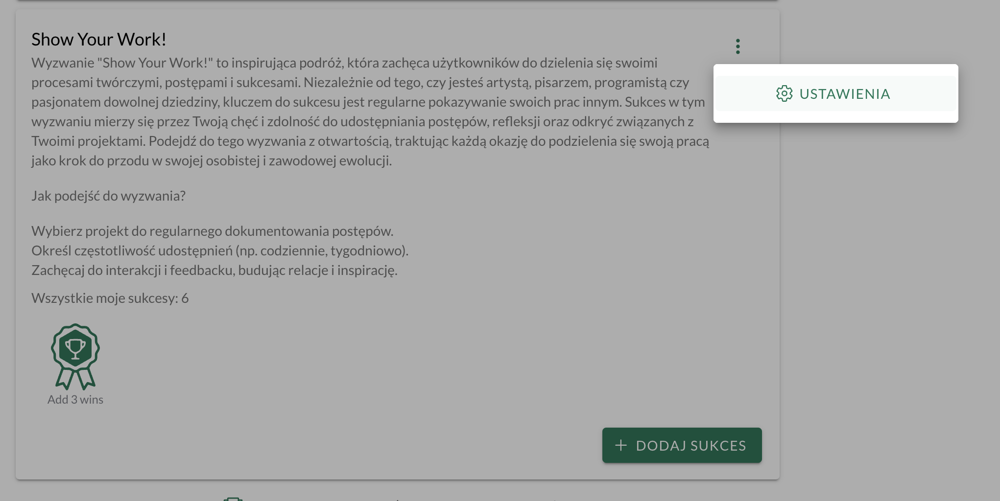
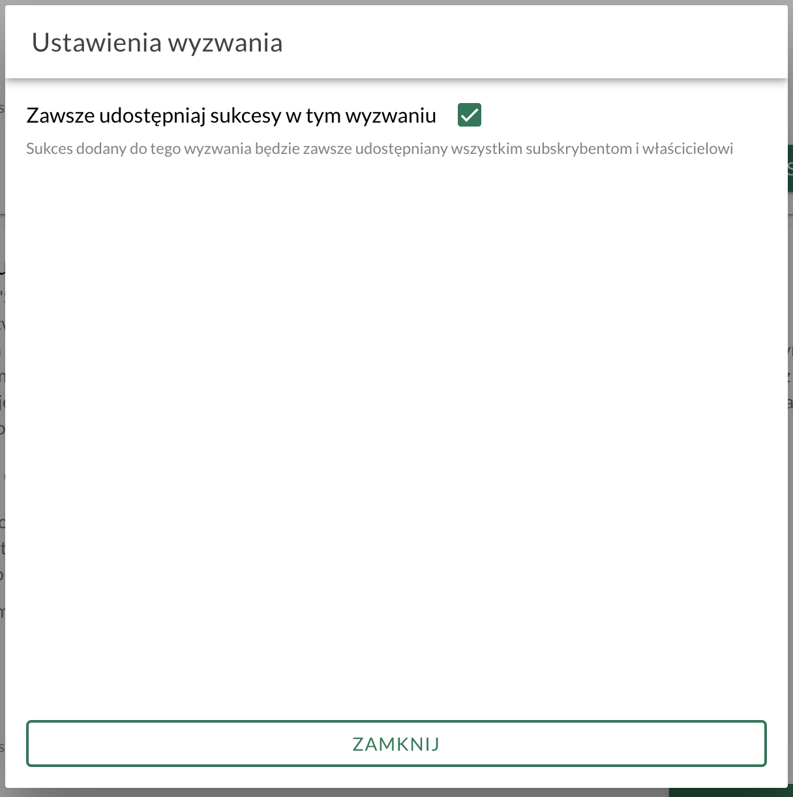

Dodałem w [[slowtracker|SlowTracker]] funkcję automatycznego udostępniania sukcesów, które są przypisane do wybranego wyzwania. To ułatwi dzielenie się wpisami zwłaszcza z trenerami, którzy tworzą wyzwania dla swoich klientów.

Do tej pory (na dobrą sprawę [[slowtracker-udostepnianie-sukcesow-w-wyzwaniach|od kilku dni]] 😅) było tak, że aby udostępnić sukces wszystkim subskrybentom wyzwania, to po dodaniu sukcesu do wyzwania trzeba było:
1. Odnaleźć wpis
2. Kliknąć trzy kropeczki (menu kontekstowe)
3. Wybrać *Udostępnij*
4. I tam dopiero zaznaczyć dla których wyzwań ma być udostępniony dany wpis.

Teraz wystarczy raz wejść w *Ustawienia* (z menu kontekstowego zasubskrybowanego wyzwania) i tam zaznaczyć opcję *Zawsze udostępniaj sukcesy w tym wyzwaniu*.

To ustawienie trzeba ręcznie włączyć, bo domyślnie wszystkie wpisy są prywatne. Sukcesy będą automatycznie udostępnione i w razie potrzeby można wyłączyć udostępnianie już po zapisaniu sukcesu, wchodząc - jak poprzednio - do panelu udostępniania.

