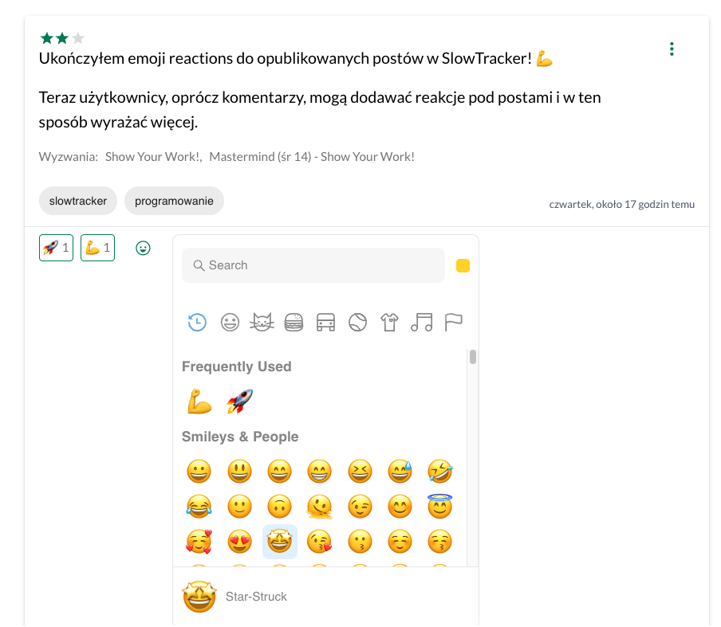

Ukończyłem emoji reactions do [[slowtracker-udostepnianie-sukcesow-w-wyzwaniach|publicznych sukcesów]] w [[slowtracker|SlowTracker]]! 💪

Teraz użytkownicy, oprócz komentarzy, mogą dodawać reakcje pod postami i w ten sposób wyrażać więcej (emocji, wsparcia).

To już chyba ostatni krok przed opublikowaniem kilku ogólnodostępnych wyzwań, które są moim drugim podejściem do rozkręcenia aplikacji. Wcześniejsze próby ze stricte prywatnymi notatkami kończyły się bardzo niską retencją użytkowników. Być może brakło przykładów w jaki sposób można korzystać z aplikacji i wyciągać z niej wartość.

Dlatego teraz chcę wykorzystać wyzwania, aby umożliwić grupowe dążenie do wspólnego celu, jakim może być na przykład:
- nabycie konkretnych umiejętności (np. pisanie, storytelling, wystąpienia publiczne)
- zmiana postawy i budowanie nawyków (np. mindfulness, slow life, [[show-your-work-austin-kleon|Show Your Work]], ekologiczny wybór, work-life balance). 

Nastawiam się głównie na grupy mastermind, które często wspierają się w dążeniu do jednego celu, a teraz mogą się wspierać codziennie i innymi kanałami niż tylko na spotkaniach. 