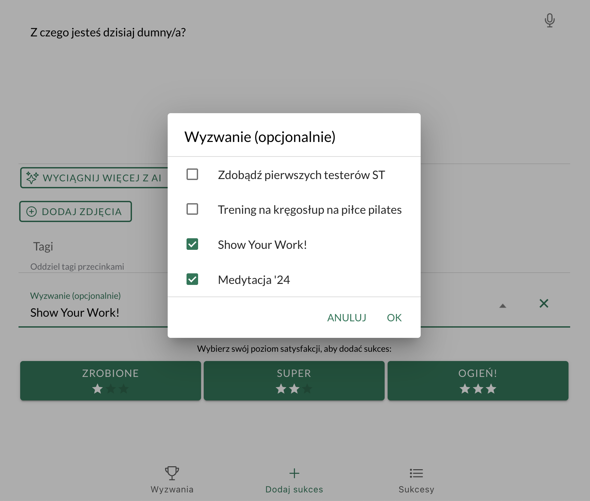

## Lepsze śledzenie postępów dzięki łączeniu wyzwań

Dodałem do [[slowtracker|SlowTracker]] funkcję subskrybowania wyzwań i przypisywania więcej niż jednego wyzwania do sukcesu. To umożliwi lepsze wykorzystanie wyzwań poprzez łączenie aktywności. 

Przykładowo, jeśli masz wyzwanie pt. *Codziennie coś nowego* oraz inne wyzwanie *Joga*, to możesz podczas każdej sesji jogi wypróbować nową asanę. W ten sposób wystarczy jeden sukces, aby śledzić postępy w obu wyzwaniach.

To ma też dać większą satysfakcję i elastyczność dla użytkowników. Oczekuję, że będzie to prowadzić do większej retencji.

## Od kuchni (dla koderów)

Przed zrobieniem tych funkcji postanowiłem trochę zrefaktorować kod (komponent dodawania sukcesu miał ponad 700 linijek). W przypadku funkcji zdjęć wiedziałem, że nie mogę tak po prostu wyeksportować komponentu, bo będę miał ich prawdopodobnie kilka w różnych miejscach formularza. Wszystkie będą musiały korzystać z tego samego stanu.

Dlatego zastosowałem React Context API i *[custom hooks](https://react.dev/learn/reusing-logic-with-custom-hooks)*. Opakowałem komponent w `ImagesProvider`, żeby umożliwić dostęp do współdzielonego kodu i stanu w kilku miejscach w formularzu dodawania sukcesu. Uprościłem tym samym kod w dość elegancki i elastyczny sposób. Chyba nie korzystałem z tego *[patternu](https://pl.wikipedia.org/wiki/Wzorzec_projektowy_(informatyka))* jeszcze.

Podobne podejście zastosowałem wreszcie do zarządzania wyzwaniami, którymi zamierzałem się zająć.

Zaprogramowanie tych wyzwań odbyło się w kilku krokach. Najpierw zrobiłem *[backend](https://pl.wikipedia.org/wiki/Front-end_i_back-end)* kilka dni temu, a teraz na *[frontendzie](https://pl.wikipedia.org/wiki/Front-end_i_back-end)* dokończyłem.

## Podsumowanie

Sukcesy są więc dwa: 
1. Nowe funkcje: łączenie wyzwań
2. Nowe doświadczenie: użycie elastycznego *patternu*

Wyzwania to funkcja eksperymentalna. Aby ją włączyć, wejdź do [ustawień](https://app.slowtracker.com/settings) (*Menu* -> *Ustawienia*).

**Uwaga**: nowe funkcje udostępniam stopniowo i nie na wszystkich urządzeniach mobilnych będzie jeszcze dostępne. Wszystkie funkcje w pierwszej kolejności są dostępne w [wersji webowej](https://app.slowtracker.com).