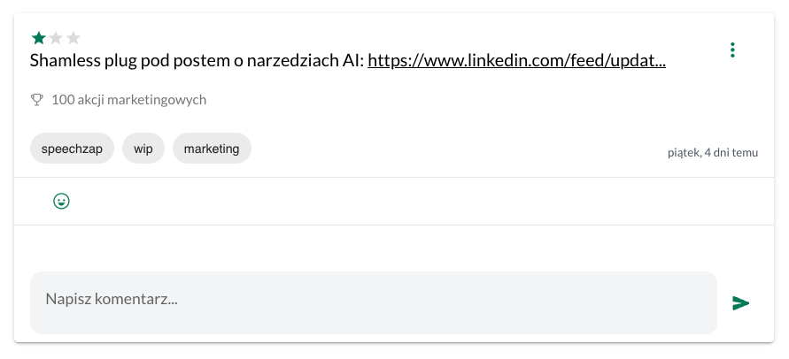

Google kazał mi do końca sierpnia udostępniać moją aplikację [[slowtracker|SlowTracker]] również dla Android 14. To była dobra zachęta do tego, żeby zrobić kilka drobnych poprawek. Nie zajmowałem się nią praktycznie przez ostatnie 2 miesiące, bo byłem w pełni skupiony na [[speechzap|SpeechZap]].

Dlatego dzisiaj krótko o nowościach w aplikacji.

## Autofocus

Podstawowym założeniem UX SlowTrackera było dodawanie sukcesów najszybciej, jak się da. Aplikacja otwiera się od razu w widoku dodawania nowego wpisu, ale trzeba było kliknąć w pole z treścią, żeby można było zacząć pisać. Irytujące. Jedna linijka kodu załatwiła sprawę i teraz po otwarciu aplikacji można od razu zacząć pisać.

## Email w API

Kiedyś miałem koncepcję, że do SlowTracker będzie można dodawać sukcesy bez wiedzy użytkowników. Może wydawać się to kontrowersyjne, ale chodziło o to, że w moim poprzednim projekcie [[microskills|MicroSkills]] użytkownik mógł śledzić swoje postępy. Chciałem wysyłać je do zewnętrznego serwisu, aby *userzy* mogli zapisywać tam dokonania i sukcesy samodzielnie lub z innych serwisów.

W ten sposób użytkownik mógłby - po założeniu konta w SlowTracker - mieć zgromadzone wszystkie swoje postępy i wykorzystać je np. do zasilenia Chat GPT, by wiedział czym się *user* zajmował i mógł pomóc opracować listę nowych kompetencji, postów na *social media* i wiele więcej.

W pierwszej wersji API trzeba było więc podać adres email użytkownika, któremu mamy przypisać ten sukces. Wpisy były oczywiście prywatne i serwis dodający je nie mógł się dostać do wcześniej wpisanych sukcesów. To była jednostronna komunikacja. 

Zagrożenia były takie, że ktoś mógł chcieć SPAMować użytkowników swoimi wiadomościami. Zabezpieczeniem przed tym była konieczność zarejestrowania aplikacji i używania klucza API. Miałem więc pewną kontrolę nad tym i mogłem w razie nadużycia usunąć dostęp.

Niestety, zamroziłem projekt MicroSkills, a innych aplikacji nie planowałem integrować. Użytkownicy SlowTracker mogą korzystać z [API](https://app.slowtracker.com/api-keys), gdzie użytkownik jest rozpoznawany po kluczu, więc nie ma potrzeby podawania jeszcze swojego adresu email.

Wyłączyłem więc konieczność podawania go w API i poprawiłem lekko [dokumentację](https://docs.api.slowtracker.com/). (Gdyby jeszcze były problemy, to napisz na support@slowtracker.com)

## Naprawiłem rozpychające URLe

W SlowTracker możesz używać [[markdown-rzadzi|markdown]] w treści notatek. W ten sposób adresy stron internetowych automatycznie przerabiane są na klikalne linki. Niestety, jeśli link był za długi, to rozpychał całą treść notatki, przez co ikonka trzech kropek wychodziła poza pole widzenia i nie można było w nią kliknąć. 

A to dość istotne, bo jeśli chcielibyśmy np. podmienić w linku klikalny tekst (powiedzmy żeby był krótszy i nie wypychał reszty treści), to nie dało się tego zrobić 😅

Skróciłem więc linki do 35 znaków za pomocą kodu, nad którym nie musiałem się specjalnie głowić, bo wygenerował mi to w minutę chat GPT:

```js
export const shortenLinks = (html: string, maxLength: number = 30) => {  
  const parser = new DOMParser();  
  const doc = parser.parseFromString(html, "text/html");  
  
  const links = doc.querySelectorAll("a");  
  
  links.forEach((link) => {  
    const text = link.textContent || "";  
  
    if (text.length > maxLength) {  
      link.textContent = text.substring(0, maxLength) + "...";  
    }  
  });  
  
  return doc.body.innerHTML;  
};
```
\
*Pretty neat, huh?*

A oto efekt:



## Automatyczne udostępnianie sukcesów w wyzwaniach i zmyślanie Rity Skeeter

Czytałem ostatnio Harry'ego Pottera. Pojawiła się tam postać redaktorki Rity Skeeter, której samopiszące pióro zmyślało historie i grubo koloryzowało wywiady.

Książka ma już 24 lata (wydana w 2000 roku), a w dzisiejszych czasach taki artefakt, jak to pióro, kojarzy mi się od razu z GPT. Postanowiłem więc stworzyć w SlowTracker wyzwanie, w którym sukcesy będą równie grubo przesadzone, jak w przypadku artykułów Rity Skeeter.

Aby to zrobić jako publiczną zabawę, potrzebowałem automatycznie udostępniać wszystkie wpisy. Dodałem więc najpierw funkcję, która podczas subskrypcji wyzwania automatycznie ustawia, aby wszystkie wpisy dodane do niego były domyślnie publiczne.

Takie ustawienie można było włączyć samodzielnie podczas konfiguracji, ale teraz jest możliwość ustawienia dodatkowej opcji do wyzwania. Ponieważ domyślnie wpisy są zawsze prywatne, to jeszcze dodałem w opisie wyzwania stosowną uwagę.

Gdy już to zrobiłem, to dodałem nową funkcję, która polega na formatowaniu wszystkich wpisów trafiających do SlowTracker. 

Jak to działa? Dodaj sukces w wyzwaniu [Rita Skeeter Pen](https://app.slowtracker.com/challenges/9facc016-065f-4966-8cc5-08f9f1dd1f48) 😉 Najpierw wstawi się sformatowany artykuł, a pod spodem oryginalny wpis.

## Podsumowanie

Jeszcze raz wszystkie nowości w SlowTracker:
- autofocus, aby nie trzeba było klikać w pole formularza, aby zacząć opisywać swój sukces
- brak konieczności podawania emaila przy dodawaniu sukcesu przez API
- poprawiona dokumentacja API
- zbyt długie adresy nie rozpychają już treści i nie blokują dodatkowych akcji
- automatyczne udostępnianie wpisów podczas subskrypcji do specjalnych wyzwań
- automatyczne formatowanie wpisów w specjalnych wyzwaniach

Najbardziej cieszę się z wprowadzenia funkcji formatowania, bo to odblokowuje kolejne możliwości. Przykładowo, teraz łatwo będzie stworzyć wyzwanie, w którym wszystkie wpisy będą automatycznie formatowane na wpis do Facebooka albo na Twittera. To ułatwi publikację swoich postępów.

Jeśli chcesz włączyć taką funkcję w [[slowtracker|SlowTracker]], to napisz do mnie na support@slowtracker.com