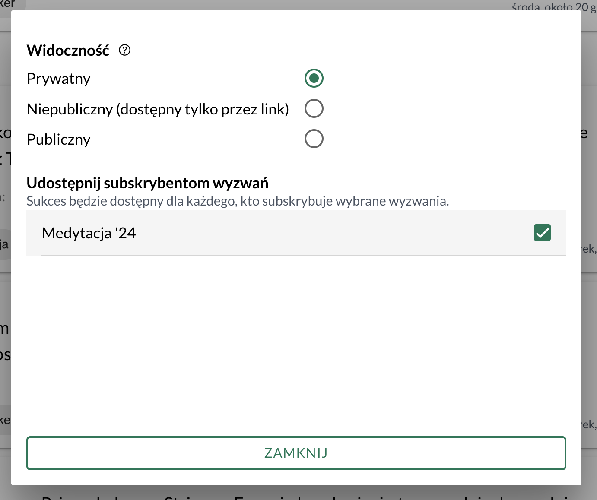

Zrobiłem udostępnianie sukcesów dla wszystkich subskrybentów wyzwania, do którego sukces jest przypisany.

Po co?

Celem jest umożliwienie [[konkurencja-slowtrackera|grupowego udostępniania sukcesów]]. Chcę ułatwić mentorom, coachom i dostawcom kursów wspieranie swoich podopiecznych w osiąganiu celów.

Widzę to tak:
1. Mentor tworzy wyzwanie dla swojego podopiecznego, np. *Naucz się pokazywać swoją pracę* albo *Naucz się pisać angażujące posty*. 
2. Udostępnia link do wyzwania podopiecznemu. Ten go subskrybuje, dodaje do niego swoje sukcesy i udostępnia mentorowi.
3. Mentor przegląda wpisy i może dać informację zwrotną - na następnej sesji z podopiecznym, w wiadomości prywatnej, albo jako komentarz w aplikacji (w przyszłości).

Wyzwanie może subskrybować więcej niż jedna osoba (o ile ma link do wyzwania). W tej sytuacji wszyscy subskrybenci będą mieli dostęp do wszystkich sukcesów udostępnionych w tym wyzwaniu.

Osobną rzeczą jest udostępnianie wpisu. Nadal można zachować kontrolę nad tym, czy wpis będzie widoczny w moim publicznym profilu, czy tylko po wejściu na odpowiedni link.

Kiedy planowałem te funkcje, to myślałem, że zejdzie mi z tym znacznie więcej czasu. Ale w miarę jak dopisuję kod, to zauważam, że nie czuję presji i działam w duchu [[Agile]]. Tworzę coś, wypuszczam i testuję z garstką użytkowników. Z każdą kolejną funkcją moja wizja staje się klarowniejsza i zauważam, że nie potrzebuję niektórych funkcji, o których myślałem, że są kluczowe.

Przykładowo, najpierw zrobiłem [[udostepnianie-sukcesow-w-slowtracker-rozterki-uxowe|udostępnianie pojedynczych sukcesów]], potem dopiero publiczny profil. Nie na odwrót. Publiczny profil nie jest potrzebny, żeby dostarczyć komuś wartość przez podzielenie się wpisem.

Teraz zrobiłem udostępnianie wpisów wszystkim, którzy subskrybują to samo wyzwanie. Nie wprowadzam żadnych społecznościowych funkcji (np. wspomniane komentarze) dopóki nie uznam, że są faktycznie potrzebne. Ważniejsze dla mnie jest, żeby można było udostępniać sukcesy i pokazywać innym swoje postępy i [[show-your-work-austin-kleon|ukończoną pracę]].