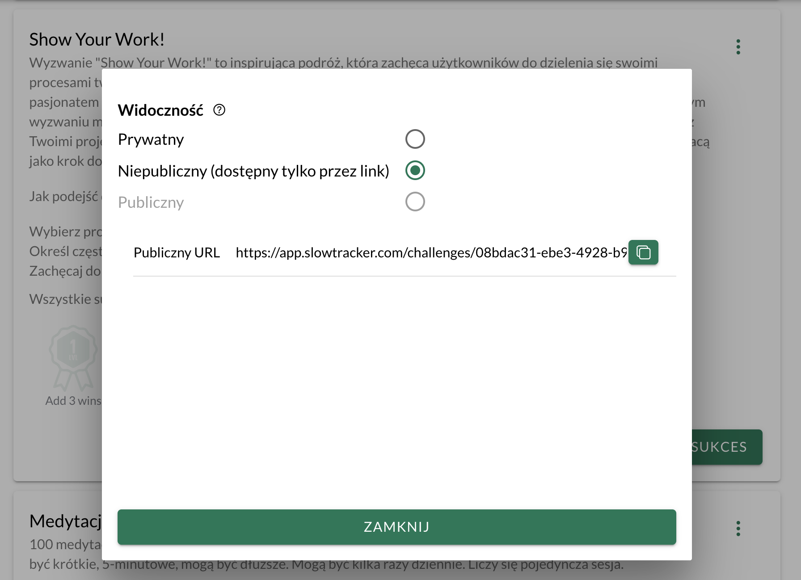

Zrobiłem udostępnianie wyzwań w [[slowtracker|SlowTracker]]. To kolejny krok do funkcji, które mają największy potencjał na monetyzację: reklamę swoich produktów i usług przez mentorów, coachów i dostawców kursów.

Teraz każdy użytkownik będzie mógł stworzyć ciekawe wyzwanie i podzielić się nim z innymi. Na razie tylko poprzez link. Publikowanie wyzwań w katalogu jest póki co nieaktywne. Jeśli masz pomysł na wartościowe wyzwanie, z którego mogliby skorzystać użytkownicy SlowTracker, to możesz do mnie napisać (np. na support@slowtracker.com), a wtedy ręcznie je opublikuję.

Swoją drogą, ta prosta funkcja kryje za sobą kilka rzeczy:
- podstronę wyzwania
- możliwość zasubskrybowania wyzwania (wcześniej pokazywała się pełna lista wyzwań podczas przypisywania sukcesu do wyzwania)
- podział na zasubskrybowane i dostępne wyzwania

Na ten moment nie rozwikłałem jeszcze zagadki [UXowej](https://pl.wikipedia.org/wiki/User_experience) związanej z zarządzaniem nieaktywnymi, zakończonymi i przerwanymi wyzwaniami. Nie wiem, czy pojawi się potrzeba resetowania wyników w ramach wyzwań.

To jedna z tych rzeczy, która nie jest potrzebna na tym etapie, bo przy braku zainteresowania wyzwaniami lub niewielkiej liczbie zasubskrybowanych wyzwań lista rozwijana w formularzu dodawania sukcesu nie jest długa. Nie jest to więc problemem.

A teraz rozpoczynam pracę nad [[slowtracker-udostepnianie-sukcesow-w-wyzwaniach|udostępnianiem sukcesów w ramach wyzwania]].

