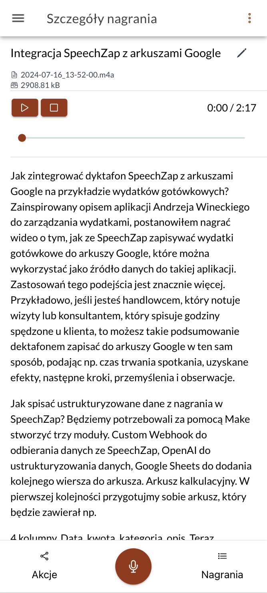
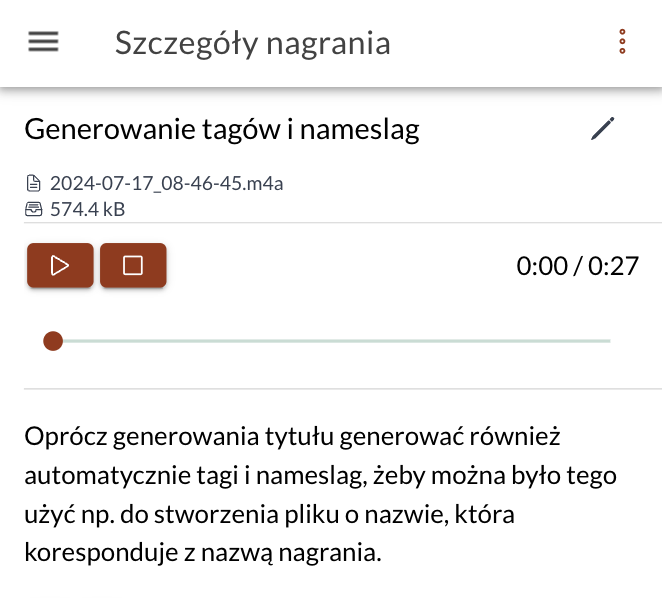
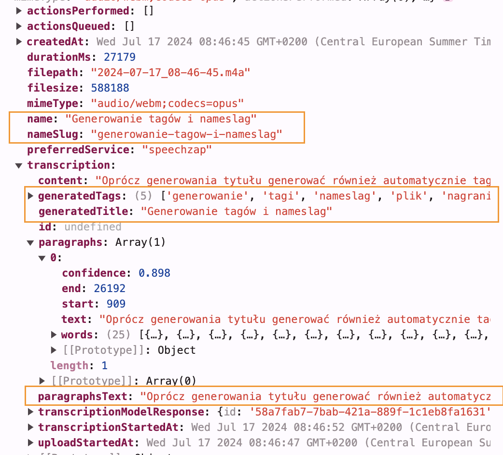

W wersji subskrypcyjnej dyktafonu [[speechzap|SpeechZap]] do tej pory, na wzór Chat GPT, tworzyłem automatycznie tytuł na podstawie treści transkrypcji. Dzięki temu łatwiej jest odnaleźć nagranie na liście lub przypomnieć sobie o czym było.

Ale AssemblyAI daje też, zupełnie bezpłatnie (choć nie *out-of-the-box*), możliwość podzielenia całej transkrypcji na zdania lub paragrafy. O ile dzielenie na zdania nie jest mi potrzebne, o tyle **paragrafy pomagają w redakcji dłuższych treści**.

Zmieniłem więc teraz sposób wyświetlania treści:

Funkcja klikania w konkretne słowa, aby przejść do odpowiadającego mu fragmentu nagrania również jest dostępna.

Ponadto podczas generowania tytułu, tworzę również listę tagów, które dołączam do całej struktury danych. W przyszłości będę je być może pokazywał na liście, aby ułatwić zarządzanie notatkami, ale nie mam jeszcze pomysłu gdzie i jak to zrobić, żeby nie zaciemnić obrazu. (Może masz pomysł? Napisz na support@speechzap.com!)

Dla przykładowego nagrania...

... struktura danych, w której znajdziesz:
- `name` - pełna nazwa nagrania, którą możesz edytować w aplikacji
- `nameSlug` - nazwa bez znaków specjalnych, przydaje się do tworzenia nazwy pliku, np. w [[integracja-speechzap-obsidian|Obsidian]]
- `generatedTags` - lista tagów wygenerowana przez SpeechZap
- `generatedTitle` - nazwa wygenerowana przez SpeechZap
- `paragraphs` - pełna lista paragrafów z dodatkowymi informacjami z AssemblyAI
- `paragraphsText` - pełny tekst paragrafów, każdy oddzielony podwójnym znakiem nowej linii (`\n\n`)

... będzie wyglądać tak:

Cała ta struktura wysyłana jest po kliknięciu w dodaną [akcję](https://app.speechzap.com/webhook-actions). O integracjach dowiesz się więcej na moim [kanale YouTube](https://www.youtube.com/playlist?list=PLBp2HwSxh1_U08EEoR8p2vA9jxflRmqcs).
