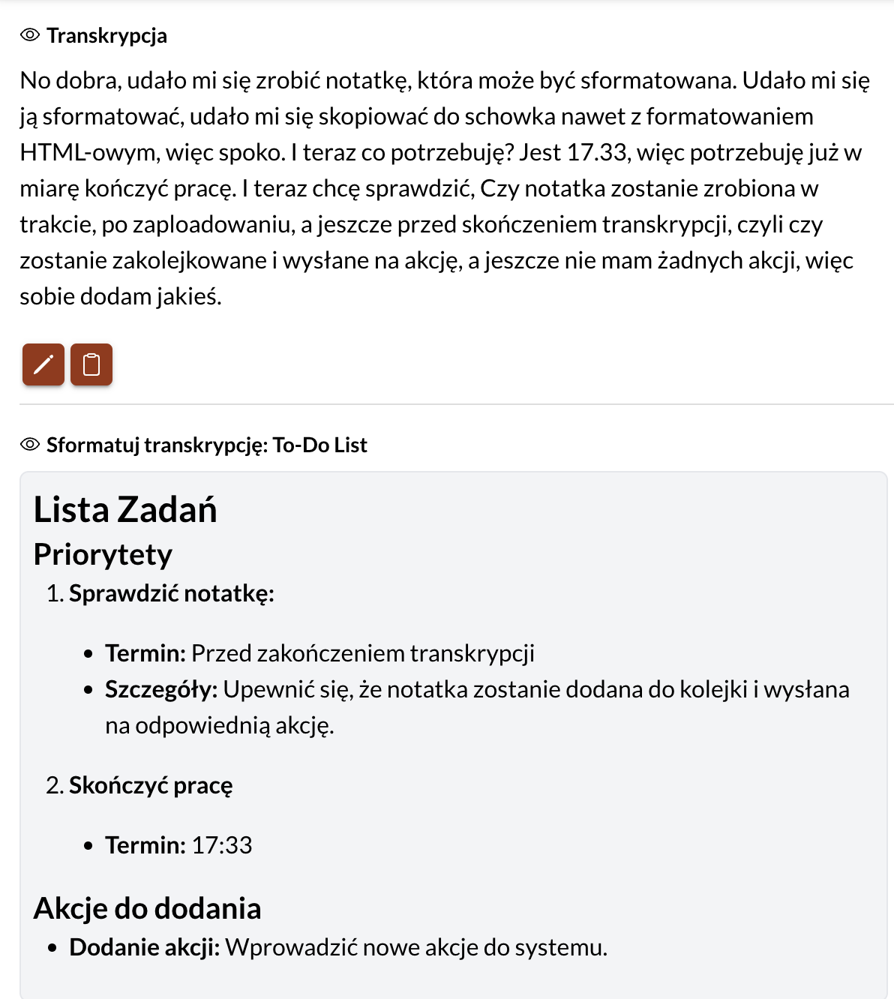

Zainspirowany konkurencją zrobiłem w [[speechzap|SpeechZap]] formatowanie transkrypcji.

Dzięki temu dogoniłem konkurencję w bardzo prosty sposób i mam wszystko, czego mi trzeba, żeby pomóc odblokować kreatywność i produktywność moich użytkowników, będących w ruchu.

## Czy klienci cenią elastyczność?

Ostatnie dni, kiedy przygotowywałem się do *launchu* na [[przygotowania-speechzap-product-hunt|Product Hunt]], odkryłem jeszcze kilku konkurentów. To jak zawsze było dla mnie bolesne przeżycie. 

Z jednej strony wiem, że to oznacza, że jest rynek. To pocieszające. Ale z drugiej strony widzę, że robią rzeczy inaczej niż ja. Być może lepiej. I być może to, że SpeechZap ma integrację z Zapier i Make, nie jest czymś, za co klienci chcą płacić. 

Aplikacje mają to do siebie, że robią tylko tyle, ile przewidzieli twórcy. Im więcej funkcji, tym większe ryzyko, że aplikacja przestanie robić dobrze to, co miała robić najlepiej. Im więcej kodu, tym więcej błędów. Programistyczna logika.

Dlatego dla mnie przede wszystkim aplikacje powinny być małe, proste i dawać maksimum możliwości integracji z nimi za pomocą innych aplikacji.

Nastawiłem się więc na to, że SpeechZap przede wszystkim ma:
1. dać możliwość nagrania swojego głosu w dowolnym momencie, niezależnie od dostępu do internetu, następnie... 
2. zrobić transkrypcję, aby łatwo było odnaleźć nagranie i szybko zrozumieć o co chodziło w notatce głosowej i wreszcie...
3. wysłać notatkę gdziekolwiek, automatycznie, aby uruchomić powtarzalny proces (np. zapisać w programie do zarządzania zadaniami, żebym nie musiał szukać po notatkach co to ja też miałem pilnie zrobić 🤔)

Ale czy klienci cenią sobie elastyczność i możliwość integracji z innymi narzędziami?
## Mainstream ceni wygodę

Moja aplikacja miała być dedykowana pracownikom umysłowym, przedsiębiorcom i twórcom internetowym. Dlatego gdy zobaczyłem konkurencję, to mina mi zrzedła. (Niektórzy z mojego otoczenia mogliby powiedzieć, że nie dało się ze mną wczoraj wytrzymać.)

Aplikacje, które odkryłem, robią z grubsza to co SpeechZap: przetwarzają mowę na tekst i mogą wywoływać na tej podstawie akcje. Nie mają aplikacji mobilnej, choć nad nią pracują. I tutaj kończą się moje przewagi.

To, co umożliwiają inni, to przede wszystkim formatowanie tekstu. Gotową transkrypcję można nie tylko odczytać i użyć we własnym zakresie, ale też od razu przepuścić przez model językowy, aby otrzymać uporządkowaną notatkę, np. w formie:
- emaila biznesowego lub nieformalnego
- listy zadań do zrobienia
- podsumowania spotkania biznesowego
- postu na bloga, LinkedIn czy inny social media
- i wiele, wiele innych

U mnie ta opcja była, ale w formie samodzielnej konfiguracji, która - powiedzmy to wprost - nie jest dla każdego. Wymaga umiejętności technicznych.

Obserwując różne rynki od ponad 20 lat, zauważam, że moje projekty często były mało wygodne w użyciu. Można było je określić jako niszowe, dla grupy specjalistów, którzy i tak nie reagowali entuzjastycznie na mój produkt. Pewnie nie rozumieli po co jest.

Może to generalizujące i poparte przeczuciami stwierdzenie, ale myślę, że **mainstream bardziej ceni wygodę, niż elastyczność**.

Oczywiście są produkty, które dzięki elastyczności są wartościowe dla klientów, choć do głowy przychodzą mi przyciężkie kombajny, które tracą na rzecz lżejszych i prostszych w użyciu konkurentów (patrz Jira vs Shortcut). Może jeszcze oprogramowanie typu *open-source*, które jest finansowane sponsoringami lub opierają model biznesowy na usługach dodatkowych, typu hosting lub wsparcie techniczne.

Aplikacja typu SpeechZap kierowana jest do przedsiębiorców i twórców internetowych, którzy chcą odblokować swoją produktywność i uwolnić się od klawiatury telefonu, gdy są w trasie. Oznacza to, że musi to być proste narzędzie, które daje ogrom możliwości od kopa. A nie dopiero po godzinie integracji.

Poza tym demonstracja produktu, który ze ściany tekstu robi wypunktowaną listę zadań do zrobienia, wywołuje *efekt wow*.

No więc sam/a powiedz, czy to nie jest super?

## Formatowanie transkrypcji

Po tych wszystkich bolesnych i dołujących myślach o niewygodzie mojej aplikacji, poszedłem na dłuższy spacer. Przegadałem do siebie całą drogę, nagrałem kilka notatek na SpeechZap i doszedłem do wniosku, że:
1. Jestem w stanie zrobić funkcję formatowania transkrypcji, bo to jest mega proste na tym etapie.
2. Wpasowuje się to w ideę organizacji notatek głosowych, której potrzebowałem od samego początku.
3. Nie będę robił początkowo żadnych ograniczeń wg planu subskrypcji (każdy klient będzie to miał).
4. Umożliwię tylko jedno formatowanie na transkrypcję (łatwiej zaimplementować, a w razie potrzeb będę zmieniał).
5. Użyję do tego najmocniejszego obecnie modelu, czyli `gpt-4o` (żeby efekt był najlepszy).
6. Zrobię kilka predefiniowanych *promptów* na start, a możliwość dodawania swoich własnych dopiero w następnej kolejności:
	- Business Memo
	- Formal Email
	- Meeting Summary
	- To-Do List
	- Casual Email
	- Instagram Reel Script
	- SEO Friendly Blog
	- Email Newsletter
	- General Concise

*Launchu* na Product Hunt i tak nie zdążyłbym zrobić w tym tygodniu, więc jeśli zaimplementuję to najprościej jak się da, to jest małe ryzyko, że popsuję coś, co już działa.

Spacer zajął mi godzinę. Implementacja 4. I jest!

Przetestuj na https://speechzap.com

> [!tip] Czytaj opinie o konkurencji
> Obserwowanie konkurencji warto robić od samego początku. To boli, ale się opłaca. Poza tym prędzej czy później i tak się zderzysz z rynkiem. 
> 
> Czytaj zwłaszcza komentarze i opinie użytkowników, bo czasem podpowiedzą Ci funkcje, które mogą dać Twojemu produktowi sporą przewagę na rynku. 
> 
> Istniejące rozwiązania często mają już swoją strategię. Ponadto im są więksi, tym większą mają bezwładność - trudno jest im zmienić sposób działania, tak jak kontenerowcowi na pełnym oceanie trudno jest wykonać szybki zwrot. Mają już swoich klientów i pełno obaw o to, czy ich nie stracą, gdy zrobią nagle rewolucję. 
> 
> Za to Ty, na początku, jesteś małą żaglówką, której wystarczy jeden ruch sterem i zmiana burty.

