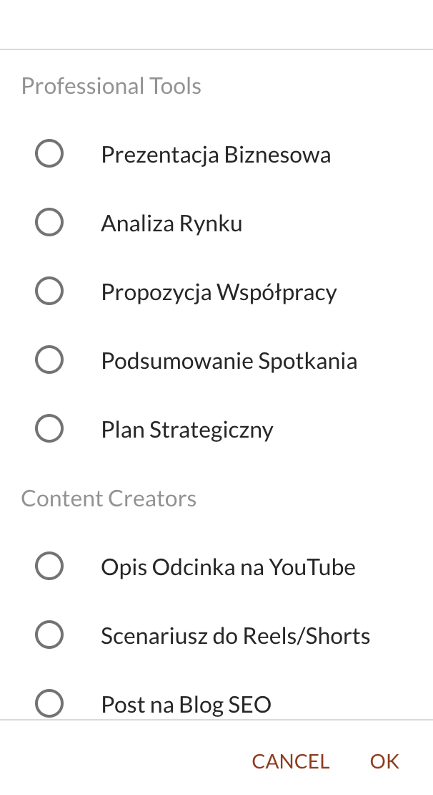

W [[speechzap|SpeechZap]], notatka głosowa jest przetworzona na tekst i można ją przerobić na jeden z ponad dwudziestu zdefiniowanych przeze mnie formatów: dla przedsiębiorców, menedżerów, twórców.

Ostatnio jeden z klientów, który nie mówi po angielsku (pozdrawiam!), poprosił mnie o przetłumaczenie nazw i opisów formatów oraz dodanie nowych, które mogą być przydatne dla niego i osób, którym rekomenduje aplikację.

Jaram się, bo potrzebowałem tylko godziny, aby przetłumaczyć formaty na język polski i dodać dwa nowe:
- scenariusz wideo w YouTube oraz...
- post na Facebook.

Pracuję teraz nad dodawaniem samodzielnych formatów, ale w międzyczasie, jeśli potrzebujesz nowych, to możesz do mnie napisać na support@speechzap.com

A jeśli jeszcze nie korzystasz z formatów i chcesz dowiedzieć się w czym moga pomóc, to znajdziesz je [tutaj](https://app.speechzap.com/formats).