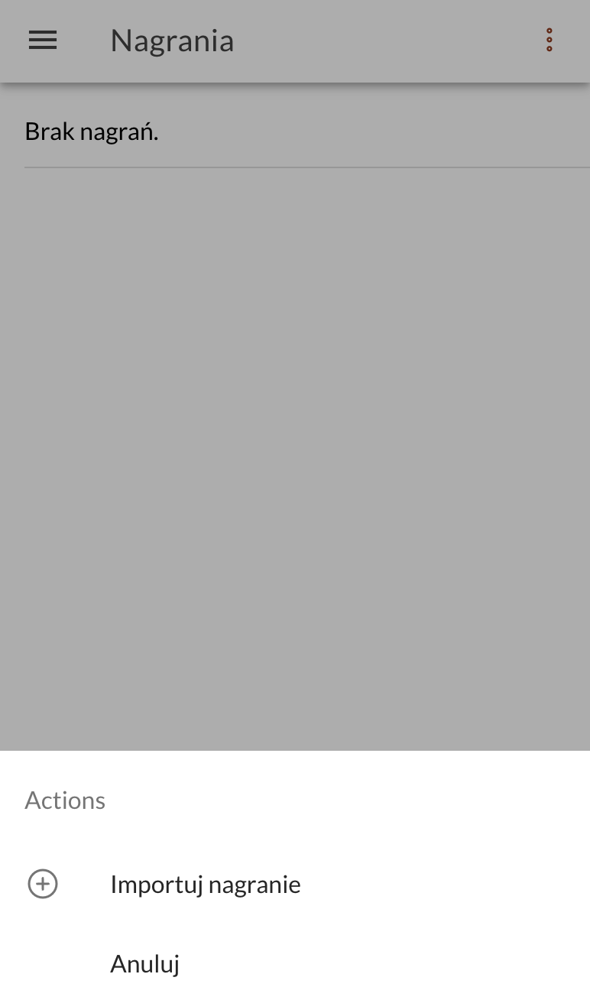

Do tej pory w [[speechzap|dyktafonie SpeechZap]] można było tworzyć transkrypcje jedynie dla plików nagranych w aplikacji. Jednak może się zdarzyć, że nagranie mamy stworzone w innej aplikacji, albo otrzymaliśmy je od kogoś.

Dlatego na Waszą prośbę, aby umożliwić transkrypcję takich plików, zrobiłem prosty importer.

W zakładce *Nagrania* w prawym górnym rogu znajdziesz ikonkę trzech kropek. Po kliknięciu w nie pojawi się lista akcji, a na niej opcja *Importuj nagranie*. Po wybraniu, plik powinien pojawić się na liście.

Jeśli brakuje Ci jakichkolwiek funkcji, to możesz śmiało pisać na support@speechzap.com. Wszystkie propozycje biorę pod uwagę i systematycznie wprowadzam.