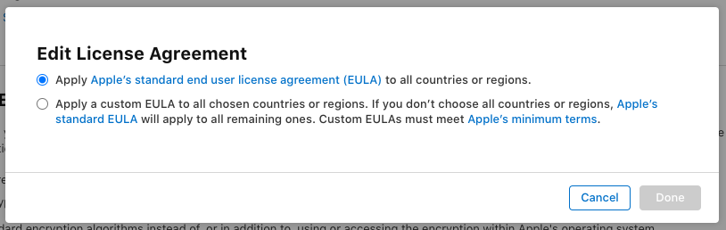
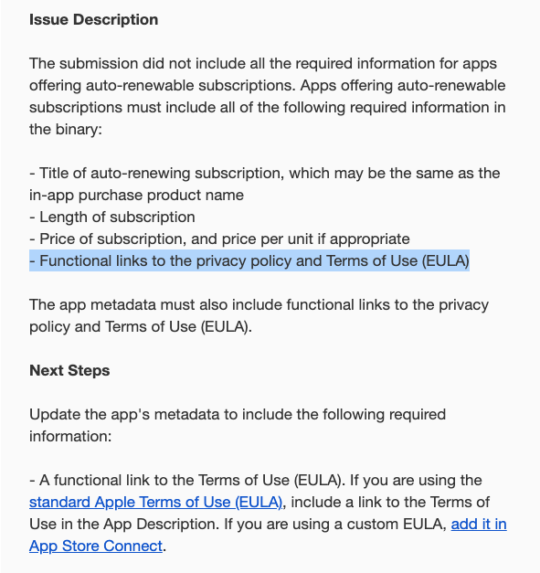
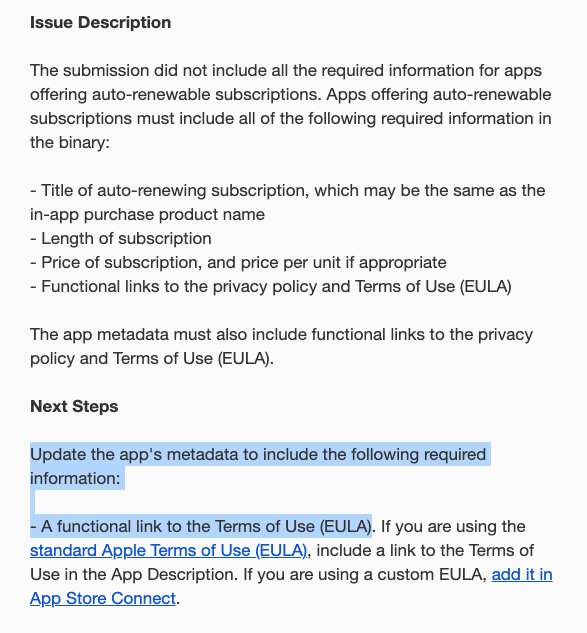
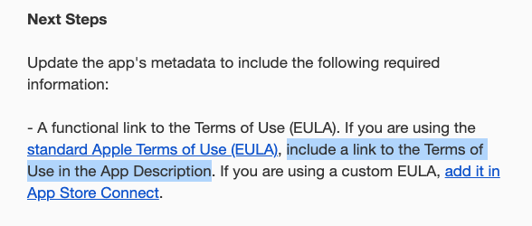
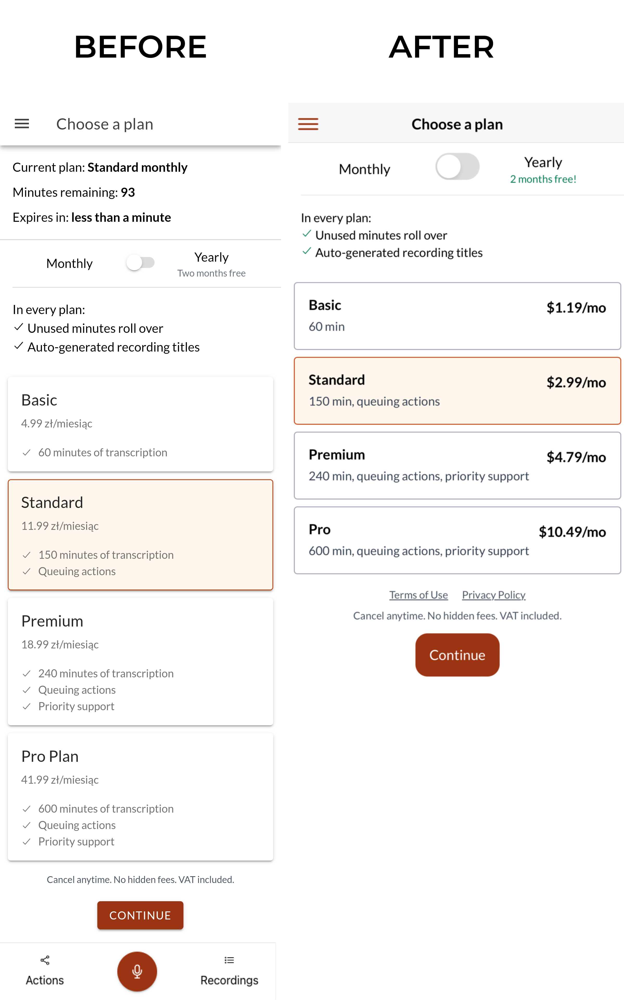

Dzisiaj pokażę jak można poprawić UX (User Experience) na przykładzie strony z cennikiem, ale najpierw muszę się do czegoś przyznać...

Jestem idiotą. 4x odrzucili mi zgłoszenie aplikacji [[speechzap|SpeechZap]] do sklepu Apple, bo nie doczytałem co powinienem był zrobić.
## Z drugiej strony...

W panelu App Store Connect jest specjalne miejsce dla wklejenia polityki prywatności oraz zupełnie w innym miejscu do ustawienia regulaminu dla użytkowników:

Wybrałem standardową licencję Apple, żeby nie komplikować sobie życia.

No i długo kminiłem czemu mi odrzucają:

Jeśli brakuje linków do polityki prywatności czy regulaminu, to może powinienem to wstawić jak byk pod listą dostępnych subskrypcji w aplikacji? Zwłaszcza, że te linki powinny być w `binary`, czyli przede wszystkim w kodzie źródłowym aplikacji.

Znowu odrzucają.

W panelu widzę, że odrzucają też zgłoszenie subskrypcji. Może więc tych dziwnych zrzutów ekranu nie wstawiłem do App Store Connect?

Wrzuciłem. Nic z tego.

Czytam jeszcze raz wiadomość:

No dobra, co to jest `app's metadata`? 

W końcu zapytałem Perplexity. Podpowiedział mi, że mam wrzucić to w panelu App Store Connect. Nie umiałem zrozumieć gdzie ja mam to wrzucić. Przecież jest ustawione w panelu! Tak samo jak polityka prywatności.

Perplexity mówi, że w opisie aplikacji. "Jak w opisie aplikacji?!" myślę. Przecież to idiotyczne. Jest w panelu ustawione!

Doczytuję:

To absurdalne!

Ale wrzucam.

Przeszło.

\ - ... 🤯

Sprawdziłem poprzednie odrzucenia i faktycznie, w każdym mailu wstawili to samo, więc to ja nie doczytałem.

## Wniosek

Po [[przeprawa-speechzap-google-play|doświadczeniach z Google Play]] nauczyłem się, że nie ma co się spodziewać konkretów. Wiadomość od nich sprawia wrażenie, że nie jest po to, żeby Ci pomóc, tylko wyjaśnić, że dostałeś żółtą kartkę. I jeśli nie zastosujesz się do tony dokumentacji to dostaniesz czerwoną.

W Apple jest łatwiej, bo:
1. mówią co jest nie tak i warto przeczytać dokładnie całą wiadomość, a ponadto...
2. nie zabiją Cię jeśli 2x popełnisz ten sam błąd.

Jednak wymagania Apple są czasem absurdalne a [[przygotowania-speechzap-product-hunt|panel nieintuicyjny|]], co prawdopodobnie utrudniło mi zrozumienie treści maila.

Trochę jak w tej historyjce, że Indianie nie widzieli nadpływających statków Kolumba, bo ich umysły nie rozumiały tego, co widzą po raz pierwszy.

Odrzucanie zgłoszenia może być frustrujące, dlatego warto pochylić się na spokojnie nad treścią maila.

## Nie ma tego złego

Gdyby nie te problemy, to nie napisałbym do Szymona, który przetestował mi to na iOS (którego ja nie mam) i podpowiedział kilka rzeczy odnośnie wyglądu samego ekranu z subskrypcjami. 

Dokonałem więc kilku prostych zmian:
1. Usunąłem dolną nawigację, która odciągała uwagę od zakupu subskrypcji (linki do akcji i nagrań oraz zaakcentowany przycisk do nagrywania).
2. Skróciłem napisy, np. `60 minutes of transcription` do `60 min` (bo jeśli ktoś już korzysta, to wie po co są minuty).
3. Zmniejszyłem napisy, przestawiłem cenę do prawej, w jednej linii z nazwą.
4. Wcześniej miałem informacje o obecnej subskrypcji oraz wybór nowej na jednym ekranie. Teraz rozdzieliłem to na 2 ekrany: *Twoja subskrypcja* i *Wybierz plan*.

Oto efekt:

## Podsumowanie

Proces akceptacji aplikacji w App Store może być frustrujący i pełen niespodziewanych przeszkód, ale każde niepowodzenie to okazja do nauki. Moje doświadczenia ze [[speechzap|SpeechZap]] pokazały mi, jak ważne jest dokładne czytanie komunikatów od Apple i dostosowywanie się do ich wymagań. 

Efektem ubocznym było poprawienie User Experience. Udoskonalenie UX to nie tylko poprawa wizualna, ale także zrozumienie, jak użytkownicy korzystają z aplikacji i jakie są ich potrzeby. Dzięki temu mogłem wprowadzić zmiany, które uczyniły SpeechZap bardziej intuicyjnym i przyjaznym dla użytkownika. 

Zachęcam do wyciągania wniosków z każdego odrzucenia i traktowania ich jako szansy na rozwój i doskonalenie swoich produktów.