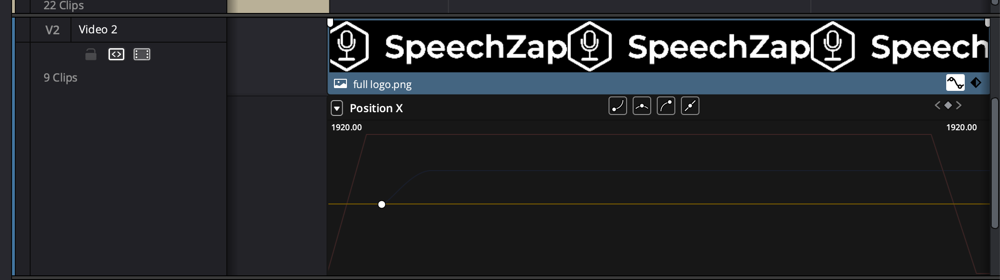

Zmontowałem moje główne wideo promocyjne do [[speechzap|SpeechZap]]. Oczywiście nie jestem zadowolony, ale, jak to mówią:
> Better done, than perfect.

Najpierw pokażę efekt, a potem omówię kolejne sztuczki, jakich nauczyłem się w Davinci Resolve, którego używam do montażu. (Polecam! Kiedyś męczyłem się na kdenlive i zraziłem się na dobrych kilka lat do.)

Oto ostateczna wersja:

<iframe width="560" height="315" src="https://www.youtube.com/embed/eM7WePyxRUA" title="YouTube video player" frameborder="0" allow="accelerometer; autoplay; clipboard-write; encrypted-media; gyroscope; picture-in-picture; web-share" referrerpolicy="strict-origin-when-cross-origin" allowfullscreen></iframe>

## Napisy

Umiem już wstawić pliki SRT z napisami do wideo. 

Do ich wygenerowania użyłem Assembly AI. *Wyrenderowałem* ścieżkę audio z filmu i zrobiłem prosty skrypt na podstawie [tej instrukcji](https://www.assemblyai.com/docs/guides/generating-subtitles-for-videos).

Najpierw miałem problem z dodaniem napisów, bo mi cały czas krzyczał program, że nie ma uprawnień do folderu. Okazało się, że trzeba dać uprawnienia do `Macintosh HD` 😲 

Potem okazało się, że gdy *renderuję* jak zwykle z *presetem* do YouTube'a, to nie można wstawić napisów. Dopiero w `Custom Export` jest opcja na dole `Export Subtitles`, którą trzeba ustawić na `Burn into video`.

## Easing

Kiedyś zajmowałem się animacjami na stronach internetowych i często stosowałem *easing*. [Przykład z balonikami](https://www.the-art-of-web.com/css/timing-function/) pokazuje w jaki sposób zmienia się przyspieszenie na różnych etapach ruchu.

W moim filmie chciałem zrobić animację logo na końcowej planszy. W Davinci Resolve, kiedy animujemy np. pozycję napisu i ustawiamy sobie *keyframes*, to możemy potem zmienić przyspieszenie, klikając w taką falkę przy klipie w trybie edycji:

Ale *screenshot* może być nieczytelny, dlatego polecam [wideo](https://www.youtube.com/watch?v=llTIUp1o_cA), z którego się tego nauczyłem.

## Podsumowanie

Uff, udało się! Montaż zajął mi w sumie jakieś 4-5 godzin i miałem dwie rundy poprawek, ale ogólnie jestem dość zadowolony. Z każdym kolejnym montażem czegoś nowego się uczę, więc może kiedyś dojdę do etapu, w którym będzie się to dało oglądać 😉 