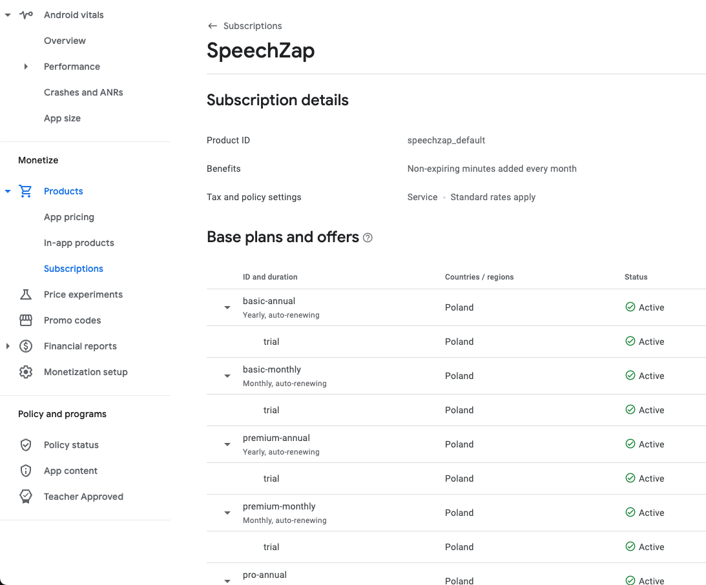
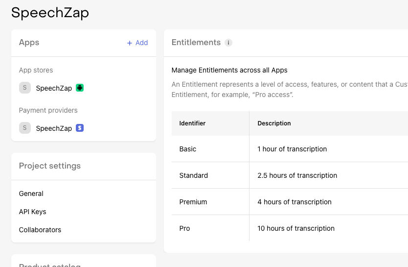
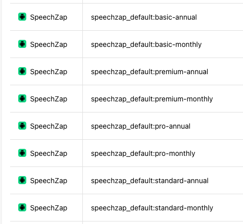
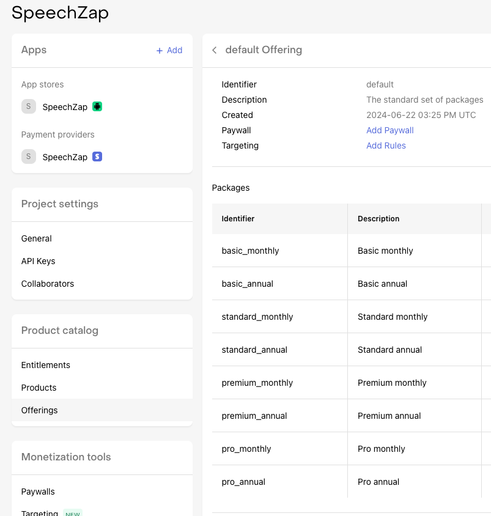
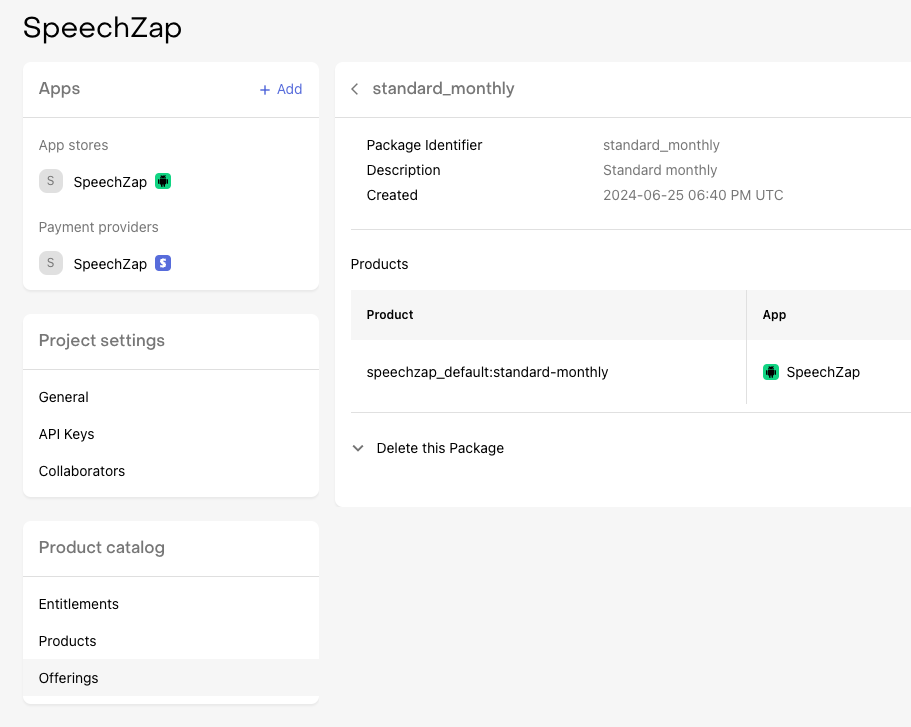
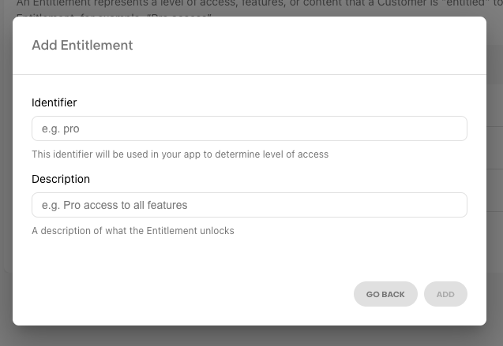
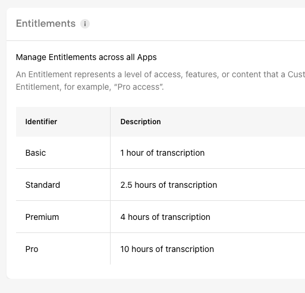
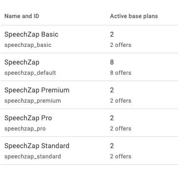

Kiedy myślę o płatnościach, to myślę to samo, co o uwierzytelnianiu użytkownika:
> ugh! 😢

Chciałbym dostarczać przede wszystkim podstawową wartość, a nie zajmować się tymi nudnymi rzeczami dookoła, które żadnej wartości nie wnoszą. *User* musi się zalogować i opłacić usługę, żeby móc korzystać, ale to samo w sobie nie jest czymś, po co instaluje apkę.

W moim najnowszym projekcie [[speechzap|SpeechZap]] do uwierzytelniania użyłem Supabase (po najmniejszej linii oporu na start: email + OTP). 

Jednak dzisiaj napiszę o tym w jaki sposób podejść do płatności w aplikacjach mobilnych.

Implementacja tego w Google Play zajęła mi tydzień (część z tego stanowiło [[rozliczenia-google-play-app-store|zrozumienie za co płacę sklepowi]]). Gdybym jednak lepiej rozumiał cały proces i pewne niuanse, to mógłbym to zrobić w czasie o połowę krótszym.

Dlatego dzisiaj o tym procesie i niuansach w kontekście planów cenowych dla rozliczeń typu *usage-based*.
## Adapter płatności

Polecono mi [RevenueCat](https://www.revenuecat.com/) jako adapter do Google Play, App Store i Stripe. Do tej pory zaimplementowałem wersję jedynie w Google Play, więc będzie tylko o tym. Nie zrobiłem płatności w wersji webowej i jeszcze nie zabrałem się za AppStore.

Warto na początku obejrzeć [to 5-min wideo](https://www.youtube.com/watch?v=QxHeZiW4KCA), aby zrozumieć co jest czym w RevenueCat.

To, czego dokumentacja nie wyjaśnia, to tego w jaki sposób zrobić więcej *tierów* (pakietów cenowych). Dostępny przykład jest prosty: płatność miesięczna, roczna i *lifetime*. W moim przypadku mam jednak pakiety *Basic*, *Standard*, *Premium* i *Pro* w wersji miesięcznej i rocznej.
## Jak to skonfigurowałem?

1. Do Google Play dodajesz subskrypcję (np. u mnie `speechzap_default`), a wewnątrz niej produkty, np. `basic-annual`, `basic-monthly`, itd. Do tego jeszcze jest oferta `trial`, która daje dostęp (w moim przypadku) na 2 tygodnie za darmo.

Na początku popełniłem w tym miejscu błąd, tj. stworzyłem osobne subskrypcje dla różnych *tierów*. O tym za chwilę.

2. Dodajesz w RevenueCat *Entitlements*, czyli uprawnienia użytkownika. Ja tutaj popełniłem drugi błąd, o czym też za chwilę.

3. Każdy z produktów ze sklepu Google Play musi być zaimportowany do RevenueCat.

4. W RevenueCat możemy stworzyć teraz *Offering* (u mnie o nazwie *default*), w którym konfigurujemy pakiety (*packages*).

5. Do każdego pakietu przypisany jest produkt.
 

## Jak to działa?

1. Apka na stronie z wyborem pakietu pobiera z RevenueCat cały *offering* ze wszystkimi pakietami. Ceny i opisy (bez *entitlements*) są przekazywane w obiekcie pakietu.
2. Klient wybiera pakiet, a wtedy apka uruchamia koszyk Google Play dla tego pakietu.
3. Klient dokonuje zakupu i wraca do apki. Apka odświeża dane o subskrypcji i na tej podstawie przekierowuje go do innej strony.
4. W tle RevenueCat wysyła *event* `INITIAL_PURCHASE` do mojego *backendu*. Tutaj sprawdzam który pakiet został wykupiony i na tej podstawie doliczam do konta klienta odpowiednią liczbę minut do wykorzystania i zapisuję jaki wybrał plan.
5. Apka aktualizuje w tle dane użytkownika, żeby pobrać aktualną liczbę dostępnych minut i inne dane.

I to tak w uproszczeniu.

Bo teraz *eventów* leci znacznie więcej. Bardzo dobrze i obrazowo jest to opisane w [dokumentacji RevenueCat](https://www.revenuecat.com/docs/integrations/webhooks/event-flows) - i do przejrzenia tego zachęcam jako drugi materiał po tym filmiku o tym co jest czym.

W przypadku prostych planów, gdzie *user* albo ma dostęp albo go nie ma, sprawa jest nieskomplikowana. Wystarczy obsłużyć kilka zdarzeń.

Jednak w moim przypadku, gdzie na podstawie zdarzeń doliczam minuty, sprawa się komplikuje. Muszę np. zapewnić deduplikację, żeby nie naliczyć za dużo minut.
## Entitlements

Pierwszy mój błąd (w kolejności chronologicznej) popełniłem z ustawieniem *entitlements*. Przykład z dokumentacji był bardzo prosty: subskrypcja miesięczna, roczna albo *lifetime*.

Formularz podpowiada, aby dodać prosty identyfikator.

Zasugerowałem się tym i dodałem moje *tiery*: 

Jednak później okazało się, że potrzebuję rozróżnienia między subskrypcją miesięczną i roczną.

I na ten moment poszedłem po najmniejszej linii oporu i wyciągnąłem tę informację z nazwy produktu w sklepie Google Play (np. `speechzap_default:basic-annual`). To bardzo słabe i nieskalowalne podejście, bo jak dojdą mi produkty ze Stripe i AppStore, to RevenueCat przestaje być adapterem, a jedynie dostawcą *eventów*.

Prawdopodobnie przejdę na inny model, to znaczy każdy *entitlement* zdubluję i zrobię `basic-annual`, `basic-monthly`, `standard-annual`, `standard-monthly`, itd.

W ten sposób łatwo będę mógł wyciągnąć z takiej nazwy konkretny produkt.

Prawdopodobnie jeszcze innym pomysłem byłoby zrobienie dwóch rodzajów *entitlements*:
1. *tier*, np. `basic`
2. okres: np. `monthly`. 

W ten sposób mógłbym po stronie *backendu* szybko wyciągnąć te dane bez dodatkowego parsowania. 

To już jest szczegół implementacyjny. Ważne, żeby tę informację zawrzeć w jakiś sposób w tym mechanizmie i uniknąć sprawdzania po nazwie produktu, bo te są różne w każdym sklepie.

Póki co nie zmieniam tego, bo zależy mi na jak najszybszym wypuszczeniu aplikacji. Jednak będzie to konieczne jak tylko zacznę robić wersję na iOS.
## Subskrypcje w Google Play

Drugi błąd, który zrozumiałem dopiero po szerszych testach, to było stworzenie osobnych subskrypcji w Google Play:

Powyżej widać moje 4 stare subskrypcje (`speechzap_basic`, itd.) oraz jedną nową `speechzap_default`.

Okazało się, że gdy jako użytkownik zmieniłem plan np. z *Basic* na *Stardard*, to tak naprawdę zasubskrybowałem plan *Standard*. I wtedy oba plany były aktywne, więc płaciłem za jeden i za drugi.

Nie da się od strony programistycznej anulować planu. Zawsze musi to zrobić użytkownik.

Dlatego wszystkie *tiery* w Google Play muszą być w jednej subskrypcji (u mnie `speechzap_default`), aby plany mogły być zmieniane automatycznie, a nie subskrybowane nowe.
## Podsumowanie

RevenueCat z pewnością ułatwia i nie jest drogie, a wręcz darmowe na start (1% prowizji powyżej 2500 USD/mc).

Warto poświęcić chwilę na zrozumienie jak to wszystko działa, żeby nie utrudnić sobie implementacji i wykorzystać możliwości, jakie daje.

Dla prostych przypadków można nawet w ciągu jednego dnia zaimplementować płatności. W modelu biznesowym *usage-based* sprawa jest bardziej skomplikowana, dlatego warto dobrze sobie zorganizować *backend*.