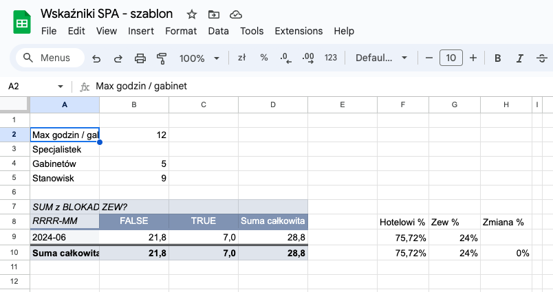

Czy wiesz, że dokładne dane mogą zrewolucjonizować działanie Twojego SPA? W hotelu, z którym współpracuję, udało się to dzięki kilku prostym krokom.

Resortowy hotel SPA, któremu pomagam jako konsultant, do tej pory gromadził dużo danych o obłożeniu hotelu, analizował dane z raportów od różnych usługodawców marketingowo-sprzedażowych i tworzył własne raporty.

Jednak pomimo, że ma już 5 gabinetów SPA, 9 stanowisk pracy i 5 fizjoterapeutek, to jedyną metryką efektywności strefy SPA był miesięczny raport przychodów. (Co ciekawe, te przychody wykazywały niską korelację z obłożeniem hotelu.)

Stosowany w firmie program hotelowy nie pozwala na zarządzanie grafikiem zabiegów, a recepcji i fizjoterapeutkom wystarcza kalendarz Google.

Menedżerka hotelu przygotowywała co miesiąc raport przychodów i wykonanych zabiegów. Podstawą były karteczki wypisane przez fizjoterapeutki.

Było to mnóstwo pracy, a te dwa raporty (przychody i ilości zabiegów) były jedynymi, które w tym czasie można było stworzyć. I polegało to na ręcznym sumowaniu (w jednej komórce w arkuszu kalkulacyjnym) poszczególnych liczb.

Z takiego raportu trudno jest wyciągnąć dodatkowe dane, jak choćby obłożenie, które w hotelu jest podstawą planowania działań marketingowo-sprzedażowych.

Stworzyłem więc arkusz kalkulacyjny *Wskaźniki SPA*, w którym każdy zabieg miał być przepisany z karteczki jako osobna pozycja w taki oto sposób:

Taka prosta baza danych z dziesięcioma kolumnami umożliwia nam zastosowanie filtrów i tabel przestawnych, z których wyciągnęliśmy ogrom potrzebnych nam informacji.
## Wskaźniki SPA

Poniżej opiszę stworzone przeze mnie raporty oraz to, co udało nam się uzyskać dzięki ich analizie.

Uwaga: dane są przykładowe, dlatego raporty nie pokazują prawdziwego obrazu. Moją intencją jest pokazanie Ci możliwości i przykładowych wniosków, jakie można było wyciągnąć.
### Statystyki zabiegów

Na początek stworzyliśmy uproszczony raport miesięczny z podziałem na fizjoterapeutki:

Pracownicy dostają premię od przychodów, więc jest to raport potrzebny do ustalenia wynagrodzenia.

W drugiej kolejności opracowałem bardziej szczegółowy raport ilości wykonanych zabiegów i przychodów:

### Obłożenie SPA (OCC)

To, co nas najbardziej na początku interesowało, to raport obłożenia (kolumna K i O):

Dzięki niemu dowiedzieliśmy się jakie jest obłożenie w skali miesiąca. Co prawda czuliśmy, że jest niskie (choćby rzucając okiem na niezbyt czytelny kalendarz Google), ale teraz dostaliśmy konkretne dane.

Ponadto dostaliśmy też dane o wykorzystaniu poszczególnych gabinetów.

### Obłożenie dzień po dniu (OCC d/d)

To jeszcze nam nie wystarczyło. Wiedzieliśmy bowiem, że weekendy są najbardziej obłożone (pakiet z noclegiem Weekend SPA to sugeruje). Ale co innego czuć, a co innego zobaczyć na liczbach.

Stworzyłem więc raport dzienny obłożenia (kolumna J i K):

Taki raport dał nam już podstawę do porozmawiania z pracownikami o tym, co możemy zrobić, aby te wyniki poprawić.

Fizjoterapeutki wraz z menedżerem (z moim drobnym kierowaniem uwagi) opracowały plan promocji strefy SPA. Uznaliśmy zgodnie, że SPA ma jeszcze ogromny potencjał do wykorzystania, podczas gdy hotel już nie bardzo. Innymi słowy, więcej klientów do hotelu nie wejdzie, a nie wszyscy klienci hotelowi pójdą na zabieg.

Pomyśleliśmy, że dobrze będzie dotrzeć do społeczności lokalnej.
### Klienci hotelowi a społeczność lokalna

I tutaj znów czuliśmy, że klientów z tego segmentu jest mało, ale potwierdzenie uzyskaliśmy z raportu proporcji godzin spędzonych w SPA przez klientów hotelowych do klientów bez noclegu (zew. - od klientów z zewnątrz).

Oto raport proporcji godzin:

A ponieważ przychody nie zawsze idą w parze z obłożeniem (różne segmenty klientów mogą mieć różny koszyk zakupowy) dorzuciłem raport proporcji przychodów:

Z kompletnym planem działania udaliśmy się do właścicieli, którzy zaakceptowali koncepcję organizacji dni otwartych i inny działań promocyjnych.

### TUR - obciążenie pracowników

Kolejnym raportem był TUR - Therapist Utilization Rate. Pokazuje on jak bardzo obciążeni byli pracownicy. Dzięki niemu można ocenić jak duży zespół jest potrzebny i czy przyszedł czas na zatrudnienie kolejnej osoby.

### TUR d/d

Miesięczny raport nie pokazuje nam jednak bardzo charakterystycznej sytuacji dla resortowego hotelu SPA: weekendy zawsze są najbardziej obłożone. Co prawda częściowo możemy to zobaczyć w raporcie obłożenia, ale - podobnie jak w raportach miesięcznych - pomiędzy obłożeniem pracowników a obłożeniem gabinetów jest pewna dysproporcja.

Chcieliśmy bliżej przyjrzeć się sytuacji i tak powstał raport dzienny obciążenia pracowników:

### TUR h/h

Jednak ani obłożenie dzienne (OCC) ani obciążenie pracowników (TUR), nawet w rozbiciu na poszczególne dni, nie pokazuje nam pełnego obrazu.

Nie mówi np.:
- ilu pracowników potrzebnych było **jednocześnie**?
- jak często to się zdarza?
- w jakich godzinach mamy najmniejsze obłożenie?

To pokazuje nam najbardziej rozbudowany raport obłożenia, który podzieliłem na 15-minutowe interwały. Oto przykładowy widok:

Liczby w kolumnach z godzinami pokazują ile fizjoterapeutek było zajętych o danej godzinie.

Jaśniejsze pola oznaczają, że SPA było puste lub mało obłożone, a ciemniejsze wskazują na większą zajętość.

Pierwszym pomysłem, jaki się nasuwa, jest wyszukanie wszystkich dni oraz godzin, w których warto zrobić promocję dla lokalnej społeczności. Godziny przedpołudniowe w tygodniu wydają się być dobrym pomysłem. Jednak niedzielne popołudnia również mogą być dobrym kandydatem. Potwierdzimy nasze przypuszczenia za pomocą tego właśnie raportu.

### Inne raporty

Z takiej bazy danych można wyciągnąć znacznie więcej wniosków. Prosty raport obłożenia poszczególnych dni, najbardziej dochodowych dni, czy najbardziej skutecznych fizjoterapeutek, to niektóre z tych, które przychodzą mi do głowy.

Raport z ilością wykonanych zabiegów przez konkretne fizjoterapeutki może nam pokazać:
- na które zabiegi jest największy popyt
- które zabiegi wyrzucić z oferty, a które zostawić
- co przynosi największy przychód
- które fizjoterapeutki mają największą skuteczność w promowaniu zabiegów, a które nie sprzedają ich w ogóle
## Podsumowanie

Odpowiednio zgromadzone dane pozwalają na stworzenie **znacznie większej liczby raportów, znacznie mniejszym wysiłkiem**. Dzięki tym raportom można podjąć świadome decyzje i skupić się na działaniach, które przyniosą **najlepsze rezultaty**.

Będą to decyzje dotyczące np.:
- działań marketingowo-sprzedażowych (w tym segmentacji klientów)
- rekrutacji, szkoleń i systemów wynagrodzeń
- oferty zabiegów SPA

Dla menedżera rozmowy z pracownikami opierają się nie tylko na odczuciach, ale też na konkretnych danych. (W konsultingu zarówno odczucia jak i dane są ważne, ale często brakuje tych ostatnich.)

Jednak najważniejsza jest kultura gromadzenia danych. Bez dobrej organizacji, świadomości co nam to daje i upewnienia się, że dane są kompletne, nie będziemy w stanie wygenerować tak wartościowych raportów.

W tym przypadku dane gromadzone są ręcznie, choć półautomatycznie. Wszystkie zabiegi, osoby, numery pokoi i inne powtarzalne dane są podpowiadane, aby wprowadzanie było jak najszybsze.

Jednak często danych nie trzeba wpisywać samodzielnie. Twój program do zarządzania SPA może nie zapewniać rozbudowanych raportów, jednak zazwyczaj ma możliwość eksportu danych do arkusza kalkulacyjnego. A tam już można dowolnie je obrabiać.

Dane są potężnym narzędziem, które może odmienić sposób zarządzania SPA. Dzięki nim możesz lepiej rozumieć swoich klientów, optymalizować pracę personelu i maksymalizować przychody. Zacznij już dziś i zobacz, jak wiele możesz zyskać!

Jeśli interesuje Cię rozbudowana analityka dla Twojej firmy i/lub pomoc w zbudowaniu kultury gromadzenia danych, to napisz do mnie na michal@kukla.tech lub zadzwoń pod numer <a href="tel:+48691059529">+48 691 059 529</a>.
