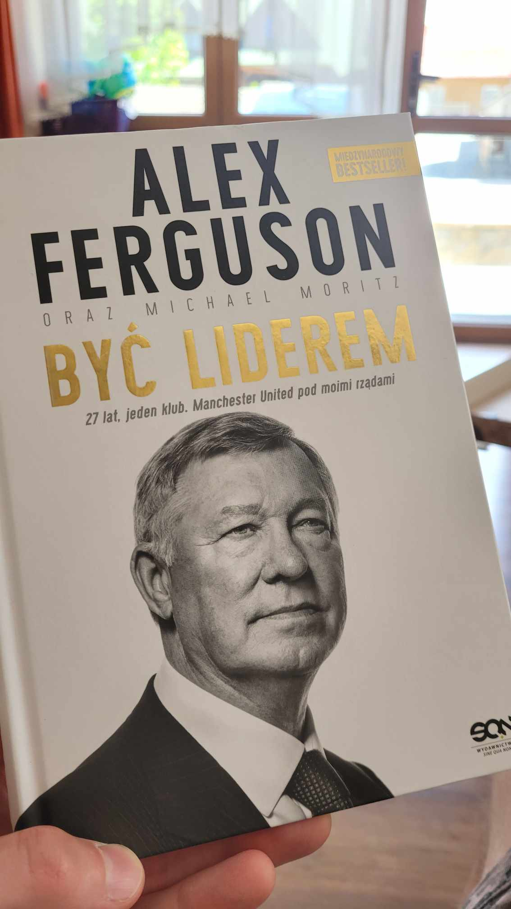

Wczoraj zacząłem czytać [[flawless-consulting|Flawless Consulting]] - książkę, którą kupiłem jakieś 7 lat temu i przeczytałem tylko w części. Krótko po tym pożyczyłem ją Szymonowi, który też zajmował się konsultingiem.

Początkiem zeszłego roku zapytałem go, czy nadal ją ma i czy będzie w moich okolicach, żeby mi ją zwrócić. Planowałem ją przeczytać w całości, ale miałem całą kolejkę innych książek, więc zupełnie mi się nie spieszyło. Nie planował, a ja nie cisnąłem.

Jednak ponieważ od kilku miesięcy pracuję jako konsultant w hotelu w zakresie technologii i ogólnego rozwiązywania problemów i [[spisalem-wlasne-standardy-konsultingowe|popełniłem kilka błędów]], to postanowiłem trochę rozwinąć swoje kompetencje.

Poprosiłem Szymona o zwrot. Powiedział, że zaraz wyśle paczkomatem, tylko żebym mu podał tytuł książki, którą chcę jeszcze przeczytać, to mi kupi w ramach zadośćuczynienia za przetrzymanie. Podziękowałem za propozycję (przynajmniej trzykrotnie), ale Szymon się uparł i powiedział, że jak mu nie podam tytułu, to sam coś wybierze. I wybrał.

Wczoraj otrzymałem w prezencie książkę [[byc-liderem-alex-ferguson|Alexa Fergusona]], legendarnego trenera Manchester United.

Lubię biografie. Z testu Gallupa - zupełnie niezależnie - wyszło mi (chyba z *Context*), że tego typu książki dobrze na mnie działają.

Szymon, zapytany o wybór, odparł:
> Cieszę się, że trafiłem w gust 😄 Założyłem, że skoro potrzebujesz z powrotem książki o consultingu, to historia przedłożenia sukcesów ze sportu na biznes może stanowić uzupełnienie wiedzy i inspirację 😉

Widać, że konsultant, prawda? 😄

Dzięki, Szymon!

A z książki już zdążyłem wynotować sporo rzeczy. Przykładowo, warto starać się [[12 etapów konsultingu z zaangażowaniem klienta|wciągać klienta w proces]], aby zmniejszyć opór przed zmianą i zwiększyć szansę na sukces projektu konsultingowego. Dotyczy to np. wspólnego ustalenia jakie dane zbieramy i jak je chcemy zbierać, przeprowadzenia części wywiadów czy przedstawienia wyników.

Jednak [[Nie we wszystko należy angażować klienta|nie we wszystko należy angażować klienta]]. Chodzi o obszary, w których konsultant jest ekspertem. Przykładowo, jeśli zajmuję się technologią, to nie ma sensu prosić klienta o pomoc w przygotowaniu listy najlepszych technologii do rozwiązania konkretnego problemu. 