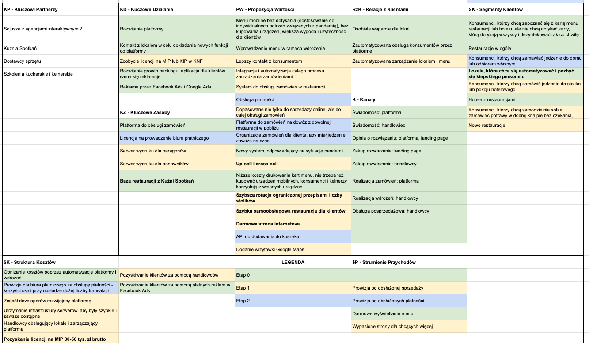

## Wstęp

Przyszła pandemia. Pracowałem wtedy jako freelancer, robiłem strony internetowe. [[kuznia-spotkan|Kuźnię Spotkań]] spisałem już w całości na straty, bo pandemia totalnie rozwaliła branżę eventową i nikt nie wiedział co będzie dalej.

Próbowałem wypromować [[dlawp|opiekę dlaWP.pl]] i ogólnie robiłem jak zwykle zbyt wiele projektów na raz. Zaangażowałem się też w pomoc przy robieniu strony nieformalnej grupy posiadaczy drukarek 3D, którzy za darmo drukowali środki ochrony osobistej dla służby zdrowia.

Rodzice prowadzili w tym czasie restaurację i dwa hotele. Kiedyś, siedząc u nich, słuchałem jak rozmawiają o procedurach dezynfekcji menu w restauracji. Wydało mi się to trochę absurdalne w czasie, gdy ludzie mają telefony komórkowe i mogliby przeglądać menu na swoim telefonie, bez dotykania wątpliwej czystości przedmiotów w przestrzeni publicznej.

Chciałem im powiedzieć, żeby na stronie wystawili menu i podali linka. Wiedziałem jednak, że nie zrobią tego i zanim skończyli rozmawiać (a nie chciałem im przerywać ożywionej dyskusji), to w mojej głowie eksplodował pomysł.

## Pomysł

Eksplodował, bo u mnie to tak często jest, że jak się rozkręcę, to już wybiegam planami wprzód do pełnego produktu z mnóstwem ficzerów. Jeśli jeszcze nie ma nazwy na tę przypadłość, to pewnie kiedyś zostanie nazwana moim imieniem. Żona twierdzi, że to ADHD.

W każdym razie, pomysł był prosty w założeniu: usługa mobilnego menu.

Klient wchodzi do restauracji, na stoliku widzi plastikowy stojaczek z QR code, skanuje go i wchodzi na stronę z menu.

Taką usługę mogę proponować również innym restauracjom, nie tylko moim rodzicom, którzy mieliby to za darmo, rzecz jasna.

## Monetyzacja i scope creep

Ale jak to monetyzować? Czy ktoś zapłaci za samą usługę mobilnego menu? Czy to nie **za mało**?

Tu był mój pierwszy błąd. Za dużo chciałem.

Pyszne.pl kasowało prowizję od sprzedaży. To była jednak platforma sprzedażowa, która opierała się na tym, że ich marka przyciąga klientów do platformy, w platformie klienci szukają i znajdują lokal, w którym mogą coś zamówić. Więc to działa na zasadzie promocji lokalu i przyciągania **nowych** klientów.

Tutaj klienci już byli, bo przyszli do lokalu. Miałem pomóc ich tylko obsłużyć. Więc za co miałbym kasować?

Tu był mój drugi błąd. Nie przemyślałem za co klienci są gotowi zapłacić. Wziąłem pod uwagę tylko znane mi przypadki.

Rozbudowałem swój pomysł więc o całą usługę POS (point of sale, punkt sprzedaży) i zarządzania kuchnią.

Wiem z doświadczenia jako klient i restaurator, że klienci jak przychodzą głodni, to lubią wiedzieć ile będą czekać na jakie dania. Chcieliby móc wybrać potrawy, które wiedzą, że czeka się na nie krótko, żeby chociaż jakąś szybką zupę czy przystawkę zjeść najpierw, a potem mogą dłużej czekać.

W dodatku na kelnerkę często długo się czeka zanim podejdzie, rozda menu, a potem pozbiera zamówienia. Taka apka mogłaby posłużyć za elektronicznego kelnera: jest dostępna od razu, może pokazać co jak wygląda, ile czasu trzeba czekać. Można by też zamówić od razu taką potrawę.

A jak już będzie cały system do zarządzania kuchnią, to apka mogłaby monitorować czas realizacji poszczególnych zamówień, obłożenie kuchni i w czasie rzeczywistym szacować jak długo na konkretną potrawę będzie trzeba czekać.

Poza tym czasem niektóre potrawy się kończą. Np. pierogi, które są przygotowane, mrożone, a potem gotowane. W apce kelnerka mogłaby zaznaczyć, że danej potrawy nie ma dzisiaj i na liście w ogóle by się nie pokazała. To podnosi doświadczenia klienta, bo unikamy wtedy rozczarowania, kiedy klient się napali na kuszącą potrawę, a kelnerka po zebraniu zamówienia powie, że jednak nie ma i żeby coś innego zamówił.

## Biznesplan

Najpierw myślałem o tej usłudzie jak o kiosku, takim jakie wtedy dopiero wchodziły do restauracji McDonald’s. Tylko nie chciałem urządzenia dotykowego, tylko skorzystać z tego, że klienci już mieli wszystko co trzeba w swojej kieszeni.

Nazwałem to roboczo mobikiosk.pl

Do tego miałem zasób, którym była baza budowana na potrzeby Kuźni Spotkań. Mnóstwo restauracji, które mogły skorzystać z mojego rozwiązania.

Przystąpiłem do rozpisania Excela i jeszcze bardziej się rozkręciłem.

### Business Model Canvas

Rozpisywałem go na 3 etapy (od 0 do 2), ale była to jedyna wersja. Nie brałem innych scenariuszy pod uwagę.

**KP – Kluczowi Partnerzy**

- Sojusze z agencjami interaktywnymi
- Kuźnia Spotkań
- Dostawcy sprzętu
- Szkolenia kucharskie i kelnerskie

**KD – Kluczowe Działania**

- (0) Rozwijanie platformy
- (0) Kontakt z lokalem w celu dokładania nowych funkcji do platformy
- (1) Zdobycie licencji na MIP lub KIP w KNF
- (0) Rozwijanie growth hackingu, aplikacja dla klientów sama się reklamuje
- (0) Reklama przez Facebook Ads i Google Ads

**KZ – Kluczowe Zasoby**

- (0) Platforma do obsługi zamówień
- (2) Licencja na prowadzenie biura płatniczego
- (1) Serwer wydruku dla paragonów
- (1) Serwer wydruku dla bonowników
- (0) Baza restauracji z Kuźni Spotkań

**PW – Propozycja Wartości**

- (0) Menu mobilne bez dotykania (dostosowanie do indywidualnych potrzeb związanych z pandemią), bez kupowania urządzeń, większa wygoda i użyteczność dla klientów
- (0) Wprowadzenie menu w ramach wdrożenia
- (0) Niższe koszty drukowania kart menu, nie trzeba też kupować urządzeń mobilnych, konsumenci i kelnerzy korzystają z własnych urządzeń
- (0) Nowy system, odpowiadający na sytuację pandemii
- (1) Lepszy kontakt z konsumentem
- (1) Integracja i automatyzacja całego procesu zarządzania zamówieniami
- (1) System do obsługi zamówień w restauracji
- (1) Dopasowane nie tylko do sprzedaży online, ale do całej obsługi zamówień
- (1) Up-sell i cross-sell
- (1) Szybsza rotacja ograniczonej przepisami liczby stolików
- (1) Szybka samoobsługowa restauracja dla klientów
- (1) Darmowa strona internetowa
- (1) Dodanie wizytówki Google Maps
- (1) Obsługa płatności
- (1) Platforma do zamówień na dowóz z dowolnej restauracji w pobliżu
- (1) Organizacja zamówień dla klienta, aby miał jedzenie zawsze na czas
- (1) API do dodawania do koszyka

**RzK – Relacje z Klientami**

- (0) Osobiste wsparcie dla lokali
- (0) Zautomatyzowana obsługa konsumentów przez platformę
- (1) Zautomatyzowana zarządzanie lokalem i menu

**K – Kanały**

- (0) Świadomość: platforma
- (0) Świadomość: handlowiec
- (0) Opinia o rozwiązaniu: platforma, landing page
- (0) Zakup rozwiązania: landing page
- (0) Zakup rozwiązania: handlowcy
- (0) Realizacja zamówień: platforma
- (0) Realizacja wdrożeń: handlowcy
- (0) Obsługa posprzedażowa: handlowcy

**SK – Segmenty Klientów**

- (0) Konsumenci, którzy chcą zapoznać się z kartą menu restauracji lub hotelu, ale nie chcą dotykać karty, którą dotykają wszyscy i dezynfekować rąk co chwilę
- (0) Restauracje w ogóle
- (0) Lokale, które chcą się automatyzować i pozbyć się kiepskiego personelu
- (0) Hotele z restauracjami
- (1) Konsumenci, którzy chcą zamówić jedzenie do stolika lub pokoju hotelowego
- (1) Konsumenci, którzy chcą samodzielnie sobie zamawiać potrawy w dobrej knajpie bez czekania, nawet jadąc autem
- (1) Nowe restauracje
- (2) Konsumenci, którzy chcą zamawiać jedzenie do domu lub odbiorem własnym

**$K – Struktura Kosztów**

- (0) Obniżanie kosztów poprzez automatyzację platformy i wdrożeń
- (0) Pozyskiwanie klientów za pomocą płatnych reklam w Facebook Ads
- (1) Pozyskiwanie klientów za pomocą handlowców
- (1) Zespół developerów rozwijający platformę
- (1) Utrzymanie infrastruktury serwerów, aby były szybkie i zawsze dostępne
- (1) Handlowcy obsługujący lokale i zarządzający platformą
- (1) Pozyskanie licencji na MIP 30-50 tys. zł brutto
- (2) Prowizje dla biura płatniczego za obsługę płatności – korzyści skali przy obsłudze dużej liczby transakcji

**$P – Strumienie Przychodów**

- (0) Darmowe wyświetlanie menu
- (1) Prowizja od obsłużonej sprzedaży
- (1) Wypasione strony dla chcących więcej
- (2) Prowizja od obsłużonych płatności

### Analiza Ryzyka

**Lokale będą bardziej chciały platformy do zwiększania sprzedaży w czasach pandemii, gdzie i tak mają duże ograniczenia, niż automatyzować zamówienia, bo nie ma czego automatyzować**

- **Szansa:** 90%
- **Wpływ:** 80%
- **Wynik:** 72%
- **Zapobieganie:** Rozważyć wprowadzenie automatyzacji zamówień na innych etapach procesu, takich jak przygotowywanie zamówień lub zarządzanie magazynem.

**Pandemia na jesień**

- **Szansa:** 80%
- **Wpływ:** 80%
- **Wynik:** 64%
- **Zapobieganie:** Wprowadzić funkcję dostawy do domu lub usługi cateringowe. Skorzystać z komunikatu, który informuje o tym, że restauracja pomaga klientom dostarczać jedzenie bezpiecznie i wygodnie, a jednocześnie dba o swoje bezpieczeństwo i higienę.

**Lokal nie chce się pozbywać kelnerów, bo chce świadczyć usługi za pomocą osobistego wsparcia kelnerów, trudno wtedy sprzedawać za pomocą ograniczenia kosztów i trudno wziąć prowizję od całej sprzedaży**

- **Szansa:** 50%
- **Wpływ:** 60%
- **Wynik:** 30%
- **Zapobieganie:**

1. Wybrać inny segment restauracji, z mniejszym osobistym wsparciem, mniejszym naciskiem na obsługę klienta.
2. Pokazać wartość lepszej komunikacji z klientem, dostępu do pełnej informacji i szansa dosprzedaży lub budowania własnej marki.

**Klienci mogą nie chcieć korzystać z urządzeń mobilnych, chcą się zapytać kelnera**

- **Szansa:** 50%
- **Wpływ:** 50%
- **Wynik:** 25%
- **Zapobieganie:** Przygotować krótki filmik instruktażowy pokazujący jak korzystać z urządzeń mobilnych i wyświetlać menu na ekranie. Zwrócić uwagę na łatwość korzystania z urządzeń mobilnych oraz korzyści dla klienta, takie jak brak oczekiwania na kelnera, szybsze zamówienie i płatność online.

**KNF może w dowolnym momencie cofnąć licencję na biuro płatnicze**

- **Szansa:** 20%
- **Wpływ:** 95%
- **Wynik:** 19%
- **Zapobieganie:** Regularnie monitorować wymagania KNF dotyczące działalności biura płatniczego, dbać o odpowiednie procedury bez

### Analiza rentowności

Zrobiłem też, a jakże. Wolałem sprawdzić, czy to się zepnie finansowo. Jechałem wtedy na oszczędnościach zbyt długo, żeby sobie tak po prostu pozwolić na kolejny produkt, który nie zarabia w ogóle.

Ale jak widać, w Strumieniach Przychodów w etapie 0 było jedynie „darmowe wyświetlanie menu”. No to jak miałem niby zarabiać na te wszystkie koszty pozyskiwania klientów a potem rozwijania platformy? No nie mogłem.

## Big plan

No więc jak widać z powyższego Excela, miałem w głowie wielkie koncepcje. Rozważałem model marketplace z przyjmowaniem płatności i rozliczaniem tego z klientami.

Robiłem research na rynku w tematach przyjmowania płatności i szukałem rozwiązań problemów przyjmowania płatności w imieniu klientów, bo chciałem mieć pod kontrolą ile klienci faktycznie wydają. Bez informacji o obrotach trudno byłoby mi naliczać prowizję od obrotów.

Rozmawiałem nawet w tych tematach z prawnikiem.

Jeśli miałbym przyjmować płatności, to musiałbym zostać MIP albo KIP (odpowiednio Mała Instytucja Płatnicza albo Krajowa Instytucja Płatnicza).

Armata na muchę.

Poświęciłem niewiarygodnie wielką liczbę godzin na projektowanie całego biznesu w dojrzałej formie.

## Konkurencja

Jak zacząłem się rozglądać za różnymi rozwiązaniami na rynku, to znalazłem kilka rozwiązań, które działały już od kilku lat. Były dość dojrzałe i wiem, że mocno się rozwinęły w czasie pandemii, zdobywając mnóstwo klientów.

Chciałem kopiować część z ich rozwiązań. Np. jedna apka robiła darmowe strony internetowe dla restauracji, żeby wstawiać właśnie na nich mobilne menu, które monetyzowali chyba abonamentem.

Inna apka miała tłumaczenia, zdjęcia, moduły do zamawiania.

Poznałem też kilka projektów, które albo właśnie rozwijały podobne produkty albo były już zrobione, wystawione do sprzedaży, ale w technologiach, w których ja nie byłem w stanie podjąć się dalszego rozwoju.

Inne apki skupiały się na części procesów, takich jak samo płacenie z zostawianiem napiwku. Nawiasem mówiąc, napiwki były jakąś przeszkodą mentalną, która blokowała mnie przed zastąpieniem kelnerów apką, bo obawiałem się, że kelnerzy będą stawiać opór, którego ja nie mam siły przezwyciężać.

## Development

Mając te wszystkie super korzyści w głowie, kupiłem domenę mKelner.pl i przystąpiłem do developmentu.

Ustaliłem, że zrobię najpierw widok mobilnego menu. Na plus, bo od razu mogę zrobić menu dla

W tym przypadku wybrałem technologię, która miała mi pozwolić zrobić tę apkę w formie PWA (progressive web application), czyli takiej, która mogłaby być instalowana na urządzeniach, ale nie wymagałaby publikacji w sklepie. Nie znałem tych procedur ani technologii do tworzenia natywnych aplikacji mobilnych, więc na plus, że nie poszedłem w tym kierunku.

Technologii do PWA jednak też nie znałem za bardzo. Wybrałem więc drogę dość eksperymentalną. To był mój błąd nr 3.

Najbardziej umęczyłem się jednak z panelem administracyjnym. Chciałem, żeby klienci sami dodawali menu i nim zarządzali. To okazało się być najbardziej kosztowną i najmniej potrzebną funkcją.

Kierowałem się jednak tym, że jeśli mam osiągnąć jakąś skalę i dawać za darmo te funkcje, to nie chcę poświęcać czasu na administrację. Koniec końców musiałem jednak poświęcić OGROM czasu na przygotowanie panelu do zarządzania, który w dodatku był trochę wadliwy i wstyd było mi go dawać klientom z szeregiem instrukcji co robić w razie problemów.

## Pierwsi klienci

Oczywiście moi rodzice byli pierwszymi klientami. Do tego jeszcze miałem kilku znajomych z knajpami, jeden z nich był bardzo otwarty na tego typu koncepcje i chętnie skorzystał i korzystał nawet przez kolejne lata. Choć ja już tego później nie rozwijałem, więc ostatecznie po 2 latach przestał korzystać.

Kilku klientów próbowałem wdrażać za darmo, nie było jednak wzięcia. Robiłem też reklamę na Facebooku, ale jakoś nigdy nie umiałem w te reklamy i raptem kilka osób w ciągu kilku miesięcy się odezwało.

Pamiętam, że przygotowałem wtedy nawet szablony do generowania kartek z kodami QR w wielu różnych formatach i układach (A6, A5, pionowo i poziomo, z logiem w różnych miejscach).

Okazało się to niepotrzebne, bo nie miałem skali, która by to uzasadniała.

## Najciekawsze koncepcje

Spośród tych wszystkich planów miałem kilka ciekawych pomysłów, które jakoś zbagatelizowałem.

1. Dwufunkcyjny stojaczek.

Przeczytałem wytyczne sanepidu i wiedziałem, że kazał dezynfekować stoliki, a potem zostawiać kartkę z napisem „Zdezynfekowano”. Pomyślałem, że restauracje będą musiały taką kartkę wystawiać, więc mogę to ograć takim stojaczkiem: z jednej stronie napis na górze „Zdezynfekowano”, a pod spodem QR code.

Prosty zabieg mógł się okazać bardzo skutecznym narzędziem sprzedaży usługi mobilnego menu oraz promocji wśród klientów restauracji. Zwłaszcza, że potem widziałem wielokrotnie takie dwufunkcyjne stojaki.

2. Hotele z restauracją.

Jednym z segmentów były hotele, które miały restaurację. Spodziewaliśmy się, że klienci nie będą mogli korzystać z sali, tylko będą mogli zamawiać do pokoi. QR code w pokoju ułatwiałby zamawianie potraw.

Zwłaszcza, że nie było bezpośredniego kontaktu z kelnerem, więc tym lepiej działałaby funkcja ukrywania potraw, które „wyszły”.

## Przekonania

1. Samo mobilne menu to za mało. Za mało na co?
2. Chcę wszystko zbudować. Cały ekosystem. Vendor lock-in.
3. Drukowanie paragonów jest kłopotliwe, za dużo prawnych aspektów, unikam jak mogę.
4. Nauczę się nowej technologii przy okazji.
5. Kelnerzy będą stawiać opór, nie będą polecać apki, bo apka pozbawi ich najpierw napiwków, potem roboty w ogóle.
6. Jak się klienci mi zlecą, to nie będę miał czasu na wdrożenia i zarządzanie ich menu.
7. Muszę zrobić model freemium (darmowe menu najpierw), bo inaczej nie zbuduję bazy klientów, z których część będzie mi płacić.

## Jak teraz bym do tego podszedł?

1. Wypromowałbym przede wszystkim samo mobilne menu. Bo jeśli jest zainteresowanie, to można dokładać ficzerów.
2. Poszukałbym POSa, z którym można zrobić integrację i próbował dogadać się, żeby sprzedawali to mobilne menu jako addon (dodatek) do swojego pakietu w formie abonamentu.
3. Sprawdziłbym, czy są gotowi zapłacić za usługę. O ile czułem, że rodzice nie będą gotowi, bo nie rozumieli produktu, to wcale nie znaczy, że ktoś inny miałby nie widzieć w tym wartości. Prawo małych liczb. Teraz szukałbym klientów na najbardziej podstawową usługę i promowałbym to jako oszczędności na menu, większe bezpieczeństwo i komfort klientów oraz łatwiejsze zarządzanie niedostępnymi potrawami.
4. Nie uczyłbym się nowej technologii, tylko wybrał najprostsze rozwiązania, które pozwoliłyby mi szybko dokładać nowe ficzery w razie potrzeby lub zrobić piwota.
5. Zrobiłbym widok menu i fajne fotki z QR code, pokazał jak to działa (co z resztą zrobiłem właśnie w pierszej kolejności) i najpierw poszedł do ludzi spróbował to sprzedać za jakieś niewielkie pieniądze. Bez napływu klientów nie było sensu dalej tego rozwijać, automatyzować, itd. Największy nacisk na pozyskanie klientów powinien być. Nie było co się nastawiać na klęskę urodzaju. Raczej na klęskę projektu jako takiego 🙂
6. Automatyzacja dopiero, kiedy przestanę się wyrabiać. Szablony do drukowanych materiałów były niepotrzebne. Panel administracyjny mógłby się ograniczyć do prostego włączania i wyłączania potraw, nawet bez logowania userów, tylko po jakimś magicznym linku.
7. Może w ogóle zacząłbym od nagrania filmiku, w którym pokazuję na makietach wszystko udając, że to działa. Zobaczyłbym, czy klienci reagują i zamawiają wdrożenie. Zrobiłbym czas na realizację kilka dni, żeby mieć czas na obsługę, gdyby się okazało, że jest ich trochę.
8. Reklama (np. wideo) kierowałaby do landing page, tam formularz przedwdrożeniowy, w którym podają adres strony i numer telefonu, potem oddzwaniam, omawiam potrzeby i robię wycenę wdrożenia. W ten sposób miałbym na bieżąco kontakt z klientami i wiedział czego naprawdę potrzebują, jak z nimi rozmawiać i jak dopasować reklamę.
9. Nawet, jeśli miałby to być model freemium, to mogłem zrobić podstawową usługę, a potem dobudowywać funkcje płatne w pakiecie. Albo zrobić darmowe do jakiejś tam ilości odsłon. Albo dorzucać fotki lub branding w cenie. Możliwości jest całe mnóstwo. Szukałbym więc więcej alternatyw monetyzacji dla najbardziej podstawowej wartości. I tę wartość wyartykułował najbardziej. I sprawdził, czy w ogóle jest dla kogoś wartością.

## Podsumowanie

Ogólnie w tym czasie był taki chaos, że nikt nie wiedział do czego dojdzie, czy restauracje zupełnie splajtują, jak długo to wszystko potrwa i co ma sens.

Wiele firm już oferowało konkurencyjne produkty i usługi, więc wydawało się, że rynek na to jest, ale nie wiadomo było jak wielki i jak teraz się zachowa.

Nie byłem gotowy wtedy na projektowanie zwinne, a teraz myślę, że zwłaszcza w takich chaotycznych czas jest to najlepsze podejście.

Zamiast siedzieć znowu nad wielkim Excelem i rozważać dziesiątki różnych scenariuszy, to mogłem skupić się na dostarczeniu prostego menu za darmo, a potem szukać opcji na monetyzację albo kasować jakąś niewielką kasę za wdrożenie i budować skalę.

Albo rozważyć kilka innych scenariuszy monetyzacji, ale już przetestować na co reagują klienci. Być bliżej rynku, a dalej od swoich marzeń o podboju branży restauracyjnej.

Być może za bardzo brakowało mi wtedy kasy, żeby racjonalnie myśleć i zrobić coś dużo prostszego i zacząć zarabiać od dnia pierwszego.

Business Model Canvas urósł mi znacząco, bo wstawiłem 3 etapy całego mojego długoterminowego planu. A mogłem go ograniczyć do etapu początkowego i przeanalizować więcej scenariuszy, **dać sobie więcej przyzwolenia na piwot i pokorę**.